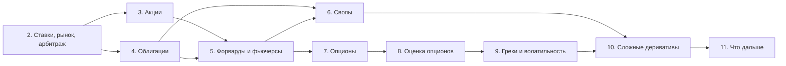

# Как устроен курс

Курс учит разбирать любой финансовый инструмент по одной схеме: какие денежные потоки он порождает, из каких более простых инструментов его можно собрать, сколько он стоит без арбитража и от каких рыночных величин зависит эта стоимость.

## Что вы научитесь делать

После курса вы решаете такие задачи, не заглядывая в уроки (разве что в шпаргалку):

| Задача | Где этому учат |
|---|---|
| По котировкам ОФЗ построить бескупонную кривую и оценить по ней любую облигацию | Модуль 4 |
| Посчитать, сколько фьючерсов на индекс нужно продать, чтобы снять рыночный риск портфеля акций | Модуль 5 |
| Оценить процентный своп на середине срока и объяснить, почему его стоимость уже не ноль | Модуль 6 |
| Найти арбитраж в наборе котировок опционов | Модуль 7 |
| Вывести уравнение Блэка–Шоулза из дельта-хеджа и решить его | Модуль 8 |
| Объяснить P&L опционной позиции через греки и реализованную волатильность | Модуль 9 |
| Разложить структурный продукт на облигацию и опционы и найти в нём маржу банка | Модуль 10 |

Проверка простая: если вы можете решить задачу из таблицы на новых числах и объяснить каждый шаг, модуль усвоен. Итоговую проверку по всему курсу даёт финальный экзамен.

## Что нужно знать заранее

Финансы курс объясняет с нуля: не нужно знать, что такое облигация или биржа. Математику он не объясняет. Нужен уровень первых двух курсов технического вуза:

- **Анализ.** Частные производные, ряд Тейлора до второго порядка по двум переменным. Главный шаг в выводе леммы Ито — именно такое разложение.
- **Теория вероятностей.** Матожидание, дисперсия, ковариация, нормальное распределение, условное матожидание. Лемма Ито и броуновское движение объясняются в курсе, но опираются на эти понятия.
- **Линейная алгебра.** Решение линейных систем: на нём держится репликация, когда ищем портфель, копирующий выплаты инструмента.
- **Python.** Домашние задания рассчитаны на Python 3.12, numpy 2.x, scipy 1.13 и новее, matplotlib. Хватит векторных операций numpy и умения написать функцию. pandas не обязателен.

Окружение для домашних заданий:

```bash
python3 -m venv .venv
source .venv/bin/activate
pip install numpy scipy matplotlib
```

## Что в курс не вошло

| Тема | Почему не вошла | Где искать |
|---|---|---|
| Технический анализ, торговые системы | Не про устройство инструментов | — |
| Оценка бизнеса (DCF, мультипликаторы) | Отдельная дисциплина: корпоративные финансы | A. Damodaran, «Investment Valuation» |
| Налоги и учёт хеджирования (МСФО 9) | Быстро меняются и зависят от юрисдикции | НК РФ, гл. 23 и 25; стандарт IFRS 9 |
| Модели процентных ставок (Васичек, Халл–Уайт, HJM) | Нужны для экзотики на ставках, а не для понимания инструментов | D. Brigo, F. Mercurio, «Interest Rate Models — Theory and Practice» |
| Корректировки стоимости XVA (CVA, FVA и др.) | Тема банковского риск-менеджмента; в курсе есть только введение | J. Gregory, «The xVA Challenge» |
| Криптовалюты | Кроме вечных фьючерсов, новых механизмов в них нет | — |

Полный обзор того, куда двигаться дальше, — в последнем модуле.

Основные книги, на которые опирается курс:
- J. Hull, «Options, Futures, and Other Derivatives»: главный справочник по деривативам;
- S. Shreve, «Stochastic Calculus for Finance I, II»: строгая математика модулей 8–9;
- B. Tuckman, A. Serrat, «Fixed Income Securities»: облигации и свопы.

## Как устроен курс



Модуль 2 — фундамент для всего курса: дисконтирование и принцип отсутствия арбитража используются в каждом следующем уроке. Дальше идут два базовых актива (акции и облигации), затем деривативы на них по возрастанию сложности.

Каждый модуль, кроме введения и последнего, заканчивается домашним заданием и тестом:

- **Домашнее задание** — расчёт на Python, 30–60 минут. Проверки нет, но в конце каждого задания есть раздел «Как проверить себя» с контрольными числами.
- **Тест** — 5–8 вопросов, проходной балл 70. Первые тесты проверяют знание, средние — применение, последние — суждение: что сломается, если сделать иначе.
- **Финальный экзамен** — 20 вопросов по всему курсу, проходной балл 80.

После курса к нему удобно возвращаться через **шпаргалку** (формулы, спецификации, правила выбора) и **глоссарий**.

## Обозначения

Каждый символ объясняется там, где впервые появляется, — специально запоминать таблицу не нужно. Она здесь на случай, если вы вернётесь к уроку из середины курса или встретите другие обозначения в книге.

| Символ | Смысл |
|---|---|
| $t$, $T$ | Текущий момент и дата погашения или экспирации, в годах |
| $\tau = T - t$ | Оставшийся срок |
| $S_t$ | Цена базового актива (акции, индекса, валюты) |
| $K$ | Цена исполнения (страйк) опциона или цена поставки форварда |
| $r$ | Безрисковая ставка с непрерывным начислением, если не сказано иное |
| $q$ | Непрерывная дивидендная доходность или иностранная ставка |
| $\sigma$ | Волатильность — годовое стандартное отклонение лог-доходности |
| $P(t,T)$ | Цена в момент $t$ бескупонной облигации, платящей 1 в момент $T$ (дисконт-фактор) |
| $F(t,T)$ | Форвардная или фьючерсная цена на момент поставки $T$ |
| $N(\cdot)$ | Функция распределения стандартного нормального закона |
| $W_t$ | Стандартное броуновское движение |
| $\mathbb{Q}$, $\mathbb{P}$ | Риск-нейтральная и реальная (физическая) вероятностные меры |
| б.п. | Базисный пункт, 0,01% = 0,0001 |

## Про даты и цифры

Спецификации контрактов, ставки, правила бирж и налоговые нормы меняются. В тексте они привязаны к дате: «по состоянию на сентябрь 2026». Всё, что помечено таким образом, перед практическим использованием стоит проверить по первоисточнику: сайту Московской биржи (moex.com), Банка России (cbr.ru), CME Group (cmegroup.com). Формулы и механика инструментов от дат не зависят.
