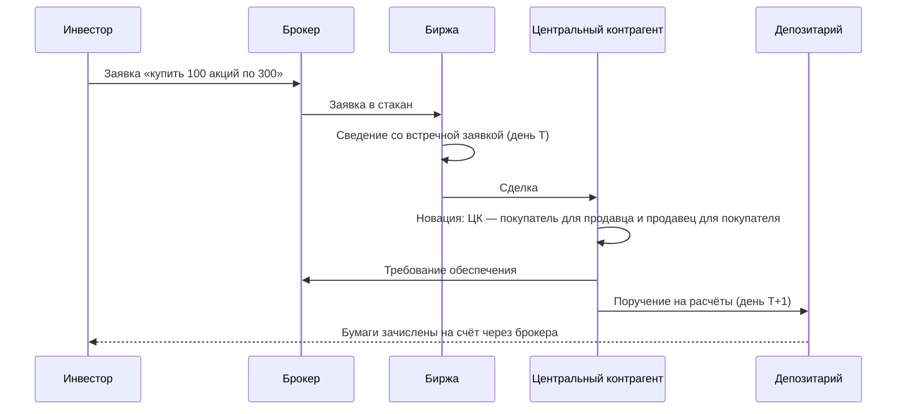

# Как устроен рынок

Урок о том, где и как заключаются сделки: через кого проходит заявка, откуда берётся цена и кто гарантирует, что вторая сторона исполнит обязательства.

## Участники

| Участник | Что делает | Примеры (сентябрь 2026) |
|---|---|---|
| Эмитент | Выпускает ценные бумаги, чтобы привлечь деньги | Минфин (ОФЗ), компании |
| Инвестор | Покупает инструменты, чтобы получить доход или застраховать риск | Частные лица, пенсионные фонды, банки |
| Брокер | Передаёт заявки клиента на биржу и отвечает за его позиции перед биржей | Т-Банк, Сбербанк, Interactive Brokers |
| Дилер, маркет-мейкер | Торгует от своего имени и постоянно выставляет цены покупки и продажи; зарабатывает на спреде | Банки, трейдинговые фирмы |
| Биржа | Сводит заявки по единым правилам | Московская биржа, NYSE, CME |
| Центральный контрагент (ЦК) | Становится стороной каждой сделки и гарантирует её исполнение | НКЦ (группа Мосбиржи), OCC, CME Clearing, LCH |
| Депозитарий | Хранит учёт прав на ценные бумаги | НРД, DTC |

## Стакан и цена сделки

На бирже цену формирует **стакан** (order book) — список активных лимитных заявок.

- **Лимитная заявка**: «купить не дороже» или «продать не дешевле» заданной цены. Если встречной заявки нет, она ждёт в стакане.
- **Рыночная заявка**: исполняется немедленно по лучшим встречным ценам, какими бы они ни были.
- **Бид** (bid) — лучшая цена покупки, **аск** (ask, offer) — лучшая цена продажи. Разница между ними — **спред** (bid-ask spread), середина — **mid**.

Возьмём стакан акции:

| Покупка: объём | Цена | Продажа: объём |
|---|---|---|
| | 300,50 | 1000 |
| | 300,20 | 800 |
| | 300,10 | 500 |
| 700 | 300,00 | |
| 1200 | 299,90 | |

Бид 300,00, аск 300,10, mid 300,05, спред 10 копеек (3,3 б.п. от mid).

Рыночная заявка на покупку 1500 акций пройдёт по трём уровням:

$$
\frac{500 \cdot 300{,}10 + 800 \cdot 300{,}20 + 200 \cdot 300{,}50}{1500} = \frac{450\,310}{1500} = 300{,}2067.
$$

Средняя цена на 15,7 копейки хуже mid, это около 5,2 б.п. Такое **проскальзывание** (slippage) — плата за немедленность исполнения. Спред и глубина стакана вместе называются **ликвидностью**: чем глубже стакан и уже спред, тем дешевле войти в позицию и выйти из неё.

Торговля идёт через стакан на **бирже**. Сделки напрямую между двумя сторонами — **внебиржевой рынок** (over-the-counter, OTC). Свопы, валютные форварды и большинство облигаций торгуются в основном вне биржи.

| | Биржа | Внебиржевой рынок (OTC) |
|---|---|---|
| Условия контракта | Стандартные: размер, даты, базовый актив | Любые, по договорённости сторон |
| Цены | Публичные, в стакане | Запрос котировки у дилеров, часто непубличные |
| Риск контрагента | Берёт на себя ЦК | Несут стороны, если сделка не передана в ЦК |
| Документация | Правила биржи | Договор ISDA (модуль 6) или национальный аналог (в России — генеральное соглашение СРО НФА) |
| Типичные инструменты | Акции, фьючерсы, биржевые опционы | Свопы, форварды, экзотические опционы, большинство облигаций |

## Клиринг и расчёты

Сделка проходит два этапа.
1. **Заключение**: стороны договорились о цене и объёме.
2. **Расчёты** (settlement): деньги и бумаги реально переходят к новым владельцам.

Между ними идёт **клиринг**: обязательства сторон определяются, сворачиваются в нетто-суммы и обеспечиваются.

Срок расчётов записывают как T+n: T — день сделки, n — число рабочих дней до расчётов.

| Рынок | Цикл расчётов по акциям |
|---|---|
| Московская биржа | T+1, с 31 июля 2023 |
| США | T+1, с 28 мая 2024 |
| ЕС, Великобритания | T+2, переход на T+1 намечен на октябрь 2027 |

### Зачем нужен центральный контрагент

Без ЦК каждый участник рискует, что именно его контрагент обанкротится до расчётов. ЦК через **новацию** заменяет одну сделку двумя: с покупателем и с продавцом. Теперь у каждого один контрагент — ЦК. Для защиты ЦК:
- берёт с участников **начальную маржу** (гарантийное обеспечение) — буфер на случай резкого движения цены;
- ежедневно пересчитывает позиции и списывает или зачисляет **вариационную маржу**;
- при дефолте участника закрывает его позиции, покрывает убыток его обеспечением, затем гарантийным фондом, затем собственным капиталом. Эта очередность называется «каскадом покрытия дефолта» (default waterfall).

Механику маржи подробно разберём на фьючерсах в модуле 5.

## Типичные ошибки

- **Путать день сделки и день расчётов.** Права на дивиденд получает тот, кто числится владельцем на дату закрытия реестра. При T+1 купить акцию нужно не позже, чем за один рабочий день до этой даты.
- **Считать, что ЦК защищает от всех рисков.** ЦК гарантирует исполнение биржевых сделок между участниками клиринга. Клиентские деньги у брокера — отдельный риск: за них отвечает брокер, а не ЦК.
- **Отправлять крупную рыночную заявку в тонкий стакан.** Средняя цена исполнения может уйти далеко от последней сделки. Крупный объём режут на части или ставят лимитную заявку.
- **Оценивать позицию по цене последней сделки.** Для неликвидного инструмента последняя сделка могла пройти неделю назад. Честная оценка — mid текущих котировок или модельная цена.
