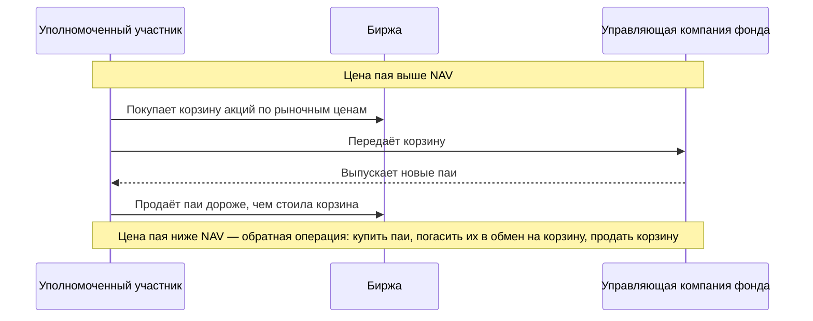

# Индексы, фонды и депозитарные расписки

Индекс — формула, по которой из цен акций получается одно число. Фонд — способ купить эту формулу одной сделкой. Урок о том, как устроены индексы, почему биржевой фонд торгуется около стоимости своих активов и что такое депозитарная расписка.

## Как считается индекс

**Капитализация** компании — рыночная стоимость всех её акций: цена одной акции, умноженная на их количество. Большинство широких индексов взвешены по капитализации: чем дороже компания, тем сильнее она влияет на индекс. Но берут не все акции, а только те, что реально торгуются: доля, принадлежащая государству или основателю и не выходящая на рынок, в расчёт не идёт. Эта торгуемая доля называется **free float** (свободное обращение).

$$
I_t = \frac{\sum_i S_{i,t}\, N_i\, f_i\, c_i}{\text{Div}_t},
$$

где:
- $I_t$ — значение индекса в момент $t$;
- $S_{i,t}$ — цена акции компании $i$;
- $N_i$ — сколько всего у неё акций;
- $f_i$ — доля акций в свободном обращении, число от 0 до 1;
- $c_i$ — ограничивающий коэффициент: если по капитализации на компанию приходилось бы, скажем, 40% индекса, её вес искусственно срезают, чтобы индекс не превратился в одну бумагу;
- $\sum_i$ — сумма по всем компаниям индекса, то есть их суммарная торгуемая капитализация;
- $\text{Div}_t$ — **делитель** (divisor).

Зачем нужен делитель. Индекс должен показывать движение рынка, а не то, что в него добавили новую компанию. Но при смене состава или выпуске новых акций числитель скачком меняется, хотя ни одна бумага не подорожала. Поэтому в момент такого события делитель пересчитывают так, чтобы значение индекса осталось ровно прежним: скачок гасится, а дальнейшие движения цен индекс отражает как обычно.

**Пример.** Капитализация бумаг в индексе — 1000 млрд, делитель 1, индекс 1000. Компания из индекса размещает новые акции на 50 млрд по рыночной цене. Числитель станет 1050 млрд. Новый делитель $1050/1000 = 1{,}05$, индекс по-прежнему 1000.

| Индекс | Правила (по состоянию на 2026) |
|---|---|
| Индекс МосБиржи (IMOEX) | Рублёвый, взвешен по капитализации с free float, вес одного эмитента ограничен. Состав пересматривается раз в квартал |
| Индекс РТС (RTSI) | Та же корзина, что у IMOEX, но в долларах США |
| MCFTR | Индекс МосБиржи полной доходности: дивиденды реинвестируются |
| S&P 500 | 500 крупных компаний США, взвешен по free float, состав определяет комитет S&P Dow Jones Indices |

**Ценовой индекс** (IMOEX, S&P 500) не учитывает дивиденды. **Индекс полной доходности** (MCFTR, S&P 500 Total Return) учитывает. На российском рынке с высокими дивидендами разница за десять лет измеряется десятками процентов. Сравнивать фонд с ценовым индексом — ошибка: фонд, получающий дивиденды, почти всегда «обгонит» такой индекс.

## Биржевые фонды и механизм создания паёв

**Биржевой фонд** (exchange-traded fund, ETF; в России — биржевой паевой инвестиционный фонд, БПИФ) держит корзину активов и выпускает паи, которые торгуются на бирже. **Стоимость чистых активов** (net asset value, NAV) на один пай — стоимость корзины минус обязательства, делённая на число паёв.

Цена пая на бирже задаётся спросом и предложением, но от NAV далеко не уходит благодаря **механизму создания и погашения** паёв. В нём участвуют уполномоченные участники (authorized participants), обычно крупные брокеры и маркет-мейкеры:

Это арбитраж из модуля 2: пай и корзина — два способа получить одни и те же выплаты. Отклонение цены от NAV ограничено издержками операции: комиссиями, спредами по бумагам корзины, налогами. Для фонда на ликвидные акции это доли процента. Для фонда на неликвидные облигации в панику — проценты.

**Качество фонда** измеряют двумя числами:
- **разница с индексом** (tracking difference) — разница доходностей фонда и индекса за период. Туда входят комиссия управляющего (expense ratio), налоги на дивиденды внутри фонда, издержки ребалансировки;
- **ошибка слежения** (tracking error) — стандартное отклонение разницы доходностей, то есть насколько неровно фонд следует за индексом.

### Фонды с плечом

Фонд «2× индекс» обещает двойную доходность — но только **за один день**. Каждый вечер он перестраивает позицию под новую стоимость активов, и из-за этого за длинный срок результат отличается от двойного движения индекса.

Посмотрим на два дня: индекс сначала +10%, потом −10%. Индекс: $1{,}1 \cdot 0{,}9 = 0{,}99$, то есть −1%. Фонд: $1{,}2 \cdot 0{,}8 = 0{,}96$, то есть −4%, а не −2%. Разница возникает потому, что после хорошего дня фонд увеличивает позицию (её стоимость выросла, а плечо надо сохранить двойным) — и падение следующего дня бьёт по большей позиции.

Для непрерывного времени (модель из модуля 8) потерю можно записать точно:

$$
\ln\frac{V_T}{V_0} = L\ln\frac{S_T}{S_0} - \frac{(L^2 - L)\,\sigma^2 T}{2},
$$

где:
- $V_0$ и $V_T$ — стоимость пая фонда в начале и в конце периода, $S_0$ и $S_T$ — значения индекса;
- $L$ — заявленное плечо фонда: 2 для «2×», −1 для обратного фонда;
- $\sigma$ — волатильность индекса, $T$ — срок в годах;
- второе слагаемое — потеря, которая накапливается просто от колебаний.

При волатильности 30% фонд «2×» за год отстаёт от двойного движения индекса на $(4-2) \cdot 0{,}09/2 = 9\%$. Столько же теряет фонд «−1×» (проверьте: $(1+1)\cdot 0{,}09/2$). Чем сильнее рынок колеблется, тем быстрее такие фонды тают, даже если индекс в итоге вернулся на прежний уровень.

## Депозитарные расписки

**Депозитарная расписка** — бумага, выпущенная банком-депозитарием на акции, которые он держит. Расписка торгуется на другой бирже и в другой валюте. Американская депозитарная расписка (ADR) торгуется в США, глобальная (GDR) — чаще в Лондоне.

Каждая расписка соответствует фиксированному числу акций. **Паритет** — цена расписки, при которой нет разницы с базовыми акциями:

$$
\text{Паритет} = \frac{\text{акций в расписке} \times \text{цена акции}}{\text{валютный курс}}.
$$

**Пример.** В одной расписке 2 акции, акция стоит 750 рублей, курс 80 рублей за доллар. Паритет $2 \cdot 750/80 = 18{,}75$ долларов. Если расписка торгуется по 20, можно купить акции, сконвертировать их в расписки через депозитарий и продать расписки. Премия держится, только если конвертация запрещена или дорога.

Российский пример такого ограничения — 2022 год. Федеральный закон № 114-ФЗ от 16 апреля 2022 года обязал российских эмитентов прекратить программы расписок, а конвертация для многих держателей стала невозможной. Цены расписок и акций разошлись в разы, и арбитраж не работал: вторая сторона сделки была недоступна.

## Где ошибаются

- **Сравнивать фонд с ценовым индексом.** Правильный ориентир — индекс полной доходности, причём в версии с учётом налогов на дивиденды, если фонд их платит (у MCFTR это MCFTRR).
- **Выбирать фонд только по комиссии.** Комиссия — часть разницы с индексом. Смотрите на фактическую разницу за несколько лет и на спред пая на бирже.
- **Держать фонд с плечом долго.** Он спроектирован для однодневных позиций. Из-за волатильностного сопротивления на длинном сроке результат может быть отрицательным даже при росте индекса.
- **Верить в арбитраж, когда один из механизмов закрыт.** Связь пая с NAV или расписки с акцией держится на возможности конвертации. Остановили создание паёв или конвертацию — и цены расходятся без ограничений.
