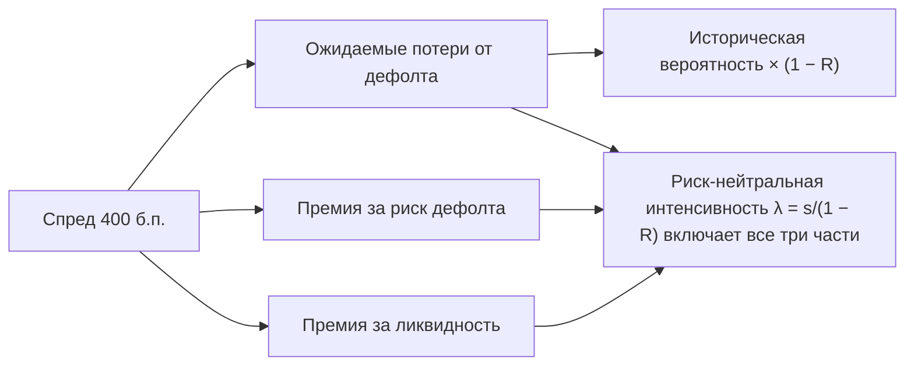

# Кредитный риск облигаций

До сих пор мы считали, что эмитент всегда платит. Корпоративная облигация может не выплатить обещанное, и рынок требует за это дополнительную доходность. Урок о том, как измерить эту надбавку и извлечь из неё вероятность дефолта.

## Кредитный спред

**Кредитный спред** — надбавка к безрисковой ставке, которую требует рынок за риск эмитента. Меряют его по-разному:

| Мера | Определение | Когда использовать |
|---|---|---|
| Спред к доходности | YTM корпоративной бумаги − YTM государственной бумаги близкой дюрации | Быстрое сравнение; так спреды публикуют в обзорах |
| G-спред | YTM бумаги − доходность G-кривой ОФЗ на срок дюрации бумаги | Российский стандарт в аналитике |
| Z-спред | Постоянная $s$, при которой $P_{\text{грязн}} = \sum c_i\,e^{-(z(t_i) + s)t_i}$ | Точная оценка с учётом всей формы кривой |

Z-спред корректнее всего: он сдвигает каждую точку бескупонной кривой (предыдущий урок), а не сравнивает две разные YTM.

Спред оплачивает не только ожидаемые потери от дефолта. В нём есть:
- **премия за риск** — инвесторы не любят потери, которые случаются одновременно с кризисом;
- **премия за ликвидность** — корпоративную облигацию труднее продать, чем ОФЗ.

## Рейтинги и очередь требований

**Кредитные рейтинги** — мнения агентств о вероятности дефолта. По состоянию на 2026 год в России рейтинги присваивают АКРА, «Эксперт РА», НКР и НРА, в мире — S&P Global, Moody's и Fitch.

| Шкала S&P / Fitch | Шкала Moody's | Категория |
|---|---|---|
| AAA … BBB− | Aaa … Baa3 | Инвестиционный уровень |
| BB+ … B− | Ba1 … B3 | Спекулятивный уровень (high yield) |
| CCC+ и ниже | Caa1 и ниже | Высокий риск дефолта |
| D | — | Дефолт |

Национальные шкалы (ruAAA, AAA(RU)) несопоставимы с международными: верх российской шкалы — лучшие заёмщики внутри страны.

При дефолте кредиторы получают **долю возмещения** (recovery rate, $R$). Она зависит от очереди требований:
1. обеспеченный старший долг (senior secured) — возмещение самое высокое, в среднем около половины номинала;
2. необеспеченный старший долг (senior unsecured) — около 40%. Это стандартное допущение рынка кредитных деривативов (модуль 10);
3. субординированный долг — ниже, часто 20–30%;
4. акционеры — последние, обычно ноль.

Средние значения по историческим данным агентств сильно зависят от отрасли и цикла. Для конкретного эмитента это лишь отправная точка.

## Вероятность дефолта из спреда

**Одна выплата.** Бескупонная облигация эмитента платит 100 через $T$ лет. С **риск-нейтральной** вероятностью (модуль 2) $p$ эмитент объявит дефолт, и держатель получит $100R$. Цена:

$$
P_{\text{корп}} = P_{\text{гос}} \cdot \big[(1-p) + pR\big] \quad\Rightarrow\quad p = \frac{1 - P_{\text{корп}}/P_{\text{гос}}}{1 - R}.
$$

**Интенсивность дефолтов.** Пусть дефолт — первый скачок пуассоновского процесса с интенсивностью $\lambda$ (hazard rate). Вероятность дожить до $T$ без дефолта — $e^{-\lambda T}$. Если считать, что при дефолте теряется доля $1-R$ текущей стоимости бумаги, цена бескупонной облигации равна

$$
P_{\text{корп}} = P_{\text{гос}} \cdot e^{-\lambda(1-R)T} \quad\Rightarrow\quad s = \lambda(1-R).
$$

Это **кредитный треугольник**: спред ≈ интенсивность дефолтов × потери при дефолте. Приближение точное при возмещении в доле рыночной стоимости и хорошее при небольших $\lambda$ в других схемах.

**Пример.** Безрисковая непрерывная ставка 12%, трёхлетняя бескупонная облигация компании торгуется со спредом 400 б.п., $R = 40\%$.

- Цены за 100 номинала: $P_{\text{гос}} = 100e^{-0{,}36} = 69{,}77$, $P_{\text{корп}} = 100e^{-0{,}48} = 61{,}88$.
- Одношаговая формула: $p = (1 - 0{,}8869)/0{,}6 = 18{,}8\%$ за три года.
- Кредитный треугольник: $\lambda = 0{,}04/0{,}6 = 6{,}67\%$ в год, вероятность дефолта за три года $1 - e^{-0{,}2} = 18{,}1\%$, за пять лет — 28,3%.

Разница между 18,8% и 18,1% возникает из разных допущений о возмещении: доля номинала в первой формуле, доля рыночной стоимости во второй.

Для сравнения: исторически компании рейтинга BB объявляли дефолт в среднем примерно в 1% случаев в год. **Риск-нейтральная вероятность из спреда в разы выше исторической** — в ней сидят премии за риск и ликвидность. Для оценки деривативов (модуль 10) нужна именно риск-нейтральная вероятность, а для прогноза потерь банка — историческая.

## Где ошибаются

- **Считать высокую YTM высокой ожидаемой доходностью.** Облигация с YTM 25% при безрисковых 14% «обещает» 11% сверху. Но если вероятность дефолта 15% в год при возмещении 30%, ожидаемые потери съедают почти всю надбавку.
- **Путать риск-нейтральную вероятность дефолта с реальной.** Спред в 400 б.п. не значит, что каждая пятая компания обанкротится за три года: большая часть спреда — премия.
- **Сравнивать спреды без учёта очереди требований.** Субординированная облигация банка и старшая облигация того же банка — разные риски, и спред у них должен различаться.
- **Забывать, что спред коррелирует с рынком.** В кризис спреды всех эмитентов расширяются одновременно, и корпоративный портфель теряет разом, хотя дефолтов может не быть.
