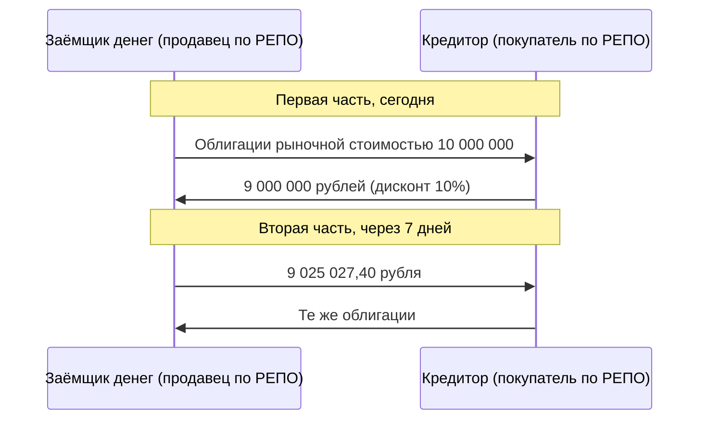

# Денежный рынок: ключевая ставка, RUONIA, SOFR, РЕПО

Денежный рынок — займы на срок от одного дня до года. Его ставки — нижний конец кривой доходности и основа плавающих ставок, к которым привязаны флоатеры (этот модуль), процентные свопы (модуль 6) и форвардные цены (модуль 5).

## Ключевая ставка и процентный коридор

Центральный банк управляет стоимостью денег на один день. Банк России:
- выдаёт банкам кредиты под **ключевую ставку плюс 1 п.п.**;
- принимает депозиты под **ключевую ставку минус 1 п.п.**;
- на аукционах предоставляет и забирает ликвидность по ставкам около ключевой.

Ни один банк не займёт у другого дороже, чем у ЦБ, и не разместит дешевле, чем в ЦБ. Поэтому межбанковские ставки на один день держатся внутри **коридора** шириной 2 п.п. вокруг ключевой.

По состоянию на 11 сентября 2026 года ключевая ставка — 14,00%, следующее заседание совета директоров — 23 октября 2026 года. Актуальное значение — на cbr.ru.

## Ставки овернайт и переход от LIBOR

**LIBOR** — ставка, которую банки из панели сами называли как стоимость необеспеченного займа на срок. Расследования 2012 года показали, что ею манипулировали. Кроме того, реальных сделок за котировками почти не было. Регуляторы заменили LIBOR ставками по фактическим сделкам овернайт:

| Ставка | Валюта | Что измеряет | Администратор | Конвенция |
|---|---|---|---|---|
| RUONIA | RUB | Необеспеченные межбанковские займы овернайт | Банк России | ACT/365 |
| SOFR | USD | Займы овернайт под залог гособлигаций США (РЕПО) | ФРБ Нью-Йорка | ACT/360 |
| €STR | EUR | Необеспеченные займы овернайт у банков | ЕЦБ | ACT/360 |
| SONIA | GBP | Необеспеченные займы овернайт | Банк Англии | ACT/365 |

Публикация LIBOR в долларах от панели банков прекратилась 30 июня 2023 года, синтетический долларовый LIBOR — 30 сентября 2024 года.

Ставка овернайт известна только на один день. Чтобы получить процентный платёж за квартал, её **капитализируют за период** (compounding in arrears):

$$
r_{\text{период}} = \left[\prod_{i=1}^{n}\left(1 + \frac{r_i\,d_i}{B}\right) - 1\right]\cdot\frac{B}{D},
$$

где:
- $r_i$ — ставка дня $i$;
- $d_i$ — число календарных дней, на которые она действует (ставка пятницы действует 3 дня);
- $D = \sum d_i$ — длина периода;
- $B$ — 365 или 360 по конвенции.

**Пример.** Неделя RUONIA:

| День | Пн | Вт | Ср | Чт | Пт |
|---|---|---|---|---|---|
| Ставка | 13,80% | 13,85% | 13,90% | 13,75% | 13,70% |
| Дней действия | 1 | 1 | 1 | 1 | 3 |

$$
r = \left[\left(1 + \tfrac{0{,}138}{365}\right)\cdots\left(1 + \tfrac{0{,}137 \cdot 3}{365}\right) - 1\right]\cdot\frac{365}{7} = 13{,}785\%.
$$

Простое взвешенное среднее дало бы 13,771%. Разница мала за неделю, но за год при ставках 14% набегает около 100 б.п. (сравните с таблицей эффективных ставок в модуле 2). Главное отличие от LIBOR: **ставка за период известна только в его конце**. Платёж по флоатеру или свопу на RUONIA или SOFR определяется за несколько дней до выплаты. Для этого в условиях задают сдвиг наблюдения (lookback), обычно 2–5 рабочих дней.

## РЕПО

**РЕПО** (repurchase agreement) — продажа бумаги с обязательством выкупить её обратно через заданный срок по заранее известной цене. Экономически это **займ денег под залог бумаги**:

- **Ставка РЕПО** определяет цену второй части: $9\,000\,000 \cdot (1 + 0{,}145 \cdot 7/365) = 9\,025\,027{,}40$.
- **Дисконт** (haircut) — запас на случай падения цены залога. Кредитору выдают меньше стоимости бумаг. Если за срок сделки бумаги подешевели сильнее дисконта, кредитор требует довнести обеспечение (**маржин-колл по РЕПО**).
- Купоны по бумагам, выплаченные в течение сделки, экономически принадлежат заёмщику и компенсируются ему.
- Со стороны кредитора та же сделка называется **обратным РЕПО** (reverse repo).

Ставка РЕПО ниже ставки необеспеченного займа: у кредитора есть залог. Поэтому SOFR (обеспеченная) обычно немного ниже необеспеченных долларовых ставок.

**Зачем нужно РЕПО:**
- **финансировать облигации**: купить ОФЗ и тут же отдать их в РЕПО — позиция с плечом, доходность которой равна разнице доходности ОФЗ и ставки РЕПО (сравните с уроком про плечо в модуле 3);
- **занять бумагу** для короткой продажи через обратное РЕПО;
- **разместить свободные деньги** под залог.

**РЕПО с центральным контрагентом.** На Московской бирже основной объём — РЕПО с ЦК, в том числе с **клиринговыми сертификатами участия** (КСУ): участник вносит пул бумаг и занимает под пул, а не под конкретный выпуск. ЦК устанавливает дисконты и гарантирует исполнение. Ставки этого рынка публикуются как индикаторы RUSFAR.

## Другие инструменты денежного рынка

| Инструмент | Суть | Пример |
|---|---|---|
| Межбанковский депозит | Необеспеченный займ между банками | Источник RUONIA |
| Бескупонные гособлигации до года | Продаются с дисконтом к номиналу | US Treasury bills |
| Облигации Банка России (КОБР) | Инструмент, которым ЦБ забирает у банков лишнюю ликвидность, купон по ключевой ставке | Покупать могут только банки |
| Коммерческие бумаги | Краткосрочный необеспеченный долг компаний | US commercial paper |
| Фонды денежного рынка | Паевые фонды, вложенные в РЕПО и короткие инструменты | БПИФ на RUSFAR, US money market funds |

## Где ошибаются

- **Считать ставку «на RUONIA» известной в начале периода.** В отличие от LIBOR, капитализированная ставка овернайт известна в конце. При планировании денежных потоков нужен её прогноз.
- **Путать дисконт в РЕПО с процентами.** Дисконт — это недовыданные деньги, а не плата. Проценты считаются только на фактически выданную сумму.
- **Думать, что РЕПО снимает риск бумаги.** Заёмщик по РЕПО несёт весь рыночный риск залога: бумаги он выкупит по заранее известной цене, сколько бы они ни стоили на рынке.
- **Сравнивать SOFR и RUONIA напрямую.** Одна обеспечена залогом и считается по ACT/360, другая необеспечена и считается по ACT/365. Кроме того, это ставки в разных валютах, и их разность отражает инфляцию и политику двух центробанков, а не «дешевизну» денег.
