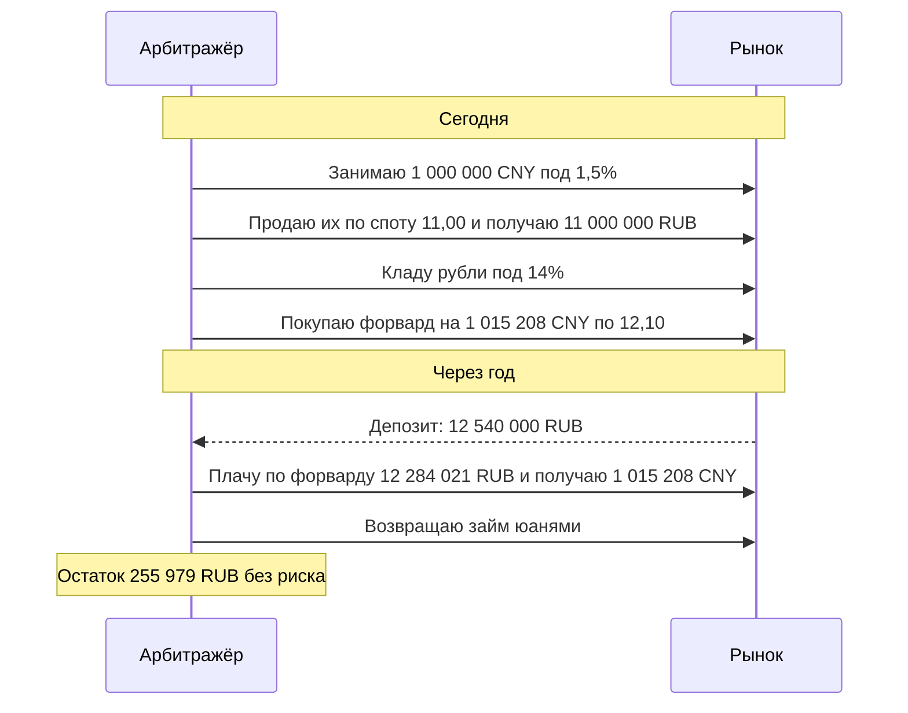

# Валютные форварды, валютные свопы и вечные фьючерсы

У валюты есть своя процентная ставка: доллары или юани на депозите приносят проценты в своей валюте. Поэтому форвардный курс определяется разницей ставок двух стран. Урок выводит эту связь, показывает, как она используется в валютном свопе, и разбирает вечный фьючерс, у которого вовсе нет даты экспирации.

## Покрытый процентный паритет

Котировка валютной пары — цена одной единицы базовой валюты в котируемой. Например, CNY/RUB = 11,00 значит 11 рублей за юань. Пусть $r_d$ — ставка в котируемой (domestic) валюте, $r_f$ — в базовой (foreign).

Два способа получить рубли через срок $\tau$ из одного юаня:
1. положить юань под $r_f$ и продать итог по форвардному курсу $F$;
2. продать юань сейчас по $S$ и положить рубли под $r_d$.

Оба пути безрисковые, значит, результаты равны. Это **покрытый процентный паритет** (covered interest parity, CIP):

$$
F = S\cdot\frac{1 + r_d\,\tau_d}{1 + r_f\,\tau_f} \qquad \text{или в непрерывной форме} \qquad F = S\,e^{(r_d - r_f)\tau}.
$$

Доли года $\tau_d$ и $\tau_f$ считаются по конвенциям своих валют (модуль 2). Это частный случай формулы стоимости владения: иностранная валюта — актив с «дивидендной доходностью» $r_f$.

**Пример** (ставки условные). CNY/RUB спот 11,00. Рублёвая ставка на год — 14% (ACT/365), юаневая — 1,5% (ACT/360), год — 365 дней.

$$
F = 11{,}00\cdot\frac{1 + 0{,}14}{1 + 0{,}015\cdot 365/360} = 12{,}3521.
$$

Разница $F - S = 1{,}3521$ называется **форвардными пунктами**. Валюта с более высокой ставкой (рубль) торгуется на форварде дешевле спота: за юань в будущем дают больше рублей. Это не прогноз ослабления рубля, а компенсация разницы процентов.

### Арбитраж при нарушении паритета

Пусть рынок котирует годовой форвард по 12,10 — ниже справедливого. Покупаем дешёвое (юани на форварде) и финансируем покупку:

## Валютный своп (FX swap)

**Валютный своп** — две сделки в одном контракте: покупка валюты сегодня по споту (ближняя нога) и её обратная продажа через срок по форвардному курсу (дальняя нога). Разница курсов ног — те же форвардные пункты.

Экономически это займ одной валюты под залог другой. Отдал юани, получил рубли, через срок вернул рубли и получил юани. Поэтому валютный своп:
- даёт **финансирование в нужной валюте**. Банк с избытком юаней и нехваткой рублей не берёт необеспеченный кредит, а делает своп;
- **задаёт подразумеваемую ставку**. Из котировки свопа и известной ставки одной валюты по паритету выводится ставка другой. При форварде 12,10 подразумеваемая рублёвая ставка — $(12{,}10/11{,}00)\cdot 1{,}01521 - 1 = 11{,}67\%$ против рыночных 14%.

На валютном рынке Мосбиржи своп-сделки идут отдельными инструментами (например, «сегодня / завтра» по юаню). Их ставки — важный индикатор стоимости валютной ликвидности.

С 2008 года паритет на мировых рынках нарушается устойчиво: доллары через валютный своп стоят дороже, чем долларовая ставка. Разница называется **кросс-валютным базисом** и возникает из-за ограничений на балансы банков, которые мешают арбитражу. В модуле 6 мы вернёмся к нему на кросс-валютных свопах.

## Вечный фьючерс

У обычного фьючерса есть дата экспирации, в которую он сходится к споту. **Вечный фьючерс** (perpetual futures) не истекает никогда. Чтобы его цена не уходила от спота, между длинными и короткими позициями каждый день перечисляется **фандинг** (funding): доплата той стороне, против которой цена фьючерса отклонилась от спота.

- Цена вечного фьючерса **выше** спота — длинные позиции платят коротким. Держать лонг становится дорого, покупатели уходят, цена возвращается к споту.
- Цена **ниже** спота — короткие платят длинным.

На Московской бирже вечные фьючерсы на курсы USD/RUB, EUR/RUB и CNY/RUB торгуются с 2023 года, позже появились вечные фьючерсы и на другие активы, например на индекс МосБиржи и золото. Для валютных контрактов (по состоянию на 2026):
- отклонение $D$ = средневзвешенная цена фьючерса за дневную сессию − курс Банка России этого дня;
- фандинг зависит от $D$ и ограничен сверху и снизу лимитами, заданными в спецификации;
- фандинг включается в вариационную маржу вечернего клиринга.

Точная формула с коэффициентами меняется — смотрите её в спецификации конкретного контракта на moex.com.

**Экономика фандинга — тот же паритет.** Держатель длинной позиции получает экспозицию на доллар, не отдавая рубли и продолжая получать на них рублёвую ставку. Если бы фандинг был нулевым, это было бы бесплатно. Поэтому в равновесии цена фьючерса держится чуть выше спота, а фандинг в среднем близок к дневной разнице ставок:

$$
\text{фандинг за день} \approx S\cdot\frac{r_d - r_f}{365}.
$$

При курсе 82, рублёвой ставке 14% и долларовой 4% это около 0,0225 рубля на доллар в день, или 10% годовых от стоимости позиции. Длинная позиция в вечном фьючерсе за год платит примерно ту же сумму, которую покупатель годового форварда «платит» через форвардные пункты.

На криптовалютных биржах вечные фьючерсы (perpetual swaps) — основной инструмент, фандинг там обычно перечисляется раз в 8 часов.

## Где ошибаются

- **Видеть в форвардных пунктах прогноз курса.** Форвардный курс 12,35 при споте 11 не значит, что рынок ждёт ослабления рубля на 12%. Непокрытый паритет (ожидаемый курс равен форварду) эмпирически не выполняется. Валюты с высокой ставкой в среднем обесцениваются меньше, чем показывает форвард: на этом построена стратегия керри-трейд (carry trade).
- **Путать конвенции ставок в паритете.** Юаневая ставка по ACT/360 и рублёвая по ACT/365 дают разные доли года. На сроке год ошибка в конвенции сдвигает форвард на несколько тысячных — больше типичного спреда.
- **Держать вечный фьючерс долго, не считая фандинг.** Фандинг начисляется каждый день и за год при высокой рублёвой ставке съедает около 10% стоимости длинной позиции в валюте.
- **Считать арбитраж по паритету бесплатным.** Нужны лимиты на контрагентов, доступ к займам в обеих валютах и место на балансе. Если их нет, отклонение от паритета может держаться долго.
