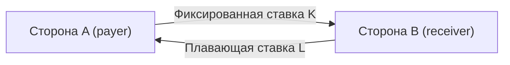

# Процентный своп

Процентный своп (interest rate swap, IRS) — договор обмениваться процентными платежами: одна сторона платит фиксированную ставку, другая — плавающую, на один и тот же условный номинал. Это самый большой по объёму дериватив в мире. Урок показывает, что своп — всего лишь разница двух облигаций, и выводит из этого его цену и риск.

## Устройство

| Термин | Значение |
|---|---|
| Номинал $N$ | Сумма, от которой считаются проценты. Сам номинал не передаётся |
| Фиксированная нога | Платежи $N\cdot K\cdot\tau_i$ по ставке $K$ |
| Плавающая нога | Платежи $N\cdot L_i\cdot\tau_i$, где $L_i$ — плавающая ставка за период $i$ |
| Плательщик фиксированной ставки (payer) | Платит $K$, получает $L$. Выигрывает при росте ставок |
| Получатель фиксированной ставки (receiver) | Получает $K$, платит $L$. Выигрывает при падении ставок |
| Даты | Дата начала, график платежей по каждой ноге, конвенции подсчёта дней (модуль 2) |

Платежи в одну дату обычно сворачиваются в одну нетто-сумму.



**Зачем.** Компания взяла кредит под плавающую ставку и боится её роста. Она входит в своп как плательщик фиксированной ставки: получает $L$ и отдаёт его банку-кредитору, а сама платит $K$. Долг стал фиксированным без перезаключения кредита. Обратная операция превращает фиксированный долг в плавающий. Банки свопами управляют процентным риском баланса, инвесторы — дюрацией портфеля.

## Своп как разница двух облигаций

Оценивать своп с нуля не нужно: его легко свести к уже знакомым облигациям. Для этого применим трюк — добавим к обеим ногам выплату номинала в конце срока. На экономику это не влияет: суммы одинаковые, в один и тот же день, и они гасят друг друга. Зато теперь каждая нога превратилась в облигацию:

- **фиксированная нога** — обычная облигация с купоном $K$: $B_{\text{фикс}} = N\left(K\sum_i \tau_i P(0,T_i) + P(0,T_n)\right)$, то есть дисконтированные купоны плюс дисконтированный номинал;
- **плавающая нога** — флоатер. А про него из модуля 4 известно: в дату пересмотра купона он стоит ровно номинал, $B_{\text{плав}} = N$. Считать ничего не нужно.

Плательщик фиксированной ставки как бы выпустил первую облигацию и купил вторую, поэтому своп стоит для него разницу:

$$
V_{\text{payer}} = B_{\text{плав}} - B_{\text{фикс}} = N\left(1 - P(0,T_n) - K\cdot A\right), \qquad A = \sum_{i=1}^n \tau_i P(0,T_i),
$$

где:
- $N$ — номинал свопа, $K$ — фиксированная ставка;
- $T_1, \dots, T_n$ — даты платежей, $\tau_i$ — длина периода в годах;
- $P(0,T_i)$ — дисконт-факторы из модуля 4;
- $A$ — сумма дисконтированных длин периодов. Её называют **аннуитетом** свопа: это стоимость потока «по 1% годовых на весь срок», удобная мера чувствительности.

**Справедливая ставка свопа** (par swap rate) — та ставка $K$, при которой своп в момент заключения не стоит ничего ни одной стороне. Приравняв стоимость к нулю, получаем:

$$
S_{0,n} = \frac{1 - P(0,T_n)}{A}.
$$

Так котируют свопы: «пятилетний своп — 12,12%» означает, что новый пятилетний своп по этой фиксированной ставке ничего не стоит.

## Своп как набор соглашений о будущей ставке

Есть и второй взгляд на своп, который пригодится в следующих уроках. Своп — это просто набор маленьких обменов, по одному на каждый период. Отдельный такой обмен называется **соглашением о будущей процентной ставке** (forward rate agreement, FRA): в дату $T_i$ стороны платят друг другу разницу $N\tau_i(L_i - K)$ между фактической плавающей ставкой и фиксированной.

Сколько стоит один такой обмен? Плавающая ставка $L_i$ сегодня неизвестна, но её безарбитражная оценка известна — это форвардная ставка $F_i$ из модуля 4. Поэтому FRA стоит $N\tau_i(F_i - K)P(0,T_i)$: ожидаемая разница, приведённая к сегодняшнему дню. Своп — сумма таких платежей:

$$
V_{\text{payer}} = N\sum_{i=1}^n \tau_i\,(F_i - K)\,P(0,T_i),
$$

где $F_i = f(T_{i-1}, T_i)$ — форвардная ставка на $i$-й период.

Отсюда второй смысл справедливой ставки: это **среднее форвардных ставок**, взвешенное множителями $\tau_i P(0,T_i)$. Две формулы дают одно и то же: если подставить $\tau_i F_i P(0,T_i) = P(0,T_{i-1}) - P(0,T_i)$ (это просто определение форвардной ставки, переписанное иначе), соседние члены суммы сократятся и останется $1 - P(0,T_n)$ — в точности числитель первой формулы.

**Пример.** Кривая с годовыми платежами (та же, что в домашнем задании модуля 4):

| $T$ | 1 | 2 | 3 | 4 | 5 |
|---|---|---|---|---|---|
| $P(0,T)$ | 0,88110 | 0,78596 | 0,70416 | 0,63216 | 0,56740 |
| Форвардная ставка | 13,49% | 12,10% | 11,62% | 11,39% | 11,41% |
| Ставка свопа на срок $T$ | 13,49% | 12,84% | 12,48% | 12,25% | 12,12% |

Для пяти лет $A = 3{,}57078$, $S_{0,5} = (1 - 0{,}5674)/3{,}57078 = 12{,}115\%$.

Ставка свопа выше последних форвардов, но ниже первых: она усредняет инвертированную кривую.

## Переоценка и риск

**Своп через год.** Банк год назад стал плательщиком 12,115% по пятилетнему свопу на 1 млрд рублей. Только что прошёл обмен платежами, и плавающая ставка на следующий период зафиксирована по рынку. Ставки выросли, новые дисконт-факторы на оставшиеся 4 года:

| $T$ | 1 | 2 | 3 | 4 |
|---|---|---|---|---|
| $P(1,T)$ | 0,87873 | 0,78038 | 0,69489 | 0,61988 |

$$
V = 10^9\cdot\left(1 - 0{,}61988 - 0{,}12115\cdot 2{,}97389\right) \approx 19{,}8 \text{ млн рублей}.
$$

Проверка через рыночную ставку: новая четырёхлетняя ставка свопа равна $0{,}38012/2{,}97389 = 12{,}782\%$. Значит, $V = N(S_{\text{нов}} - K)\cdot A = 10^9\cdot 0{,}00667\cdot 2{,}97389 \approx 19{,}8$ млн. Банк платит 12,115% там, где рынок сейчас требует 12,782%, и эту выгоду получает четыре года.

**DV01 свопа.** Формула $V = N(S_{\text{рын}} - K)A$ показывает: стоимость свопа меняется пропорционально сдвигу рыночной ставки, а коэффициент — номинал, умноженный на аннуитет. Значит, чувствительность к сдвигу на 1 базисный пункт (DV01 из модуля 4) считается совсем просто:

$$
\text{DV01} \approx N\cdot A\cdot 0{,}0001.
$$

Для нового пятилетнего свопа на 1 млрд рублей это $10^9 \cdot 3{,}571 \cdot 0{,}0001 = 357$ тысяч рублей на каждый базисный пункт.

Знак у этой чувствительности противоположен облигационному: держатель облигации при росте ставок теряет, а плательщик фиксированной ставки по свопу — зарабатывает. Говорят, что у него **отрицательная дюрация**. Отсюда и главное практическое применение: чтобы уменьшить процентный риск портфеля облигаций, не нужно продавать сами бумаги — достаточно войти в своп плательщиком.

```python
# Python 3.12, numpy 2.x
import numpy as np

def swap_value_payer(notional, fixed_rate, dfs, taus):
    dfs, taus = np.asarray(dfs), np.asarray(taus)
    annuity = (taus * dfs).sum()
    return notional * (1 - dfs[-1] - fixed_rate * annuity), (1 - dfs[-1]) / annuity

P = [0.88110, 0.78596, 0.70416, 0.63216, 0.56740]
_, par = swap_value_payer(1e9, 0.0, P, [1] * 5)
print(round(par, 5))                                                            # 0.12115
print(round(swap_value_payer(1e9, par, [0.87873, 0.78038, 0.69489, 0.61988], [1] * 4)[0] / 1e6, 2))  # 19.83
```

## Где ошибаются

- **Путать номинал с риском.** Номинал свопов в мире — сотни триллионов долларов, но реальная стоимость и риск на порядки меньше. Риск свопа — это DV01 и возможная стоимость замены при дефолте контрагента, а не номинал.
- **Считать, что плавающая нога всегда стоит номинал.** Это верно в дату фиксации ставки и только если дисконтирование и прогноз идут по одной кривой. В следующем уроке мы разделим эти кривые.
- **Забывать про первый зафиксированный купон.** Между датами пересмотра плавающая нога стоит $N(1 + L_i\tau_i)P(t, T_i)$, а не $N$. Ставку текущего периода уже знают, и она меняет оценку.
- **Путать направление.** «Купить своп» на разных рынках может означать разное. Всегда говорите явно: плачу фиксированную (payer) или получаю фиксированную (receiver).
