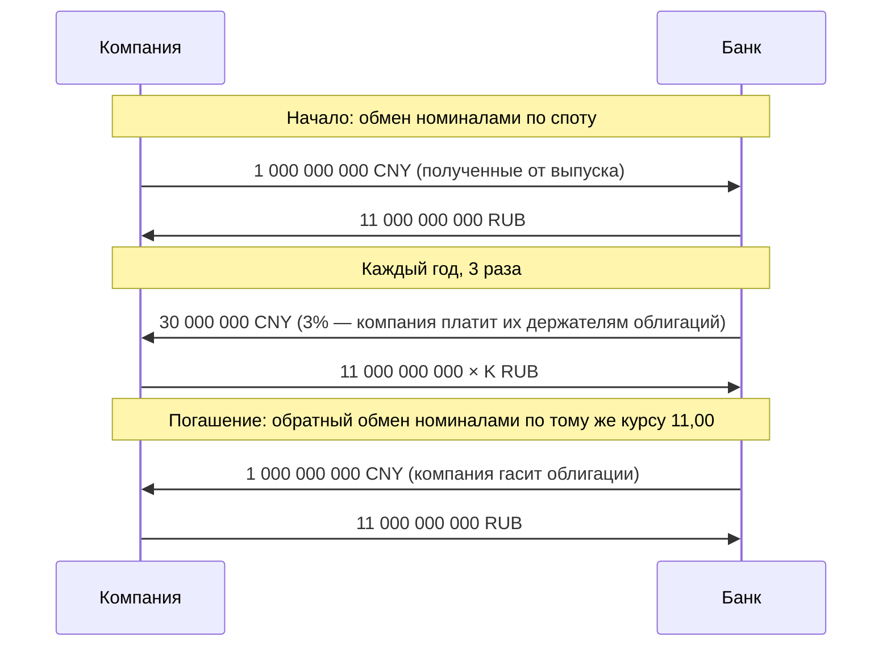

# Кросс-валютный своп

Кросс-валютный своп (cross-currency swap, CCS) — обмен процентными платежами **в разных валютах** с обменом номиналами в начале и в конце. Он превращает долг в одной валюте в долг в другой. Урок показывает механику, оценку и главное отличие от процентного свопа: из-за обмена номиналом риски здесь намного больше.

## Механика

Российская компания заняла 1 млрд юаней на три года под 3% годовых (выпуск облигаций в юанях), но выручка у неё в рублях. Она заключает с банком кросс-валютный своп по курсу 11,00:

В итоге у компании рублёвый долг 11 млрд под ставку $K$: валютный риск и купонов, и номинала переложен на банк.

| Вид | Нога 1 | Нога 2 |
|---|---|---|
| Фиксированная–фиксированная | Фиксированная в валюте A | Фиксированная в валюте B |
| Фиксированная–плавающая | Фиксированная в валюте A | Плавающая в валюте B |
| Плавающая–плавающая (базисный CCS) | Овернайт-ставка валюты A + спред | Овернайт-ставка валюты B |

Рыночный стандарт — плавающая–плавающая форма с **базисным спредом**, остальные собираются из неё и процентных свопов в каждой валюте.

## Оценка

Здесь номиналами реально обмениваются, поэтому трюк с «добавим номинал» не нужен: каждая нога и так уже облигация. Компания из примера получает юаневые платежи и платит рублёвые, то есть владеет юаневой облигацией и выпустила рублёвую. Чтобы сложить их в одну цифру, юаневую часть переводим в рубли по текущему курсу:

$$
V_{\text{RUB}} = S_t\cdot B_{\text{CNY}} - B_{\text{RUB}},
$$

где:
- $B_{\text{CNY}}$ — стоимость юаневой ноги в юанях: купоны плюс номинал, дисконтированные по юаневой кривой;
- $B_{\text{RUB}}$ — то же для рублёвой ноги, в рублях и по рублёвой кривой;
- $S_t$ — текущий курс CNY/RUB;
- $V_{\text{RUB}}$ — стоимость свопа для компании, в рублях.

**Справедливая ставка.** В начале стоимость нулевая. Если юаневый купон 3% равен рыночной юаневой ставке, то $B_{\text{CNY}}$ равно номиналу 1 млрд. Тогда рублёвая ставка $K$ должна сделать $B_{\text{RUB}}$ равной 11 млрд, то есть $K$ равна рублёвой ставке свопа на три года (без базиса). При рублёвой кривой из предыдущего урока это 12,0%.

**Переоценка.** Через год, сразу после купонов, курс вырос до 12,50, а ставки в обеих валютах не изменились. Обе ноги стоят номинал в своей валюте:

$$
V_{\text{RUB}} = 12{,}50\cdot 1\,000\,000\,000 - 11\,000\,000\,000 = +1{,}5 \text{ млрд рублей}.
$$

Для компании это хедж: её юаневый долг в рублях вырос ровно на эту сумму. Но для банка это **требование к компании на 1,5 млрд рублей**, 14% номинала, за один год. Для сравнения, процентный своп на 11 млрд при изменении ставок на 100 б.п. стоил бы около 250 млн (номинал × аннуитет ≈ 2,4 × 1%). Из-за обмена номиналом кредитный риск кросс-валютного свопа на порядок выше, чем у процентного, и банк либо требует обеспечение, либо закладывает этот риск в ставку.

**Связь с валютными форвардами.** Если процентные ставки в обеих валютах — рыночные ставки без базиса, кросс-валютный своп раскладывается в набор валютных форвардов (модуль 5): каждый обмен купонами и финальный обмен номиналами — форвардная сделка по курсу, отличному от рыночного форвардного. Приведённые стоимости всех этих отклонений в сумме дают ноль.

## Кросс-валютный базис

Если покрытый процентный паритет выполняется (модуль 5), плавающие ноги по овернайт-ставкам в двух валютах с обменом номиналами стоят одинаково, и спред на одну из ног равен нулю. На деле с 2008 года спред устойчиво ненулевой. Его называют **кросс-валютным базисом** и котируют как добавку к ставке недолларовой ноги.

Отрицательный базис по паре EUR/USD означает, что тот, кто занимает доллары через своп (получает долларовый номинал и платит SOFR, а взамен отдаёт евро), получает на отданные евро **меньше** рыночной ставки €STR. Иначе говоря, доллары через своп дороже, чем по долларовой ставке. Причины:
- постоянный спрос на доллары со стороны неамериканских банков, страховщиков и компаний;
- после 2008 года регулирование (леверидж банков, резервы капитала) сделало арбитраж по паритету дорогим: он раздувает баланс.

Базис растёт в стресс: в марте 2020 года ФРС открывала своп-линии с центробанками, чтобы снизить нехватку долларов. Для кривых это значит, что валютные форварды нельзя строить только по паритету ставок: нужна кривая базиса.

## Где ошибаются

- **Не учитывать риск номинала.** Кросс-валютный своп на 3 года с плавающими ставками почти нечувствителен к ставкам, но при движении курса на 20% его стоимость — 20% номинала. Лимиты на контрагента считают по потенциальной стоимости с учётом курса, а не по DV01.
- **Хеджировать купоны, но не номинал.** Своп без обмена номиналом в конце (coupon-only swap) оставляет главный риск — погашение долга в валюте — открытым.
- **Приравнивать базис к ошибке рынка.** Базис — цена ограничений на балансы и спроса на валюту. Попытка «заработать на арбитраже» требует капитала, который этот заработок не окупает.
- **Путать кросс-валютный своп и валютный своп.** Валютный своп (модуль 5) — две сделки по курсу без промежуточных купонов, обычно на срок до года. Кросс-валютный своп — многолетний обмен процентными потоками с обменом номиналом.
