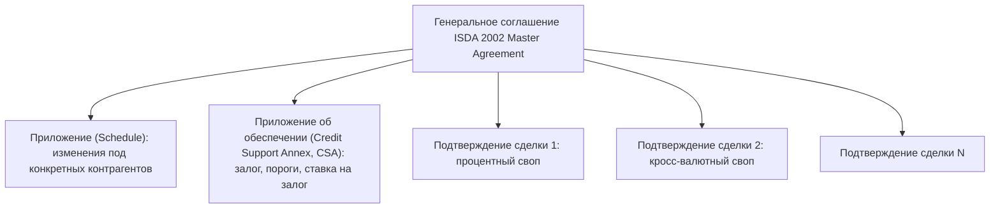

# Свопы на доходность, документация и риск контрагента

Логика свопа не ограничена ставками: обменивать можно доходность акции, цену нефти, что угодно измеримое. Урок разбирает свопы на полную доходность и товарные свопы, а затем то, что стоит за любым внебиржевым свопом: договор ISDA, обеспечение и риск того, что контрагент не заплатит.

## Своп на полную доходность

**Своп на полную доходность** (total return swap, TRS) — одна сторона платит **полную доходность** базового актива (изменение цены плюс дивиденды или купоны), другая — плавающую ставку плюс спред. Базовым активом может быть акция, корзина, индекс, облигация или кредит. Частный случай на акции называют **equity-свопом**.

**Пример.** Хедж-фонд хочет экспозицию на корзину акций на 1 млрд рублей, не покупая их. Банк заключает с ним TRS на квартал:
- банк платит фонду полную доходность корзины;
- фонд платит банку RUONIA + 2% годовых (пусть RUONIA за квартал в среднем 14%).

За квартал корзина выросла на 5% и выплатила дивиденды на 1%:

| Поток | Сумма, рублей |
|---|---|
| Банк → фонд: полная доходность $10^9 \cdot 6\%$ | 60 000 000 |
| Фонд → банк: $10^9 \cdot 16\% \cdot 0{,}25$ | 40 000 000 |
| Нетто фонду | +20 000 000 |

Упади корзина на 5%, фонд заплатил бы банку ещё и падение: $50 + 40 - 10 = 80$ млн.

Экономически TRS — **синтетическая покупка с плечом**. Фонд получает доходность акций и платит проценты, как если бы купил их на заёмные деньги (модуль 3). Банк обычно хеджирует позицию, покупая корзину сам. Для него TRS — займ фонду под залог акций, а спред 2% — маржа. Акции числятся на балансе банка, поэтому фонд может не раскрывать свою экспозицию.

Последнее сыграло главную роль в истории **Archegos Capital** (март 2021 года). Фонд через TRS с несколькими банками набрал позиции в отдельных акциях, во много раз превышающие его капитал. Ни один банк не видел полной картины. Когда цены упали, банки начали принудительно закрывать позиции, продавая акции-хеджи. Потери банков превысили 10 млрд долларов, из них у Credit Suisse — около 5,5 млрд.

## Товарный своп

Авиакомпания обменивает рыночную цену топлива на фиксированную: платит 700 долларов за тонну авиакеросина и получает среднюю за месяц рыночную цену по 10 000 тонн в месяц в течение года.
- Рыночная цена 780 — компания получает $80 \cdot 10\,000 = 800\,000$ долларов, которые компенсируют дорогое топливо.
- Цена 650 — компания платит 500 000 долларов, но топливо дёшево.

Итог — фиксированная цена топлива 700. Оценка — тот же принцип, что у процентного свопа: $\sum_i (F_i - K)\,Q_i\,P(0,T_i)$, где $F_i$ — форвардные цены товара на месяц $i$ (модуль 5).

Усреднение по месяцу снижает риск манипуляции ценой одного дня и соответствует реальной закупке, растянутой во времени.

## Документация: ISDA и CSA

Внебиржевые деривативы оформляются стандартными договорами Международной ассоциации свопов и деривативов (ISDA):

Все сделки под одним генеральным соглашением — **один договор**. Отсюда главное свойство — **ликвидационный неттинг** (close-out netting). При дефолте одной стороны все сделки прекращаются, их стоимости сворачиваются в одну сумму.

**Пример.** С обанкротившимся контрагентом три сделки стоимостью (для нас) +50, −30, −15 млн.
- **Без неттинга**: мы должны заплатить 45 млн в конкурсную массу, а свои 50 млн требуем как рядовой кредитор и получим, скажем, 40% — 20 млн. Итог: −25 млн.
- **С неттингом**: требование $50 - 30 - 15 = 5$ млн, потеря при том же возмещении — 3 млн.

В России аналог — генеральное соглашение о срочных сделках на финансовых рынках (RISDA), разработанное СРО НФА вместе с Ассоциацией российских банков и НВА. Ликвидационный неттинг защищён статьёй 4.1 закона о несостоятельности (банкротстве).

**CSA** задаёт, как стороны обеспечивают текущую стоимость сделок:
- **вариационная маржа** — залог на сумму текущей стоимости, пересчитывается ежедневно;
- **начальная маржа** — дополнительный буфер на время закрытия позиций при дефолте;
- **порог** (threshold) и **минимальная сумма перевода** — ниже порога залог не требуется;
- **допустимые активы** (деньги, гособлигации) и **ставка на денежный залог** — обычно овернайт-ставка. Отсюда дисконтирование по OIS (урок про мультикривой подход).

После кризиса 2008 года страны G20 договорились о реформе внебиржевого рынка. Стандартные процентные свопы стали обязательными к клирингу через центральных контрагентов. Для неклиринговых сделок в 2016–2022 годах поэтапно ввели обязательные вариационную и начальную маржу.

## Риск контрагента и CVA

Если залога нет или его не хватает, при дефолте контрагента мы теряем стоимость замены сделки, но только если она для нас положительна. **Ожидаемая положительная стоимость** на дату $t$ — **ожидаемая экспозиция** (expected exposure) $EE(t) = \mathbb{E}[\max(V_t, 0)]$. Цена этого риска — **корректировка на кредитный риск контрагента** (credit valuation adjustment, CVA):

$$
\text{CVA} \approx (1 - R)\sum_i EE(t_i)\,\big[Q(t_{i-1}) - Q(t_i)\big]\,P(0, t_i),
$$

где $Q(t) = e^{-\lambda t}$ — вероятность, что контрагент доживёт до $t$ без дефолта (модуль 4).

**Пример.** Своп на 3 года без залога. Ожидаемая экспозиция на конец 1, 2 и 3 года (по результатам моделирования) — 20, 30 и 25 млн рублей. Интенсивность дефолтов контрагента — 3%, $R = 40\%$, дисконт-факторы OIS — 0,885, 0,792, 0,713.

$$
\text{CVA} = 0{,}6\cdot\big(20 \cdot 0{,}02955 \cdot 0{,}885 + 30 \cdot 0{,}02868 \cdot 0{,}792 + 25 \cdot 0{,}02783 \cdot 0{,}713\big) \approx 1{,}02 \text{ млн рублей}.
$$

Справедливая стоимость свопа для банка — безрисковая стоимость минус CVA. Экспозицию $EE(t)$ считают методом Монте-Карло по сценариям рыночных факторов. Этот метод появится в модуле 10, а полный набор корректировок (XVA) — тема для дальнейшего изучения (модуль 11).

## Где ошибаются

- **Считать TRS безрисковым для банка, раз у него есть хедж.** Банк защищён от цены акций, но не от дефолта клиента в момент, когда тот должен большую сумму. Нужна начальная маржа, покрывающая падение цены за время закрытия позиции. У Archegos её было мало, а позиции огромные.
- **Оценивать экспозицию по текущей стоимости сделки.** Своп, который сегодня стоит ноль, через год может стоить сотни миллионов. Риск определяет распределение будущих стоимостей, а не текущая.
- **Путать номинальную стоимость и экспозицию после неттинга.** Лимиты и капитал считаются по нетто-экспозиции внутри генерального соглашения. Сделки под разными соглашениями не неттингуются.
- **Игнорировать связь экспозиции и дефолта** (wrong-way risk). Кросс-валютный своп, по которому российский банк получает доллары от российской компании, стоит больше всего при резком ослаблении рубля. Именно тогда у компании растёт вероятность дефолта. Формула CVA выше предполагает независимость и такой риск занижает.
