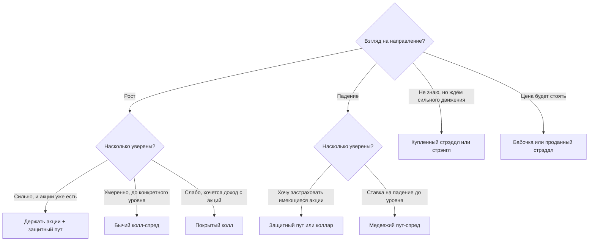

# Опционные стратегии

Комбинируя опционы разных страйков с базовым активом, можно получить почти любую форму выплаты. Урок разбирает стандартные конструкции и учит главному: по взгляду на рынок подобрать стратегию и заранее знать её максимальную прибыль, максимальный убыток и точки безубыточности.

## Исходные котировки

Во всех примерах акция стоит 100, до экспирации 3 месяца. Опционы европейские, премии:

| Страйк | 90 | 95 | 100 | 105 | 110 |
|---|---|---|---|---|---|
| Колл | 13,49 | 9,67 | 6,53 | 4,14 | 2,46 |
| Пут | 0,83 | 1,86 | 3,57 | 6,04 | 9,21 |

Цены согласованы по паритету колл–пут при ставке 12% и проходят все проверки из предыдущего урока. Прибыль ниже считается в экспирацию, без процентов на премии.

Три величины, которыми описывают любую стратегию:
- **максимальная прибыль** — лучший возможный исход;
- **максимальный убыток** — худший;
- **точка безубыточности** — цена актива в экспирацию, при которой стратегия выходит в ноль. Их может быть две, если стратегия теряет и на росте, и на падении.

## Стратегии с базовым активом

| Стратегия | Состав | Взгляд | Макс. прибыль | Макс. убыток | Безубыточность |
|---|---|---|---|---|---|
| Покрытый колл (covered call) | Акция + проданный колл 105 | Умеренный рост или боковик | $105 - 100 + 4{,}14 = 9{,}14$ | $100 - 4{,}14 = 95{,}86$ (акция обнулилась) | 95,86 |
| Защитный пут (protective put) | Акция + купленный пут 95 | Рост, но нужна страховка | Не ограничена | $100 - 95 + 1{,}86 = 6{,}86$ | 101,86 |
| Коллар (collar) | Акция + купленный пут 95 + проданный колл 105 | Защита без затрат, согласны отдать рост выше 105 | $105 - 100 + 2{,}28 = 7{,}28$ | $100 - 95 - 2{,}28 = 2{,}72$ | 97,72 |

**Коллар** в примере даже приносит деньги: проданный колл 105 (4,14) дороже купленного пута 95 (1,86) на 2,28. Итог стоимости акции в экспирацию зажат между 95 и 105. Подбором страйков делают **коллар без затрат** (zero-cost collar) — его часто используют владельцы крупных пакетов и компании при хеджировании выручки.

По паритету покрытый колл — это **проданный пут** плюс облигация, а защитный пут — это **купленный колл** плюс облигация. Профили выплат совпадают, отличаются только деньги сегодня.

## Спреды

| Стратегия | Состав | Взгляд | Стоимость | Макс. прибыль | Макс. убыток | Безубыточность |
|---|---|---|---|---|---|---|
| Бычий колл-спред | +колл 100, −колл 110 | Рост до 110 | 4,07 | $10 - 4{,}07 = 5{,}93$ | 4,07 | 104,07 |
| Медвежий пут-спред | +пут 100, −пут 90 | Падение до 90 | 2,74 | $10 - 2{,}74 = 7{,}26$ | 2,74 | 97,26 |
| Бабочка (butterfly) | +колл 95, −2 колла 100, +колл 105 | Цена останется около 100 | $9{,}67 - 13{,}06 + 4{,}14 = 0{,}75$ | $5 - 0{,}75 = 4{,}25$ при $S_T = 100$ | 0,75 | 95,75 и 104,25 |

Спред дешевле одиночного опциона, потому что проданный опцион частично оплачивает купленный. Плата за это — ограниченная прибыль. Бабочка стоит мало, но и прибыль приносит в узком диапазоне. Кроме того, это инструмент арбитражной проверки: её цена не может быть отрицательной (предыдущий урок).

## Ставки на волатильность

| Стратегия | Состав | Взгляд | Стоимость (макс. убыток) | Безубыточность |
|---|---|---|---|---|
| Стрэддл (straddle), купленный | +колл 100, +пут 100 | Сильное движение в любую сторону | $6{,}53 + 3{,}57 = 10{,}10$ | 89,90 и 110,10 |
| Стрэнгл (strangle), купленный | +пут 95, +колл 105 | Очень сильное движение | $1{,}86 + 4{,}14 = 6{,}00$ | 89,00 и 111,00 |

Купленный стрэддл зарабатывает, если за три месяца цена уйдёт больше чем на 10,1%. Направление не важно. Это ставка не на рост и не на падение, а на то, что реальное движение окажется больше заложенного в премию. Продавец стрэддла ставит на обратное и имеет неограниченный риск в обе стороны.

Премия стрэддла — это рыночная оценка того, насколько сильно актив сдвинется. Есть грубое правило, позволяющее перевести её в годовую волатильность прямо в уме:

$$
\text{цена стрэддла на деньгах} \approx 0{,}8\,S\,\sigma\sqrt{\tau},
$$

где $S$ — цена актива, $\sigma$ — годовая волатильность, $\tau$ — срок в годах. Проверим на наших числах: $0{,}8 \cdot 100 \cdot \sigma \cdot \sqrt{0{,}25} = 10{,}1$, откуда $\sigma \approx 25\%$. То есть рынок закладывает в цену этих опционов волатильность около 25% годовых. Как рассчитать её точно — тема модуля 9.

## Как выбрать стратегию



```python
# Python 3.12, numpy 2.x
import numpy as np

def payoff(legs, s_T):
    """legs: список кортежей (тип, страйк, количество, премия); тип — 'call', 'put' или 'stock'.
    Для акции страйк — цена покупки, премия — 0. Возвращает прибыль в экспирацию."""
    total = np.zeros_like(s_T, dtype=float)
    for kind, k, qty, prem in legs:
        if kind == "call":
            value = np.maximum(s_T - k, 0)
        elif kind == "put":
            value = np.maximum(k - s_T, 0)
        else:
            value = s_T - k
        total += qty * (value - prem)
    return total

s = np.array([90.0, 95.0, 100.0, 105.0, 110.0])
butterfly = [("call", 95, 1, 9.67), ("call", 100, -2, 6.53), ("call", 105, 1, 4.14)]
print(payoff(butterfly, s))  # [-0.75 -0.75  4.25 -0.75 -0.75]
```

## Где ошибаются

- **Выбирать стратегию по цене, а не по профилю.** Бабочка за 0,75 выглядит дешёвой, но прибыльна только в диапазоне 95,75–104,25. Дешевизна отражает малую вероятность выигрыша.
- **Путать «защищённую» и «безрисковую» позицию.** Коллар ограничивает убыток на акции, но отдаёт рост выше 105. Если акция вырастет на 40%, упущенная выгода — плата за защиту.
- **Считать покрытый колл консервативной стратегией.** Он почти так же рискован при падении, как голая акция: премия 4,14 компенсирует только первые 4%. Это продажа пута, а не страховка.
- **Не учитывать досрочное исполнение проданных американских опционов.** Короткий колл в покрытом колле на акцию с дивидендом могут исполнить накануне отсечки, и дивиденд достанется покупателю колла.
