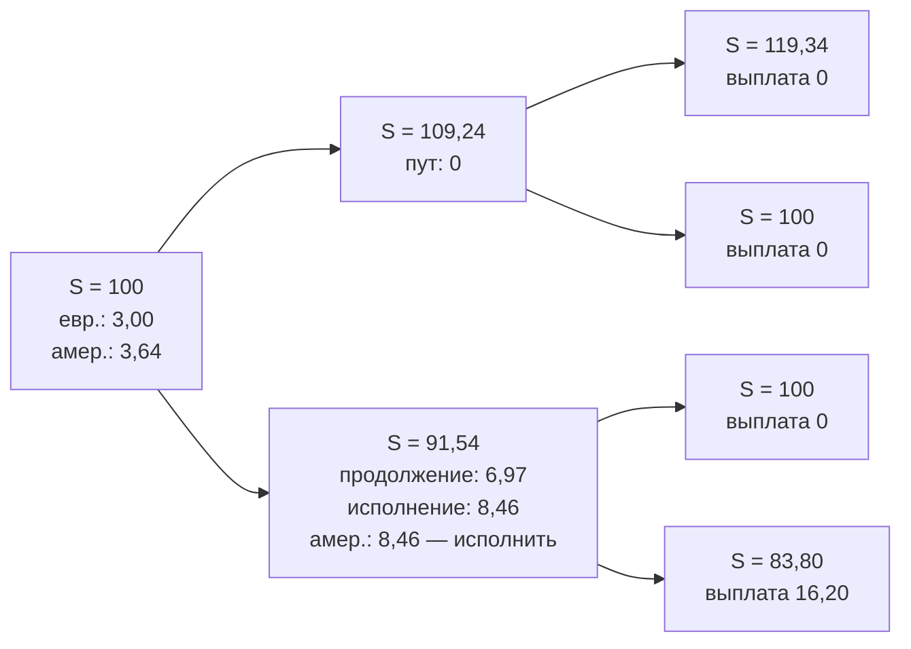

# Биномиальное дерево и американские опционы

Один шаг грубо описывает рынок. Разобьём срок опциона на $n$ шагов, и получится дерево цен, в каждом узле которого работает одношаговая формула. Урок строит дерево Кокса–Росса–Рубинштейна, оценивает на нём американский пут и показывает, как дерево сходится к непрерывной модели.

## Дерево Кокса–Росса–Рубинштейна

Разобьём срок опциона $T$ на $n$ маленьких шагов длиной $\Delta t = T/n$ каждый. На каждом шаге цена ходит вверх или вниз, как в предыдущем уроке. Остаётся выбрать $u$ и $d$ так, чтобы дерево описывало акцию с заданной волатильностью $\sigma$: шаги должны быть тем крупнее, чем выше волатильность и чем длиннее шаг по времени. Отсюда параметры Кокса–Росса–Рубинштейна:

$$
u = e^{\sigma\sqrt{\Delta t}}, \qquad d = \frac{1}{u}, \qquad q = \frac{e^{(r - \delta)\Delta t} - d}{u - d},
$$

где:
- $\sigma$ — годовая волатильность акции;
- $\delta$ — непрерывная дивидендная доходность акции или индекса; для валюты это иностранная ставка (модуль 5). Для акции без дивидендов $\delta = 0$;
- $q$ — та же риск-нейтральная вероятность из предыдущего урока, только с поправкой на доход по активу.

Выбор $d = 1/u$ удобен тем, что шаг вверх и шаг вниз возвращают цену в исходную точку. Из-за этого дерево **рекомбинирует**: после $i$ шагов получается не $2^i$ узлов, а всего $i+1$. Цена в $j$-м узле слоя $i$ равна $S u^{i-j} d^{j}$ — это $i-j$ движений вверх и $j$ вниз в любом порядке.

**Обратная индукция** — способ посчитать цену. Идём с конца: в последнем слое стоимость опциона известна, это его выплата. Дальше шагаем назад, применяя в каждом узле одношаговую формулу:

$$
V_{i,j} = e^{-r\Delta t}\big[q\,V_{i+1,j} + (1 - q)\,V_{i+1,j+1}\big],
$$

где $V_{i,j}$ — стоимость опциона в узле $j$ слоя $i$, а $V_{i+1,j}$ и $V_{i+1,j+1}$ — стоимости в двух узлах, куда можно попасть из него на следующем шаге (вверх и вниз). Дойдя до корня, получаем сегодняшнюю цену.

Для **американского** опциона добавляется одна строчка. В каждом узле у держателя есть выбор: подождать (тогда опцион стоит как посчитано выше) или исполнить прямо сейчас. Разумный держатель выберет лучшее:

$$
V_{i,j}^{\text{амер}} = \max\Big(\underbrace{e^{-r\Delta t}\big[q\,V_{i+1,j} + (1-q)\,V_{i+1,j+1}\big]}_{\text{подождать}},\ \underbrace{\text{выплата}(S_{i,j})}_{\text{исполнить сейчас}}\Big).
$$

## Пример: американский пут на двух шагах

$S = 100$, $K = 100$, $r = 12\%$, $\sigma = 25\%$, $T = 0{,}25$, $n = 2$. Тогда $\Delta t = 0{,}125$, $u = 1{,}09241$, $d = 0{,}91541$, $q = 0{,}56330$, $e^{-r\Delta t} = 0{,}98511$.



В нижнем узле первого шага:
- продолжение стоит $0{,}98511 \cdot 0{,}4367 \cdot 16{,}20 = 6{,}97$;
- немедленное исполнение даёт $100 - 91{,}54 = 8{,}46$.

Держатель американского пута исполнит опцион. В корне:
- европейский пут: $0{,}98511 \cdot 0{,}4367 \cdot 6{,}97 = 3{,}00$;
- американский: $0{,}98511 \cdot 0{,}4367 \cdot 8{,}46 = 3{,}64$.

Разница 0,64 — **премия за право досрочного исполнения**.

## Сходимость

Те же параметры, разное число шагов. Формула Блэка–Шоулза (урок 4 этого модуля) даёт колл 6,5281 и пут 3,5727.

| $n$ | Европейский колл | Европейский пут | Американский пут |
|---|---|---|---|
| 1 | 7,6274 | 4,6719 | 4,6719 |
| 2 | 5,9542 | 2,9988 | 3,6393 |
| 10 | 6,4038 | 3,4484 | 3,8149 |
| 100 | 6,5156 | 3,5601 | 3,8627 |
| 101 | 6,5393 | 3,5838 | 3,8772 |
| 1000 | 6,5269 | 3,5714 | 3,8673 |

Три наблюдения:
- Ошибка убывает примерно как $1/n$, но **колеблется**: чётные и нечётные $n$ дают оценки по разные стороны от предела. Страйк попадает то точно в узел, то между узлами. На практике усредняют соседние $n$ или берут $n$, при котором страйк лежит в узле.
- Европейские колл и пут на любом $n$ точно удовлетворяют паритету: разница $C - P$ равна $S - Ke^{-rT} = 2{,}9554$.
- Американский пут дороже европейского на 0,29 при $n = 1000$. Для путов в деньгах, например со страйком 110, премия больше: 10,38 против 9,21.

**Почему дерево сходится к логнормальному распределению.** Логарифм цены после $n$ шагов — сумма $n$ независимых слагаемых $\pm\sigma\sqrt{\Delta t}$. При $n \to \infty$ по центральной предельной теореме $\ln(S_T/S_0)$ становится нормальным с дисперсией $\sigma^2 T$ и средним (под $\mathbb{Q}$) $(r - \delta - \sigma^2/2)T$. Это модель следующих двух уроков.

```python
# Python 3.12, numpy 2.x
import numpy as np
from math import exp, sqrt

def crr(S, K, r, sigma, T, n, kind="call", american=False, div=0.0):
    dt = T / n
    u = exp(sigma * sqrt(dt)); d = 1 / u
    q = (exp((r - div) * dt) - d) / (u - d)
    disc = exp(-r * dt)
    j = np.arange(n + 1)
    S_T = S * u ** (n - j) * d ** j
    V = np.maximum(S_T - K, 0) if kind == "call" else np.maximum(K - S_T, 0)
    for i in range(n - 1, -1, -1):
        V = disc * (q * V[:-1] + (1 - q) * V[1:])
        if american:
            S_i = S * u ** (i - np.arange(i + 1)) * d ** np.arange(i + 1)
            exercise = np.maximum(S_i - K, 0) if kind == "call" else np.maximum(K - S_i, 0)
            V = np.maximum(V, exercise)
    return V[0]

print(round(crr(100, 100, 0.12, 0.25, 0.25, 1000, "put", american=True), 4))  # 3.8673
```

## Где ошибаются

- **Проверять досрочное исполнение только в экспирацию.** Тогда американский опцион не отличается от европейского. Сравнение с выплатой нужно в **каждом** узле при обратной индукции.
- **Брать одно значение $n$ и доверять четвёртому знаку.** Из-за колебаний разница между $n = 100$ и $n = 101$ больше, чем между $n = 100$ и пределом. Для точности нужны сотни шагов и сглаживание.
- **Забывать дивиденды в $q$.** Для индекса с дивидендной доходностью 8% или валюты с иностранной ставкой $q$ считается по $r - \delta$. Иначе цена колла завышена, а пута занижена.
- **Считать американский колл на акцию без дивидендов по дереву с исполнением.** Результат совпадёт с европейским (модуль 7), и лишние вычисления ничего не дадут. Досрочное исполнение важно для путов и для коллов на активы с доходом.
