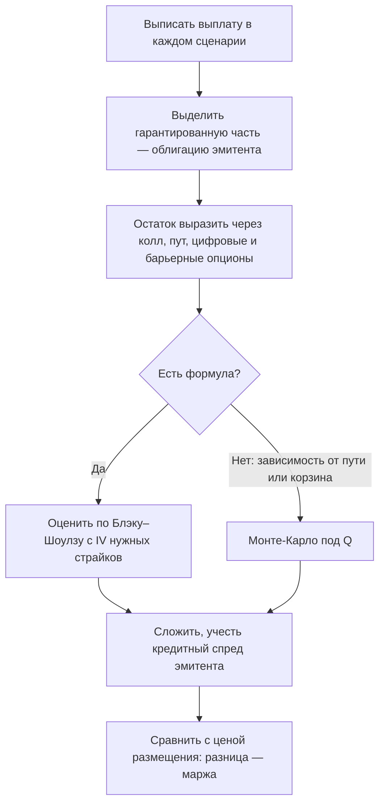

# Структурные продукты

Структурный продукт — облигация или вклад, выплата которых привязана к цене актива. Для покупателя это «одна бумага с понятным обещанием». Для оценщика — набор из бескупонной облигации и опционов, собранных в одну упаковку. Урок учит разбирать такие упаковки на части, находить справедливую стоимость и заложенную в цену маржу банка.

Общие параметры: непрерывная рублёвая ставка 13%. Кредитный риск эмитента пока не учитываем — к нему вернёмся в конце.

## Продукт с защитой капитала

**Обещание:** через год вернуть 100% вложенного, а если индекс вырос — ещё и долю этого роста. Доля называется **коэффициентом участия**: участие 80% означает, что при росте индекса на 20% инвестор получит 16%.

**Разложение.** Обещание распадается на две части. «Вернуть 100% в любом случае» — это бескупонная облигация на 100. «Плюс доля роста» — это $k$ коллов на индекс со страйком, равным сегодняшнему значению: они платят, только если индекс вырос.

Теперь понятно, откуда берётся коэффициент участия: он не выбирается банком из щедрости, а получается из бюджета. Часть денег уходит на облигацию (иначе защита не обеспечена), часть — маржа банка, а на что осталось, столько коллов и купили.

Сборка на 100 рублей инвестора:

| Компонент | Стоимость |
|---|---|
| Бескупонная облигация: $100e^{-0{,}13}$ | 87,81 |
| Маржа банка (закладывается при сборке) | 2,50 |
| Остаток на опционы | 9,69 |
| Колл на деньгах на год на индекс: $\sigma = 22\%$, дивидендная доходность 8% | 10,34 |
| **Коэффициент участия** $k = 9{,}69/10{,}34$ | **94%** |

Что влияет на участие:
- **ставки**: при 13% облигация дешёвая, и на опционы остаётся много. При ставках около нуля на опцион остались бы копейки, и участие падает в разы;
- **дивиденды**: продукт привязан к ценовому индексу, и дивиденды инвестор не получает. При нулевой дивидендной доходности колл стоил бы 15,71, а участие упало бы до 62%. Высокие дивиденды российских акций удешевляют коллы на ценовой индекс;
- **волатильность**: дорогие опционы — ниже участие.

Отказ от дивидендов — неочевидная плата за защиту. Индекс полной доходности за тот же год мог вырасти на 8% больше ценового (модуль 3).

## Обратная конвертируемая облигация

**Обещание** (reverse convertible): купон 20% годовых на полгода. В погашение вернут 100%, если акция не ниже начальной цены, а иначе — акции на сумму вложений по начальной цене, то есть стоимость $100\cdot S_T/S_0$.

**Разложение:** облигация с купоном + **проданный** пут на деньгах. Инвестор получает высокий купон, потому что продал банку страховку от падения акции.

| Компонент | Стоимость на 100 |
|---|---|
| Облигация: $(100 + 10)e^{-0{,}13\cdot 0{,}5}$ | 103,08 |
| Проданный пут на полгода, $\sigma = 35\%$ | −6,72 |
| **Справедливая стоимость** | **96,36** |
| Цена размещения | 100,00 |
| **Маржа банка** | **3,64** |

Честный купон, при котором стоимость равна 98,5 (маржа 1,5%), — около 24,6% годовых. «Высокий» купон 20% на деле ниже справедливого.

Профиль выплаты — покрытый колл (модуль 7): ограниченный рост, почти полный риск падения. Продукт выгоден, только если акция стоит на месте или растёт, а премия за волатильность, которую банк платит инвестору, ниже рыночной.

## Автоколл

Самый популярный структурный продукт в мире. **Обещание** (пример на год, акция с $S_0 = 100$, $\sigma = 30\%$):
- раз в квартал проверяется цена. Если она **не ниже 100**, продукт досрочно погашается по номиналу с купоном 4% за каждый прошедший квартал;
- если за год ни разу не погасился, а цена в конце **не ниже барьера 70**, возвращается 100% без купона;
- если в конце ниже 70, возвращается $100\cdot S_T/S_0$ — полный убыток от падения.

**Разложение.** Купонная часть — набор цифровых опционов (предыдущий урок): каждый платит фиксированную сумму, если в свою дату наблюдения цена окажется выше 100 и продукт до этого не погасился. Часть с риском — **проданный** инвестором пут с барьером 70: пока падение меньше 30%, он ничего не стоит, а при пробое барьера инвестор принимает на себя весь убыток по акции.

Формулы для такого набора нет: выплата зависит от всего пути цены, а не только от её значения в конце. Поэтому продукт оценивают методом Монте-Карло под мерой $\mathbb{Q}$ (предыдущий урок). Результат по 400 000 сценариев:

| Исход | Риск-нейтральная вероятность | Выплата |
|---|---|---|
| Погашение через квартал | 55,7% | 104 |
| Через полгода | 13,5% | 108 |
| Через 9 месяцев | 6,6% | 112 |
| Через год с купоном | 4,1% | 116 |
| Через год без купона | 14,6% | 100 |
| Через год с убытком | 5,6% | $100\cdot S_T/100$, в среднем около 61 |

**Справедливая стоимость — 96,37 ± 0,04 на 100 номинала, маржа — около 3,6%.**

Особенности:
- «Купон 16% годовых» почти никогда не выплачивается за год: в 56% сценариев продукт погашается через квартал с 4%, и деньги приходится реинвестировать.
- Убыток приходит в худших сценариях и бывает большим.
- Продавец автоколла — банк — **покупает** у инвестора пут с барьером, то есть волатильность. У банков, выпускающих много автоколлов, копится позиция по этому риску, которую они хеджируют на рынке.

## Конвертируемая облигация

**Устройство:** облигация компании, которую держатель может обменять на заданное число акций (**коэффициент конверсии**). Экономически это обычная облигация плюс колл на акции эмитента.

**Пример.** Номинал 1000, купон 8% в год, 3 года, конвертируется в 20 акций. Акция стоит 40, волатильность 30%, кредитный спред эмитента 3%.

| Компонент | Стоимость |
|---|---|
| Облигационная часть: купоны и номинал по ставке $13\% + 3\%$ | 794,55 |
| 20 коллов на акцию со страйком $1000/20 = 50$ на 3 года | $20 \cdot 11{,}02 = 220{,}41$ |
| **Грубая оценка** | **1014,95** |
| Стоимость конверсии сейчас: $20 \cdot 40$ | 800 |

Облигационная часть служит **полом** цены: пока компания платёжеспособна, цена не упадёт ниже 795 при любом падении акции. Разложение грубое: страйк колла — это отданная облигация, её стоимость зависит от ставок и кредитного качества, и чаще всего есть право эмитента на досрочный выкуп. Реальные модели решают задачу деревом или сеткой с кредитным риском.

## Кредитный риск эмитента

Во всех разложениях выше облигационная часть — **долг эмитента продукта**. Если банк-эмитент обанкротится, защита капитала не сработает. Держатели структурных нот Lehman Brothers в 2008 году потеряли бо́льшую часть вложений, хотя многие продукты обещали «100% защиту».

**Регулирование в России** (по состоянию на 2026): неквалифицированный инвестор может купить структурные облигации только после тестирования, которое брокеры обязаны проводить с 1 октября 2021 года. Детали — в базовом стандарте защиты прав инвесторов и нормативных актах Банка России.

## Как разобрать любой продукт

## Где ошибаются

- **Сравнивать продукт с депозитом по «обещанной» доходности.** Купон автоколла или обратной конвертируемой облигации — плата за проданный опцион. Сравнивать нужно риск-скорректированную стоимость, а не максимальную доходность.
- **Считать защиту капитала безусловной.** Защита — обязательство эмитента, а не биржи или государства. Стоимость продукта включает кредитный риск банка.
- **Игнорировать реинвестирование при досрочном погашении.** Автоколл погашается именно тогда, когда рынок вырос, и деньги возвращаются в момент, когда купить тот же риск дороже.
- **Оценивать продукт по одной волатильности.** Барьер 70 у автоколла — это пут далеко вне денег, и его цена определяется перекосом (модуль 9). С IV на деньгах проданный пут недооценивается, а продукт выглядит справедливее, чем есть.
