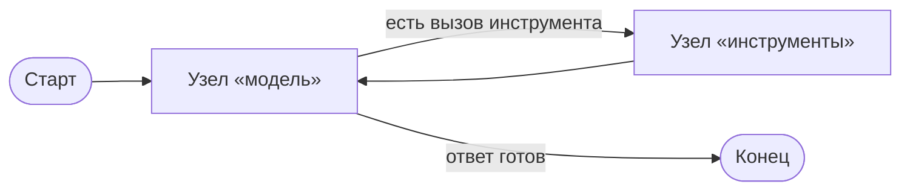

# Что такое LangGraph и когда он нужен

LangGraph — низкоуровневый оркестратор для приложений, где языковая модель вызывается не один раз, а много, в цикле, с инструментами и сохранением состояния между вызовами. В курсе используется версия 1.2 (актуальна на сентябрь 2026); всё, что появилось позже 1.0, помечено в тексте.

Начать проще не с определения, а с кода, который LangGraph заменяет.

## Агент, который помещается в двадцать строк

Вот работающий агент без всяких фреймворков оркестрации: модель, список инструментов, цикл.

```python
# Python 3.12, langchain 1.x
from langchain.chat_models import init_chat_model
from langchain.tools import tool

@tool
def find_lesson(query: str) -> str:
    """Найти урок по запросу и вернуть его текст."""
    return "Урок «Редьюсеры»: редьюсер решает, как объединить..."

model = init_chat_model("openai:gpt-5.5").bind_tools([find_lesson])
tools_by_name = {"find_lesson": find_lesson}

messages = [{"role": "user", "content": "Что такое редьюсер?"}]
while True:
    answer = model.invoke(messages)
    messages.append(answer)
    if not answer.tool_calls:
        break
    for call in answer.tool_calls:
        result = tools_by_name[call["name"]].invoke(call)
        messages.append(result)

print(messages[-1].text)
```

Это честный ReAct-агент: модель решает, звать ли инструмент, цикл исполняет вызов и возвращает результат обратно. Для скрипта, который отработал и завершился, этого достаточно. Никакой фреймворк тут не нужен.

Проблемы начинаются, когда такой агент становится частью продукта.

## Что ломается при переходе в продукт

Представим, что этот агент — наставник внутри нашей платформы: студент читает урок и спрашивает у него про редьюсеры.

**Процесс перезапустился на середине.** Модель успела вызвать три инструмента, деплой выкатил новую версию — и весь разговор потерян. Восстановить его неоткуда: состояние жило в переменной `messages` внутри процесса.

**Нужно остановиться и спросить человека.** Студент просит проверить домашнее задание, агент нашёл ошибку и хочет показать готовое решение. Но сначала надо спросить: «показать решение целиком или дать подсказку?» В цикле `while` пауза означает блокировку потока на минуты — веб-сервер такого не переживёт.

**Часть работы независима и должна идти параллельно.** Проверка ДЗ по пяти критериям — это пять независимых вызовов модели. В цикле выше они пойдут по очереди, и ответ займёт вместо трёх секунд пятнадцать.

**Ветвление разрастается.** Сначала «если вопрос про урок — ищи урок». Потом «если студент завалил тест — посмотри его ответы». Потом «если вопрос не про курс — вежливо откажись». Через месяц в цикле живёт `if`-дерево на сто строк, и никто, включая автора, не может сказать, какие пути исполнения в нём возможны.

**Непонятно, что произошло.** Агент ответил ерунду. Какие инструменты он звал, что они вернули, на каком шаге он свернул не туда — из `print(messages[-1].text)` не видно.

## Что вместо этого даёт LangGraph

LangGraph предлагает описать приложение как **граф**: узлы (node) — это функции, которые что-то делают, рёбра (edge) — правила перехода между ними, а всё, что узлы читают и пишут, живёт в общем **состоянии** (state) графа.



Дальше всё остальное следует из этой формы:

- Состояние описано явно, поэтому его можно **сохранить после каждого шага** (чекпойнт) и продолжить с того же места в другом процессе — хоть через неделю.
- Раз выполнение восстановимо, узел может **прерваться и дождаться человека**: процесс не держится, ожидание ничего не стоит.
- Раз переходы описаны отдельно от кода узлов, движок **видит независимые ветки** и выполняет их параллельно сам.
- Раз каждый шаг проходит через движок, у нас есть **поток событий**: что началось, что обновило состояние, какие токены пришли от модели.

Официальная документация формулирует назначение так: «низкоуровневый оркестратор и среда исполнения для долгоживущих агентов с состоянием». Слово «низкоуровневый» здесь ключевое: LangGraph не решает за вас, каким должен быть агент, — он даёт исполнение, состояние и надёжность, а архитектуру выбираете вы.

## Чем LangGraph не является

| Не является | Почему путают | Что на самом деле |
|---|---|---|
| Фреймворком для промптов и моделей | Лежит в одной экосистеме с LangChain | Модели, инструменты и структурированный вывод — это LangChain; LangGraph их только исполняет |
| Готовым агентом | В экосистеме есть `create_agent` | `create_agent` — заранее собранный граф; LangGraph — то, из чего он собран |
| RAG-фреймворком | Часто используется для RAG | Векторные базы, чанкинг, ранжирование — вне LangGraph, это ваши инструменты внутри узлов |
| Очередью задач | Умеет долгие фоновые прогоны | Celery-подобного планировщика в самой библиотеке нет; фоновые прогоны появляются на уровне сервера (модуль 10) |
| Способом улучшить качество ответов | «Сделаем граф — станет умнее» | Качество даёт модель, промпт и инструменты; граф даёт управляемость и надёжность |

LangGraph работает и без LangChain: узел — это обычная Python-функция, в ней может быть вызов чего угодно. Но на практике модели подключают через LangChain, и в курсе мы делаем так же.

## Когда он не нужен

Граф стоит сложности, и эту сложность надо окупать. Ориентир:

| Задача | Чем делать |
|---|---|
| Один вызов модели: классифицировать, переписать, извлечь поля | Обычная функция, никакого графа |
| Фиксированная цепочка из двух-трёх шагов без ветвления | Обычная функция или цепочка LangChain |
| Цикл «модель ↔ инструменты», живущий внутри одного запроса | `create_agent` из LangChain |
| То же, но с сохранением диалога, паузой для человека, параллельностью или нестандартным ветвлением | LangGraph |
| Всё перечисленное плюс фоновые прогоны, версии ассистентов, очередь | LangGraph + сервер |

Типичная ошибка новичка — начать с графа на десять узлов там, где задача решается одним вызовом модели. Обратная ошибка встречается позже и стоит дороже: агент уже в проде, состояние живёт в памяти процесса, и переписывание под чекпойнты растягивается на недели.

## Что мы будем строить

Сквозной пример курса — **агент-наставник для этой платформы**. Студент читает урок и может спросить его о чём угодно по курсу; агент отвечает со ссылками на конкретные уроки, разбирает домашние задания по их же критериям, объясняет ошибки в тестах и помнит, где студент буксовал в прошлый раз.

Этот агент — не выдумка для учебника: код будет лежать в этом репозитории, работать на его Postgres и в конце курса подключится к интерфейсу, в котором вы сейчас читаете этот текст. Как именно устроена эта работа — в следующем уроке.
