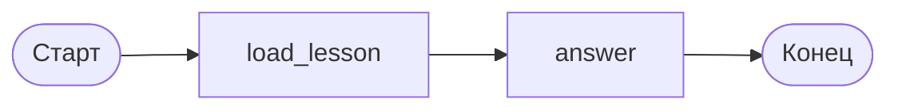

# Состояние, узлы и первый граф

Граф в LangGraph состоит из трёх вещей: схемы состояния, узлов и рёбер. В этом уроке — первые две. Состояние отвечает на вопрос «какие данные ходят по графу», узел — «что с ними делают».

## Состояние — это контракт между узлами

Схема состояния описывается обычным `TypedDict`. Это не хранилище и не база: это объявление полей, которые узлы вправе читать и писать.

```python
# Python 3.12, langgraph 1.2.x
from typing_extensions import TypedDict


class TutorState(TypedDict):
    question: str      # вопрос студента
    lesson_id: str     # урок, на котором он сейчас находится
    context: str       # текст урока, подложенный в промпт
    answer: str        # готовый ответ наставника
```

Схема — контракт: узел `answer` знает, что `context` кто-то заполнит до него, и ему не нужно знать, кто именно. Поэтому поля называют по смыслу данных, а не по узлу, который их пишет.

## Узел — это функция, возвращающая частичное обновление

Узел принимает текущее состояние и возвращает словарь **только с теми полями, которые изменил**. Остальные поля движок оставит как есть.

```python
import os
from pathlib import Path

from langchain.chat_models import init_chat_model

CONTENT = Path(__file__).resolve().parents[2] / "content"
model = init_chat_model(os.environ["TUTOR_MODEL"])


def load_lesson(state: TutorState) -> dict:
    """Кладёт в состояние текст урока, на котором сейчас студент."""
    path = CONTENT / f"{state['lesson_id']}.md"
    return {"context": path.read_text(encoding="utf-8")}


def answer(state: TutorState) -> dict:
    """Отвечает на вопрос, опираясь на текст урока."""
    reply = model.invoke(
        [
            {
                "role": "system",
                "content": (
                    "Ты наставник на учебной платформе. Отвечай по тексту урока ниже. "
                    "Если ответа в уроке нет — так и скажи.\n\n"
                    f"<урок>\n{state['context']}\n</урок>"
                ),
            },
            {"role": "user", "content": state["question"]},
        ]
    )
    return {"answer": reply.text}
```

Обратите внимание: `load_lesson` вернул только `context`, а не весь словарь состояния. Возвращать всё состояние целиком не запрещено, но это лишняя работа и источник ошибок — вы случайно затрёте поле, которое в этом шаге изменил кто-то другой.

## Сборка и запуск

Узлы соединяются рёбрами. `START` — точка входа, `END` — выход. `compile()` проверяет структуру и возвращает объект, который уже можно вызывать.

```python
from langgraph.graph import START, END, StateGraph

builder = StateGraph(TutorState)
builder.add_node("load_lesson", load_lesson)
builder.add_node("answer", answer)

builder.add_edge(START, "load_lesson")
builder.add_edge("load_lesson", "answer")
builder.add_edge("answer", END)

graph = builder.compile()

result = graph.invoke(
    {
        "question": "Зачем узлу возвращать не всё состояние?",
        "lesson_id": "langgraph/02-graph-and-state/01-state-and-nodes",
    }
)
print(result["answer"])
```



Во входном словаре заданы только `question` и `lesson_id` — остальные поля появятся по ходу. Передавать пустые `context` и `answer` не нужно: недостающие ключи `TypedDict` движок не требует.

Схему графа не обязательно рисовать руками — её отдаёт сам граф:

```python
print(graph.get_graph().draw_mermaid())
```

## Супершаг: когда обновления применяются

Движок выполняет граф шагами (в документации — super-step). На каждом шаге он берёт все узлы, готовые к выполнению, запускает их, собирает возвращённые обновления и применяет к состоянию. Отсюда главное правило: **узлы одного шага видят состояние на начало шага, а не результаты друг друга**.

Проверить это можно так: два узла `b` и `c` запускаются после `a` параллельно и записывают в накопительное поле `log`.

```python
from operator import add
from typing import Annotated


class S(TypedDict):
    log: Annotated[list[str], add]
```

Если `a` записал `["a"]`, то и `b`, и `c` увидят `log == ["a"]` — ни один из них не увидит записи другого. А вот следующий шаг увидит уже `["a", "b", "c"]`. Что означает `Annotated[list[str], add]` — тема следующего урока; пока достаточно того, что без такой пометки параллельная запись в одно поле падает с ошибкой.

## Типичные ошибки

**Опечатка в ключе не вызывает ошибки.** Это самая неприятная из ошибок начинающих, потому что она молчит:

```python
def load_lesson(state: TutorState) -> dict:
    return {"contex": path.read_text(encoding="utf-8")}  # опечатка
```

Ключа `contex` в схеме нет, движок просто отбросит его. Граф отработает, `context` останется пустой строкой, а модель бодро ответит на вопрос без текста урока. Проверено на langgraph 1.2.11: ни исключения, ни предупреждения. Отсюда практическое правило — аннотируйте возвращаемое значение узла именем схемы и включите проверку типов, тогда опечатку поймает mypy или pyright, а не пользователь.

**Изменение состояния на месте.** Такой узел работает, но неправильно:

```python
def bad(state: TutorState) -> dict:
    state["context"] += "\nдописал"   # мутация входного состояния
    return {}
```

Изменение проходит мимо механизма обновлений: его не видят редьюсеры, оно не попадает в снимок состояния как отдельное обновление и повторный запуск узла даст другой результат. Когда в модуле 05 появятся чекпойнты, такие мутации превращаются в расхождение между тем, что в памяти, и тем, что сохранено. Правило простое: входное состояние — только для чтения.

**Узел, который ничего не возвращает.** Вернуть `None` или `{}` законно — это «я ничего не изменил». Но если узел должен был что-то записать, а вернул `None` по забытому `return`, состояние останется прежним и ошибка вылезет в следующем узле, который читает пустое поле.

**Поле «на всякий случай».** Схема состояния — не свалка. Каждое поле кто-то пишет и кто-то читает; если читателя нет, поле не нужно. Раздутое состояние особенно больно бьёт в модуле 05, где оно целиком сохраняется в базу на каждом шаге.
