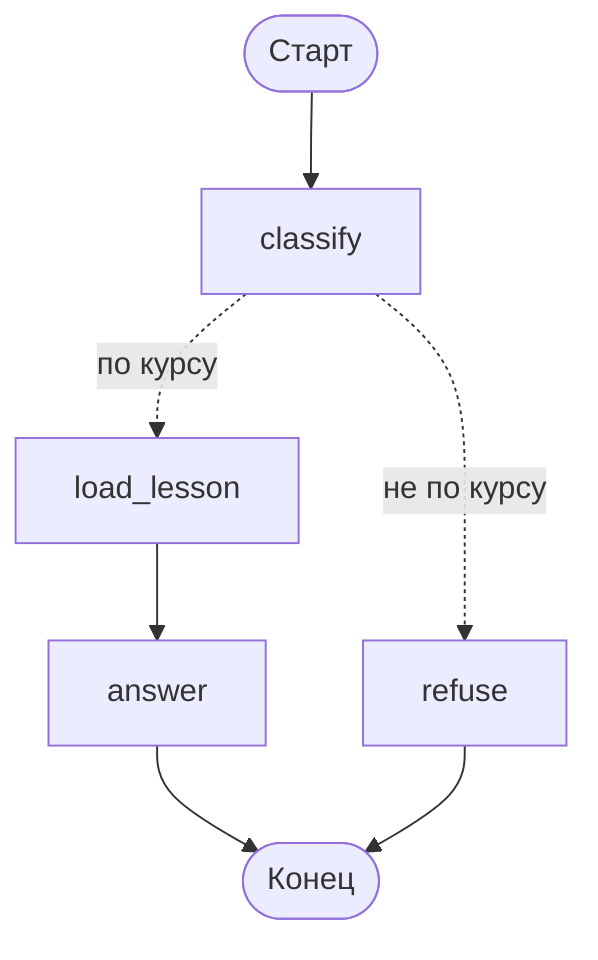

# Условные рёбра: как граф выбирает путь

Наставник не должен отвечать на всё подряд. Вопрос про редьюсеры — работа для модели с текстом урока; просьба написать диплом — вежливый отказ. Выбор между ветками задают условные рёбра.

## Маршрутизатор — это функция, возвращающая имя узла

```python
from typing import Literal

from langgraph.graph import START, END, StateGraph


def route_question(state: TutorState) -> Literal["load_lesson", "refuse"]:
    return "load_lesson" if state["is_on_topic"] else "refuse"


builder.add_conditional_edges("classify", route_question)
```

`add_conditional_edges` принимает узел-источник и функцию. Функция получает состояние **после** того, как узел-источник отработал, и возвращает имя следующего узла. Вернуть можно и `END` — тогда граф на этой ветке закончится.

Маршрутизатор — не узел. Он не появляется на схеме отдельной коробкой, не может обновить состояние и не попадает в историю шагов. Его работа — только выбрать путь.

## Подсказка типа не косметика

Аннотация `-> Literal["load_lesson", "refuse"]` выглядит необязательной, но без неё движок не знает, куда ведёт ребро. Проверка на langgraph 1.2.11: у маршрутизатора без аннотации и без явной карты путей в отрисованной схеме условные рёбра **исчезают совсем** — остаётся `a --> __end__`, будто ветвления нет.

Схема — не единственная потеря: её же читают Studio и отладочные инструменты. Поэтому правило — всегда указывать либо `Literal`, либо карту путей:

```python
def route_question(state: TutorState) -> str:
    return "по курсу" if state["is_on_topic"] else "не по курсу"


builder.add_conditional_edges(
    "classify",
    route_question,
    {"по курсу": "load_lesson", "не по курсу": "refuse"},
)
```

Карта путей (третий аргумент) отображает возвращаемое значение на имя узла. Она удобна, когда возвращать хочется не имена узлов, а смысл решения: имена узлов потом можно переименовать, не трогая логику. Цена ошибки — `KeyError` на исполнении: значения, которого нет в карте, движок не простит.

| Что вернул маршрутизатор | Что произойдёт |
|---|---|
| Имя узла (без карты путей) | переход в этот узел |
| Ключ из карты путей | переход в сопоставленный узел |
| `END` | ветка графа завершается |
| Список имён | **все** названные узлы выполнятся параллельно |
| Значение вне карты путей | `KeyError` |

## Решение принимает узел, маршрутизатор только читает

Классификация «вопрос по курсу или нет» — это вызов модели. Соблазнительно сделать его прямо в маршрутизаторе, но так делать не надо.

```python
from pydantic import BaseModel, Field


class Topic(BaseModel):
    """Относится ли вопрос к изучаемому курсу."""
    is_on_topic: bool = Field(description="True, если вопрос про материал курса")
    reason: str = Field(description="Одно предложение — почему")


classifier = model.with_structured_output(Topic)


def classify(state: TutorState) -> dict:
    verdict = classifier.invoke(
        f"Курс: LangGraph. Урок: {state['lesson_id']}.\nВопрос студента: {state['question']}"
    )
    return {"is_on_topic": verdict.is_on_topic, "reason": verdict.reason}


def route_question(state: TutorState) -> Literal["load_lesson", "refuse"]:
    return "load_lesson" if state["is_on_topic"] else "refuse"
```

Почему именно так:

- **Результат виден.** `is_on_topic` и `reason` лежат в состоянии, попадают в снимок и в трейс. Решение, принятое внутри маршрутизатора, не сохраняется нигде — при разборе жалобы «почему он мне отказал» вы останетесь без данных.
- **Повтор не стоит денег.** Маршрутизатор вызывается движком и может быть вызван повторно при восстановлении; узел с вызовом модели — шаг, результат которого сохраняется.
- **Маршрутизатор остаётся мгновенным.** Он не делает запросов в сеть, поэтому его можно читать как обычный `if`.

Общее правило: в маршрутизаторе — только чтение состояния и ветвление. Всё, что стоит времени или денег, — в узле.

## Как это выглядит у наставника

```python
builder = StateGraph(TutorState)
builder.add_node("classify", classify)
builder.add_node("load_lesson", load_lesson)
builder.add_node("answer", answer)
builder.add_node("refuse", refuse)

builder.add_edge(START, "classify")
builder.add_conditional_edges("classify", route_question)
builder.add_edge("load_lesson", "answer")
builder.add_edge("answer", END)
builder.add_edge("refuse", END)
```



Пунктир на схеме — принятая в LangGraph нотация условного перехода; так же их рисует и `draw_mermaid()`.

## Типичные ошибки

**Ветвление на `if` внутри узла вместо ребра.** Технически узел может сам решить, что делать дальше, и выполнить обе задачи внутри себя. Но тогда структура исчезает со схемы, шаги перестают быть отдельными (а значит, не сохраняются и не перезапускаются по отдельности), и в трейсе вместо двух понятных шагов будет один непрозрачный. Ветвление — работа рёбер.

**Маршрутизатор с побочными эффектами.** Запись в базу, отправка метрики, вызов модели внутри маршрутизатора — источник трудноуловимых багов: эта функция вызывается движком тогда, когда он считает нужным, и её результат нигде не сохраняется.

**Забытая ветка.** Если маршрутизатор может вернуть три значения, а рёбра заведены на два узла, третий путь обнаружится на проде. `Literal` с перечислением всех вариантов позволяет проверке типов поймать это заранее — ещё одна причина писать аннотацию.

**Узел без входящих рёбер.** Компиляция такой граф пропустит, а узел просто никогда не выполнится. Если после правки маршрутизации ветка «осиротела», вы узнаете об этом только по тому, что она молчит, — проверяйте схему глазами после каждой правки рёбер.
