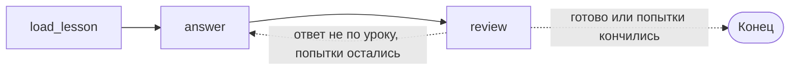

# Циклы: когда граф возвращается назад

Наставник из модуля 02 отвечает с одной попытки. Иногда этого мало: модель отвечает по памяти, а не по тексту урока, и ответ надо переписать. Проверка с возможностью повтора — это цикл в графе.

## Цикл — это ребро назад плюс условие выхода

Добавим узел `review`, который оценивает черновик ответа, и вернём граф к `answer`, если ответ не опирается на урок.

```python
from typing import Literal

from pydantic import BaseModel, Field


class Review(BaseModel):
    """Оценка черновика ответа."""
    grounded: bool = Field(description="True, если ответ опирается на текст урока")
    problem: str = Field(description="Что не так, одним предложением")


reviewer = model.with_structured_output(Review)


def review(state: TutorState) -> dict:
    verdict = reviewer.invoke(
        f"<урок>\n{state['context']}\n</урок>\n\n"
        f"<ответ>\n{state['answer']}\n</ответ>\n\n"
        "Опирается ли ответ на текст урока?"
    )
    return {
        "grounded": verdict.grounded,
        "problem": verdict.problem,
        "attempts": state["attempts"] + 1,
    }


def route_review(state: TutorState) -> Literal["answer", "__end__"]:
    if state["grounded"]:
        return "__end__"
    if state["attempts"] >= 2:
        return "__end__"
    return "answer"


builder.add_edge("answer", "review")
builder.add_conditional_edges("review", route_review)
```



В `Literal` для выхода из графа пишется `"__end__"` — это строковое значение константы `END`. Можно вернуть и сам `END`: значения совпадают.

Узел `answer` при повторном заходе должен видеть, что именно не так, — иначе он сгенерирует тот же текст. Поэтому `review` кладёт в состояние `problem`, а `answer` подмешивает его в промпт, если поле непустое.

## Счётчик попыток — часть логики, а не страховка

Обратите внимание: выход по числу попыток проверяется в самом маршрутизаторе, а поле `attempts` увеличивает узел. Это не перестраховка, а единственный способ управлять циклом осмысленно: вы решаете, сколько стоит потратить на переписывание, и что делать, когда попытки кончились (здесь — отдать последний вариант, но можно и честно сказать студенту, что ответ мог получиться неточным).

## `recursion_limit` — аварийный тормоз

У движка есть собственная защита от бесконечного цикла. Когда число шагов превышает лимит, запуск падает:

```
langgraph.errors.GraphRecursionError: Recursion limit of 10007 reached without
hitting a stop condition. You can increase the limit by setting the
`recursion_limit` config key.
```

Значение по умолчанию стоит проверить на своей версии: в langgraph 1.2.11 это **10007** (задаётся переменной окружения `LANGGRAPH_DEFAULT_RECURSION_LIMIT`), тогда как в старых статьях и примерах фигурирует 25. Разница принципиальная: с лимитом 25 ошибочный цикл падал через секунду, с лимитом в десять тысяч он сначала сожжёт деньги на вызовах модели.

Лимит задаётся на запуск:

```python
graph.invoke(payload, {"recursion_limit": 12})
```

Считаются не итерации цикла, а супершаги — каждый шаг графа, включая узлы вне цикла.

Практическое правило: `recursion_limit` — это предохранитель, а не механизм управления. Логика «сколько раз пробовать» живёт в состоянии и в маршрутизаторе; лимит нужен, чтобы ошибка в этой логике не стоила дорого. Разумно ставить его чуть выше ожидаемого числа шагов — тогда сломанный цикл обнаружится сразу.

## Цикл, который не заканчивается

```python
def route_review(state: TutorState) -> Literal["answer", "__end__"]:
    return "__end__" if state["grounded"] else "answer"
```

Здесь нет ограничения по попыткам. Если модель-рецензент упрямо считает ответ негрунтованным (а такое бывает: рецензент и автор — одна и та же модель, и у неё может быть устойчивое мнение), граф будет крутиться, пока не упрётся в лимит. Ошибка не в том, что цикл возможен, а в том, что его завершение зависит только от модели.

Другой вариант той же ошибки — условие смотрит на поле, которое в цикле никто не меняет:

```python
def route(state: TutorState) -> Literal["answer", "__end__"]:
    return "answer" if state["question"] else "__end__"   # question не меняется никогда
```

Проверка на этапе разработки: запустите граф с `recursion_limit` в 5–6 шагов. Если он падает на нормальном входе — цикл не сходится.

## Типичные ошибки

**Цикл ради цикла.** Проверять ответ моделью — это удвоение стоимости и задержки. Если проверка не приводит к переписыванию хотя бы изредка, она не нужна. Прежде чем добавлять цикл, ответьте, что именно происходит с результатом, если проверка сработала.

**Накопление в цикле.** Поле `Annotated[list, add]`, в которое пишет узел внутри цикла, растёт с каждой итерацией. Для `messages` это как раз правильно (история диалога), а для `sources` — источник дублей, если редьюсер не убирает повторы.

**Состояние, не готовое к повторному заходу.** Узел в цикле выполняется несколько раз, и каждый раз он должен быть корректен. Если `answer` при первом заходе рассчитывает, что `problem` пустой, а при втором — что заполнен, это условие надо писать явно, а не надеяться на порядок.
