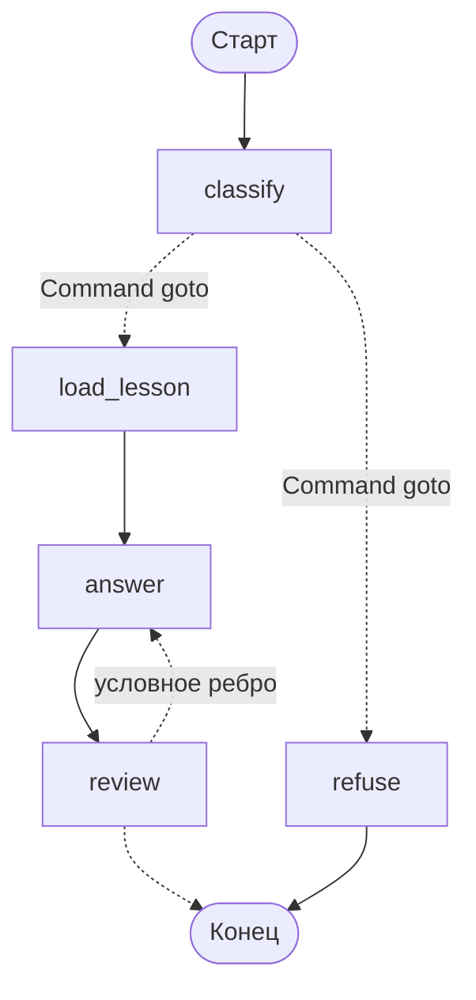

# `Command`: обновить состояние и выбрать путь одним возвратом

В прошлых уроках узел обновлял состояние, а решение о переходе принимало условное ребро. `Command` позволяет сделать и то, и другое прямо в узле.

## Как это выглядит

```python
from typing import Literal

from langgraph.types import Command


def classify(state: TutorState) -> Command[Literal["load_lesson", "refuse"]]:
    verdict = classifier.invoke(state["question"])
    return Command(
        update={"is_on_topic": verdict.is_on_topic, "reason": verdict.reason},
        goto="load_lesson" if verdict.is_on_topic else "refuse",
    )


builder.add_node("classify", classify)
# add_conditional_edges для classify больше не нужен
```

У `Command` четыре параметра: `update` — обновление состояния, `goto` — куда идти дальше, `resume` — ответ на прерывание (модуль 06) и `graph` — переход в родительский граф (модуль 08).

Аннотация `Command[Literal["load_lesson", "refuse"]]` играет ту же роль, что `Literal` у маршрутизатора: без неё движок не знает возможных целей и рёбра исчезают со схемы. Если аннотацию поставить неудобно, есть второй способ — перечислить цели при регистрации узла:

```python
builder.add_node("classify", classify, destinations=("load_lesson", "refuse"))
```

Оба варианта дают одинаковую схему (проверено на langgraph 1.2.11): `classify -.-> load_lesson` и `classify -.-> refuse`.

## Что выбрать: `Command` или условное ребро

Оба механизма делают одно и то же, и выбор между ними — вопрос того, кто владеет решением.

| Признак | Условное ребро | `Command` |
|---|---|---|
| Кто решает | отдельная функция-маршрутизатор | сам узел |
| Узел переиспользуется в разных графах | да: он не знает соседей | нет: имена соседей зашиты внутри |
| Решение основано на том, что узел только что вычислил | нужно сначала записать в состояние | естественно: результат под рукой |
| Решение основано на полях, записанных ранее | естественно | придётся читать состояние ради ветвления |
| Видно на схеме | да | да, если указан `Literal` или `destinations` |
| Передача управления между агентами | неудобно | штатный способ (модуль 08) |

Практическое правило. Если решение — это следствие работы узла (классификатор решил, агент выбрал инструмент, подграф закончил работу и передаёт управление), берите `Command`: разрывать вычисление и решение на два места незачем. Если решение — это политика над состоянием («попыток больше двух — выходим», «если оценка ниже порога — на доработку»), берите условное ребро: политику удобно менять, не трогая узлы.

Одна практическая тонкость: у узла, который возвращает `Command` с `goto`, не должно быть исходящих рёбер, заданных отдельно. Это два разных способа выбрать следующий шаг, и вместе они превращают граф в загадку — какая-то из веток окажется сюрпризом.

## `Command` и веер задач

`goto` принимает не только имя узла, но и список `Send` — тогда узел одновременно обновит состояние и разошлёт параллельные задачи:

```python
from langgraph.types import Send


def fan_out(state: HomeworkState) -> Command:
    return Command(
        update={"status": "проверка запущена"},
        goto=[Send("check_criterion", {"criterion": c}) for c in state["criteria"]],
    )
```

Что такое `Send` — следующий урок; здесь важно, что `Command` с этим сочетается.

## Как меняется наставник

С `Command` граф наставника становится короче: узел `classify` больше не нуждается в маршрутизаторе, а `review` из прошлого урока — нуждается, потому что его решение это политика («две попытки»), а не вывод модели.



Смешивать оба механизма в одном графе — нормально. Плохо другое: применять их по настроению, без правила. Держитесь одного принципа — «вывод узла решает `Command`, политика решает ребро», — и через месяц граф будет читаться.

## Типичные ошибки

**`Command` без аннотации целей.** Схема теряет рёбра — ровно как с маршрутизатором без `Literal`. Проверяется мгновенно: `print(graph.get_graph().draw_mermaid())`.

**`goto` на узел, которого нет в графе.** Компиляция это пропустит (имена целей — просто строки), а на исполнении будет ошибка о неизвестном узле. Переименовали узел — проверьте все `goto` и `destinations`.

**`Command` ради экономии строк.** Соблазн: убрать маршрутизатор и написать всё в узле. Цена: узел теперь знает про соседей, и вынуть его в другой граф (или в подграф, модуль 08) нельзя без правки. Для узлов, которые вы планируете переиспользовать, условное ребро — более дешёвый в сопровождении вариант.

**Обновление без `goto`.** `Command(update={...})` без `goto` допустим и означает «обновил состояние, дальше по обычным рёбрам». Это законно, но читателю кода непонятно, почему здесь `Command`, а не обычный возврат словаря. Если перехода нет, возвращайте словарь.
