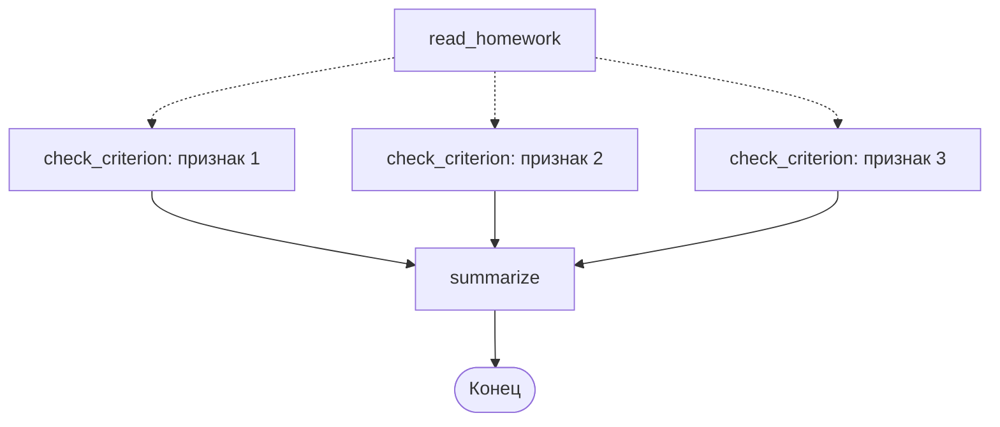

# `Send`: веер задач, число которых известно только при запуске

Наставник должен проверять домашние задания. В каждом задании курса есть раздел «Как проверить себя» — список признаков верного решения. Проверять их все одним промптом плохо: модель сваливает признаки в кучу и пропускает половину. Проверять по одному — точнее, а раз проверки независимы, их надо выполнять параллельно.

Параллельными рёбрами это не сделать: признаков может быть три, а может семь — их число известно только когда задание прочитано. Для такого случая есть `Send`.

## Как устроен `Send`

`Send` — это «запусти узел X с вот таким входом». Функция, возвращающая список `Send`, ставится на условное ребро, и движок создаёт столько параллельных задач, сколько элементов в списке.

```python
from typing import Annotated
from operator import add

from langgraph.types import Send
from typing_extensions import TypedDict


class HomeworkState(TypedDict):
    submission: str                        # решение студента
    criteria: list[str]                    # признаки из «Как проверить себя»
    checks: Annotated[list[dict], add]     # сюда стекаются результаты
    verdict: str


class CriterionTask(TypedDict):            # вход одной задачи, не всё состояние
    criterion: str
    submission: str


def fan_out(state: HomeworkState) -> list[Send]:
    return [
        Send("check_criterion", {"criterion": c, "submission": state["submission"]})
        for c in state["criteria"]
    ]


def check_criterion(task: CriterionTask) -> dict:
    verdict = checker.invoke(
        f"<признак>\n{task['criterion']}\n</признак>\n\n"
        f"<решение>\n{task['submission']}\n</решение>\n\n"
        "Выполнен ли признак? Ответь строго по решению."
    )
    return {"checks": [{"criterion": task["criterion"], "passed": verdict.passed,
                        "comment": verdict.comment}]}


builder.add_conditional_edges("read_homework", fan_out, ["check_criterion"])
```

Третий аргумент `add_conditional_edges` — список возможных целей: он нужен схеме, как `Literal` у обычного маршрутизатора.



## Узел получает задачу, а не состояние

Ключевое отличие от обычного узла: `check_criterion` видит **только то, что положено в `Send`**. Проверено на langgraph 1.2.11: если передать `{"criterion": "..."}`, то внутри узла состояние графа состоит ровно из ключа `criterion` — ни `submission`, ни `criteria` там не будет.

Это удобно (задача изолирована и её легко тестировать отдельно) и требует внимания: всё, что нужно задаче, кладётся в `Send` явно. Обновление же, которое узел возвращает, попадает в общее состояние графа по обычным правилам — через редьюсеры.

Отсюда обязательное требование: поле, в которое пишут задачи веера, **должно иметь редьюсер**. Иначе первый же запуск с двумя задачами даст знакомое:

```
langgraph.errors.InvalidUpdateError: At key 'out': Can receive only one value per step.
```

## Сборка результатов: узел `summarize` и `defer`

После веера нужен узел, который сведёт результаты в вердикт. И здесь есть ловушка, которая стоит отдельного абзаца.

Узел, в который ведут несколько рёбер, по умолчанию выполняется **каждый раз, когда завершается очередная ведущая в него ветка**. Если ветки заканчиваются на разных шагах, сборщик отработает несколько раз — с неполными данными, а потом ещё раз. Проверено на langgraph 1.2.11: узел `merge` в графе из короткой и длинной ветки выполнился дважды и в первый раз увидел только половину результатов.

Лечится флагом `defer`:

```python
builder.add_node("summarize", summarize, defer=True)
```

С `defer=True` узел ждёт, пока завершатся все ведущие в него ветки, и выполняется один раз. Для сборщика в map-reduce это правильное поведение почти всегда.

```python
def summarize(state: HomeworkState) -> dict:
    failed = [c for c in state["checks"] if not c["passed"]]
    if not failed:
        return {"verdict": "Все признаки выполнены."}
    lines = "\n".join(f"- {c['criterion']}: {c['comment']}" for c in failed)
    return {"verdict": f"Не выполнено признаков: {len(failed)}.\n{lines}"}
```

## Порядок результатов

Результаты складываются в поле в том порядке, в котором задачи были отправлены, а не в порядке их завершения. Проверено: если первая задача самая медленная, её результат всё равно окажется первым. Это делает вывод воспроизводимым — полезно и для тестов, и для того, чтобы показывать студенту признаки в том же порядке, в каком они перечислены в задании.

## Типичные ошибки

**Неограниченный веер.** `Send` на каждый элемент списка, длина которого приходит извне, — это готовый способ отправить в модель сотню параллельных запросов и упереться в ограничение по частоте запросов. Если число задач не под вашим контролем, режьте его явно: `state["criteria"][:10]`.

**Сборщик без `defer`.** Самая дорогая из ошибок этого урока, потому что она не падает: вердикт просто выносится по части проверок. Признак — сборщик отработал, а в логах видно, что он выполнялся больше одного раза.

**Задача, которой не хватает данных.** Узел веера не видит состояния, и `KeyError` внутри параллельной задачи легко списать на что угодно. Объявляйте схему задачи отдельным `TypedDict` — тогда несоответствие заметит проверка типов.

**Веер там, где хватит одного вызова.** Пять признаков — пять вызовов модели вместо одного. Для проверки ДЗ это оправданно (точность важнее), но если признаки короткие и однородные, честнее сравнить качество: иногда один вызов со списком даёт тот же результат вчетверо дешевле.
