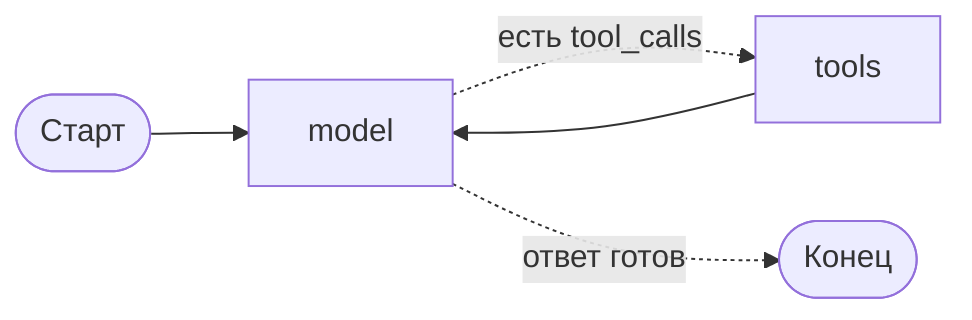

# ReAct-цикл своими руками

До сих пор наставник работал с одним уроком, который ему подкладывали снаружи. Настоящий вопрос так не устроен: «а где про это было раньше?» требует поиска по курсу, «я завалил тест» — обращения к прогрессу студента. Заранее неизвестно, что понадобится, — значит, решение должна принимать модель. Для этого ей дают инструменты.

Цикл «модель решает, инструменты исполняются, результат возвращается модели» называется ReAct (reasoning + acting). Соберём его из узлов и рёбер — это займёт двадцать строк и покажет, что происходит внутри любой готовой абстракции.

## Инструменты

```python
from pathlib import Path

from langchain.tools import tool

CONTENT = Path(__file__).resolve().parents[2] / "content"


@tool
def search_lessons(query: str, course_id: str = "langgraph") -> str:
    """Найти уроки курса, где встречается запрос.

    Возвращает список найденных уроков с их идентификаторами и первыми
    строками совпавших абзацев. Используй, когда нужно сослаться на
    конкретный урок или проверить, проходили ли тему раньше.
    """
    hits = []
    for path in sorted((CONTENT / course_id).rglob("*.md")):
        text = path.read_text(encoding="utf-8")
        if query.lower() in text.lower():
            lesson_id = path.relative_to(CONTENT).with_suffix("")
            hits.append(f"{lesson_id}: {text.splitlines()[0]}")
    return "\n".join(hits[:5]) or "ничего не найдено"
```

Докстринга инструмента — не комментарий, а часть промпта: по ней модель решает, звать ли его и с какими аргументами. Поэтому в ней пишут, **когда** инструментом пользоваться, а не только что он делает. Названия аргументов туда же: `query` и `course_id` модель видит и заполняет.

## Узел модели и узел инструментов

```python
from langgraph.graph import START, StateGraph, MessagesState
from langgraph.prebuilt import ToolNode, tools_condition

TOOLS = [search_lessons, get_progress]
model = init_chat_model(os.environ["TUTOR_MODEL"]).bind_tools(TOOLS)


class TutorState(MessagesState):
    student_id: str


def call_model(state: TutorState) -> dict:
    return {"messages": [model.invoke(state["messages"])]}


builder = StateGraph(TutorState)
builder.add_node("model", call_model)
builder.add_node("tools", ToolNode(TOOLS))

builder.add_edge(START, "model")
builder.add_conditional_edges("model", tools_condition)
builder.add_edge("tools", "model")

graph = builder.compile()
```

Три вещи, которые здесь работают:

- **`bind_tools`** сообщает модели список доступных инструментов. Без него модель просто не сможет запросить вызов — распространённая причина «почему он не пользуется инструментами».
- **`ToolNode`** — готовый узел: он берёт из последнего сообщения все `tool_calls`, исполняет их (параллельно, если вызовов несколько) и кладёт в `messages` по одному `ToolMessage` на каждый.
- **`tools_condition`** — готовый маршрутизатор: возвращает `"tools"`, если в последнем сообщении есть вызовы инструментов, и `"__end__"`, если их нет.

Ребро `tools → model` замыкает цикл: результат инструмента возвращается модели, и она решает, что делать дальше.



## Что происходит на самом деле

Вот реальная история сообщений для вопроса «что такое редьюсер?» (прогон на фейковой модели, langgraph 1.2.11):

```
HumanMessage  | что такое редьюсер?
AIMessage     |            tool_calls: [{'name': 'search_lessons', 'args': {'query': 'редьюсеры'}, 'id': 'call_1'}]
ToolMessage   | langgraph/02-graph-and-state/02-reducers: # Редьюсеры...
AIMessage     | Редьюсер — это функция объединения...
```

Поле `messages` — не просто лог. Это и есть вход модели на каждой итерации: всё, что накопилось, уходит в следующий вызов. Отсюда два следствия, важных дальше по курсу: история растёт и её приходится подрезать (модуль 05), и она же — главный источник расходов.

Важная деталь протокола: у каждого `ToolMessage` есть `tool_call_id`, связывающий его с конкретным вызовом. `ToolNode` проставляет его сам; когда в следующем уроке мы начнём возвращать результаты вручную, за этим придётся следить.

## Почему это стоит собрать руками хотя бы раз

В LangChain есть `create_agent`, который делает ровно такой граф одной строкой (следующий урок). Но в реальном агенте почти всегда нужно что-то вклинить: проверку темы до вызова модели, подрезку истории, паузу перед опасным инструментом, свою маршрутизацию после инструментов. Когда цикл собран руками, добавление узла — это две строки; когда он спрятан за фабрикой, приходится разбираться, куда его пустить.

## Типичные ошибки

**Модель не знает об инструментах.** Классика: `TOOLS` передали в `ToolNode`, но забыли `bind_tools`. Агент вежливо отвечает по общим знаниям и ни разу не зовёт инструмент.

**Разные списки инструментов.** `bind_tools([a, b])` и `ToolNode([a])` — и первый же вызов `b` падает с «инструмент не найден». Держите список в одной переменной.

**Забытое ребро `tools → model`.** Граф вызовет инструмент и завершится, так и не показав ответ: результат инструмента некому истолковать.

**Цикл без ограничения.** Модель может звать инструменты бесконечно — особенно если инструмент возвращает бесполезный результат, и она пробует ещё раз. Ограничение нужно явное: счётчик итераций в состоянии (как в модуле 03) или готовое ограничение из следующего урока.

**Докстринга «ищет».** Инструмент с описанием в одно слово модель либо игнорирует, либо зовёт не к месту. Если агент выбирает не тот инструмент, начинайте чинить с докстринги, а не с системного промпта.
