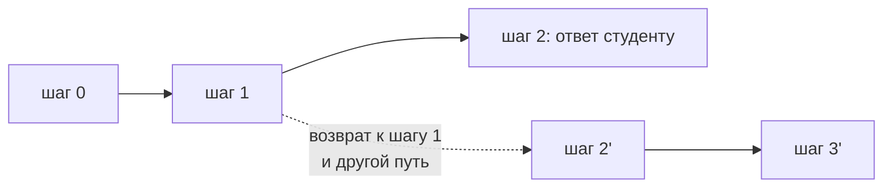

# История состояния: разбор полётов и путешествие во времени

Студент жалуется: «наставник посоветовал урок, которого нет». Разбираться по тексту ответа бесполезно — нужно видеть, что происходило внутри. Чекпойнтер уже всё сохранил, осталось научиться читать.

## Текущее состояние

```python
config = {"configurable": {"thread_id": "student-42:langgraph"}}
snapshot = graph.get_state(config)

print(snapshot.values["sources"])           # чем он подкреплял ответ
print(snapshot.next)                        # что предстоит: () — граф завершён
print(snapshot.metadata["step"])            # номер шага
```

Если `next` непустой, граф остановился, не закончив: либо ждёт человека (модуль 06), либо запуск прервался.

## Вся история

`get_state_history` отдаёт снимки **от новых к старым** — по одному на супершаг:

```python
for s in graph.get_state_history(config):
    print(s.metadata["step"], s.next, list(s.values.keys()))
```

Настоящий вывод для графа из двух узлов, запущенного дважды на одной нити (langgraph 1.2.11):

```
шаг 6 | next: ()              | n: 102
шаг 5 | next: ('b',)          | n: 101
шаг 4 | next: ('a',)          | n: 100
шаг 3 | next: ('__start__',)  | n: 2
шаг 2 | next: ()              | n: 2
шаг 1 | next: ('b',)          | n: 1
шаг 0 | next: ('a',)          | n: 0
шаг -1| next: ('__start__',)  | n: None
```

Шаг `-1` — состояние до первого узла, сразу после приёма входа. Шаги с `next: ('__start__',)` — точки, где на нить пришёл новый вход. По такой распечатке видно и порядок узлов, и что именно было в состоянии на каждом шаге: если `sources` опустел на четвёртом шаге, виноват узел, отработавший на четвёртом шаге, а не тот, что писал ответ.

## Правка состояния руками

`update_state` записывает обновление так, как будто его вернул узел, — со всеми редьюсерами:

```python
graph.update_state(config, {"sources": []})          # вычистить ссылки
```

Дополнительный параметр `as_node` говорит, **от чьего имени** сделана запись, и это меняет не только метаданные: граф считает, что названный узел только что отработал, и планирует то, что идёт после него.

Проверено: `update_state(config, {...}, as_node="a")` в графе `a → b` даёт снимок с `next == ("b",)`. Следующий вызов `graph.invoke(None, config)` продолжит с узла `b`.

Это главный рабочий инструмент «починки на живую»: заменить кривой ответ модели, подложить недостающее поле и доиграть граф с нужного места.

## Путешествие во времени

Каждый снимок знает свой `checkpoint_id`. Передав конфигурацию снимка вместо обычной, можно запустить граф **от того момента**:

```python
history = list(graph.get_state_history(config))
target = [s for s in history if s.next == ("answer",)][-1]

result = graph.invoke(None, target.config)      # вход None: состояние берётся из снимка
```

Вход `None` здесь принципиален: он означает «ничего не добавляй, просто продолжи с сохранённого состояния».

Зачем это нужно на практике:

- **Отладка.** Поменяли промпт узла `answer` — прогнали граф от того же снимка и сравнили ответы на одних и тех же входных данных.
- **Альтернативная ветка.** Вернулись к моменту до ответа, изменили состояние через `update_state` и пошли другим путём. Старые снимки при этом остаются: возврат назад не стирает историю.
- **Разбор инцидента.** Воспроизвели ровно ту ситуацию, на которую пожаловался студент.



## Что с этим делает наставник

Две вещи, которые стоит сделать сразу:

1. **Отладочная команда.** Скрипт, который по `thread_id` печатает историю шагов: какие инструменты звались, что они вернули, чем закончилось. Это дешевле любого логирования, потому что данные уже есть.
2. **Кнопка «ответь заново».** Студент недоволен ответом — возвращаемся к снимку перед `answer`, добавляем в состояние пожелание («короче», «с примером») и продолжаем. Переспрашивать всё заново не нужно.

## Типичные ошибки

**Ожидание, что история — это лог.** Снимки хранят состояние, а не то, что вы напечатали. Если нужно знать, почему узел принял решение, — кладите причину в состояние (как `reason` у классификатора в модуле 02), иначе в истории её не будет.

**`update_state` без `as_node`.** Запись пройдёт, но граф не узнает, откуда продолжать, и «доиграть с нужного места» не получится.

**Правка истории в проде без следа.** `update_state` ничем не отличается от обычного обновления — со стороны видно только результат. Если вы правите состояние руками в бою, оставляйте пометку в самом состоянии (например, поле `edited_by`), иначе через неделю никто не поймёт, откуда взялось это значение.

**Путешествие во времени на `ShallowPostgresSaver`.** Он хранит только последний снимок: ни истории, ни возврата. Выбирая его ради экономии места, вы отказываетесь от этого урока целиком.
