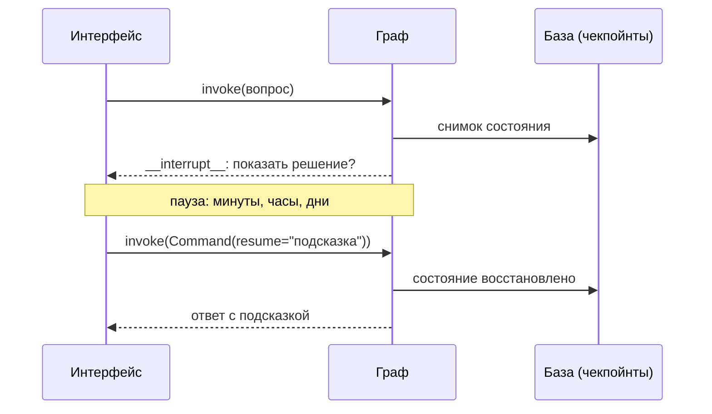

# `interrupt`: остановиться и дождаться человека

Наставник разобрал домашнее задание и готов показать, как его решить. Но выдавать готовое решение сразу — значит лишить студента смысла задания. Правильное поведение: спросить, хочет ли он решение целиком или подсказку.

Это не «задать вопрос в тексте ответа», а именно остановка графа: узел приостанавливается, ответ человека приходит через часы, и работа продолжается с того же места.

## Как это выглядит

```python
from langgraph.types import interrupt, Command


def offer_solution(state: TutorState) -> dict:
    choice = interrupt(
        {
            "вопрос": "Показать готовое решение или дать подсказку?",
            "варианты": ["решение", "подсказка"],
            "найденная_ошибка": state["problem"],
        }
    )
    if choice == "подсказка":
        return {"answer": make_hint(state)}
    return {"answer": state["draft_solution"]}
```

Запуск возвращает управление, не дойдя до конца:

```python
result = graph.invoke(payload, config)
result["__interrupt__"]
# [Interrupt(value={'вопрос': 'Показать готовое решение или дать подсказку?', ...},
#            id='7a13edc90b0a474c...')]
```

Значение, переданное в `interrupt`, доходит до вызывающего кода без изменений — это и есть то, что нужно показать человеку. Продолжение:

```python
graph.invoke(Command(resume="подсказка"), config)
```

То, что передано в `resume`, становится возвращаемым значением `interrupt` внутри узла.



Прерывания работают **только с чекпойнтером**: пауза — это сохранённое состояние. Без него останавливаться некуда.

## Главная особенность: узел выполняется заново

Вот факт, из-за которого ломается больше всего кода. После `Command(resume=...)` узел выполняется **с начала**, а не продолжается со строки с `interrupt`.

Проверено на langgraph 1.2.11: узел с печатью в первой строке напечатал её дважды — при первом запуске и после возобновления. Всё, что стоит до `interrupt`, выполнится дважды.

```python
def bad(state: TutorState) -> dict:
    mark_lesson_complete(state["lesson_id"])       # выполнится ДВАЖДЫ
    ok = interrupt("Отметить урок пройденным?")
    ...
```

Правило: до `interrupt` в узле должно быть только чтение и подготовка данных. Всё, что меняет мир — записи в базу, отправки, начисления, — ставится **после**. Дорогие вызовы (модель, длинный поиск) тоже лучше вынести в предыдущий узел: иначе вы платите за них дважды.

Из того же правила следует, что `interrupt` удобнее всего в маленьком отдельном узле: он ничего не делает, кроме как задаёт вопрос и раскладывает ответ.

## Несколько вопросов подряд

Два `interrupt` в одном узле работают последовательно: первый запуск останавливается на первом вопросе, `resume` отвечает на него и доводит узел до второго, следующий `resume` — до конца. Проверено; но помните про повторное выполнение: тело узла между вопросами прогоняется каждый раз.

Если параллельно работают два узла и каждый зовёт `interrupt`, движок вернёт **оба** прерывания сразу, и ответить надо тоже обоим — словарём, где ключ это `id` прерывания:

```python
ints = result["__interrupt__"]
answers = {i.id: решение_человека(i.value) for i in ints}
graph.invoke(Command(resume=answers), config)
```

## Как узнать, что граф ждёт

Пауза видна в снимке состояния:

```python
snapshot = graph.get_state(config)
snapshot.next               # ('offer_solution',) — узел, который ждёт
snapshot.interrupts         # (Interrupt(value=..., id=...),)
```

Это важно для интерфейса: студент закрыл вкладку и вернулся завтра. Приложение достаёт снимок нити, видит непустой `interrupts` и показывает тот же вопрос — не запуская граф заново.

## Типичные ошибки

**Побочные эффекты до `interrupt`.** Главная ошибка урока: письмо уходит дважды, баллы начисляются дважды. Всё необратимое — после.

**Прерывание без чекпойнтера.** Останавливаться некуда: состояние негде хранить, и продолжить будет нечем.

**Ответ не дошёл до нужного прерывания.** При нескольких одновременных прерываниях `Command(resume="да")` без указания идентификаторов — источник путаницы. Отвечайте словарём по `id`.

**Вопрос, на который нельзя ответить.** В `interrupt` передают всё, что нужно человеку для решения: не «Продолжить?», а «Вот найденная ошибка, вот черновик решения — показать целиком или подсказку?» Интерфейс не имеет доступа к состоянию графа и покажет ровно то, что вы передали.

**Вечная пауза.** Граф будет ждать столько, сколько нужно, — в том числе никогда. Решите заранее, что делать с нитями, которые висят в ожидании неделями: закрывать по таймеру, напоминать, удалять.
