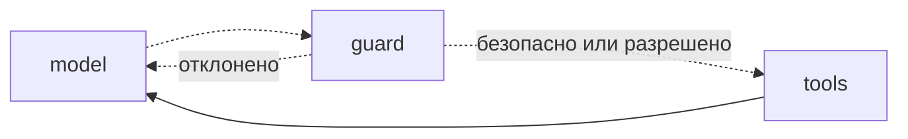

# Четыре паттерна участия человека

`interrupt` — один механизм, но применяют его по-разному. Полезно различать четыре ситуации: человек утверждает, человек правит, человек отвечает на вопрос, человек проверяет вызов инструмента.

## Утвердить или отклонить

Самый частый случай: агент собрался сделать что-то необратимое.

```python
from typing import Literal

from langgraph.types import interrupt, Command


def confirm_reset(state: TutorState) -> Command[Literal["do_reset", "answer"]]:
    ok = interrupt({
        "действие": "сбросить прогресс по курсу LangGraph",
        "последствия": "результаты тестов и отметки о пройденных уроках будут удалены",
    })
    if ok is True:
        return Command(goto="do_reset")
    return Command(update={"answer": "Хорошо, ничего не меняю."}, goto="answer")
```

Узел ничего не делает сам — он только спрашивает и маршрутизирует; само действие живёт в `do_reset`, который выполняется уже после подтверждения. Это прямое следствие правила из прошлого урока: до `interrupt` ничего необратимого.

## Отредактировать результат

Иногда нужно не «да/нет», а исправленный вариант: человек правит то, что предложил агент.

```python
def review_feedback(state: TutorState) -> dict:
    edited = interrupt({
        "черновик_разбора": state["draft_feedback"],
        "подсказка": "Исправьте формулировки или верните как есть",
    })
    return {"feedback": edited}
```

Здесь ответ человека — не флаг, а содержимое. Так удобно устроен преподавательский режим: наставник готовит разбор ДЗ, человек правит и отправляет студенту.

## Спросить недостающее

Агенту не хватает данных, и выдумывать их нельзя.

```python
def clarify(state: TutorState) -> dict:
    answer = interrupt({
        "вопрос": "По какому курсу проверять задание? Вы проходите два.",
        "варианты": state["active_courses"],
    })
    return {"course_id": answer}
```

Граница здесь тонкая: если вопрос можно задать прямо в диалоге, обычной репликой, — `interrupt` не нужен, достаточно ответить текстом и дождаться следующего сообщения. Прерывание оправдано, когда граф уже в середине работы и терять её жалко: проверка ДЗ идёт, десять вызовов модели позади, и на одиннадцатом выяснилось, что курс неоднозначен.

## Проверить вызов инструмента

Отдельный случай — не действие агента, а конкретный вызов инструмента, который хочется просмотреть до исполнения. Узел-страж встаёт между моделью и инструментами:

```python
DANGEROUS = {"reset_progress", "mark_completed"}


def guard(state: TutorState) -> Command[Literal["tools", "model"]]:
    last = state["messages"][-1]
    risky = [c for c in last.tool_calls if c["name"] in DANGEROUS]
    if not risky:
        return Command(goto="tools")

    decision = interrupt({"вызовы": risky, "вопрос": "Разрешить?"})
    if decision == "разрешить":
        return Command(goto="tools")
    return Command(
        update={"messages": [ToolMessage(content="Пользователь отклонил вызов.",
                                         tool_call_id=risky[0]["id"])]},
        goto="model",
    )
```



Обратите внимание на ветку отказа: модели нужно сообщить, что вызов не состоялся, — иначе она будет ждать результата. Отказ оформляется таким же `ToolMessage`, как обычный результат.

Тот же механизм есть готовым в `HumanInTheLoopMiddleware` из LangChain (модуль 04): если вы работаете на `create_agent`, проще взять его, а не писать стража руками.

## Что из этого нужно наставнику

| Ситуация | Паттерн |
|---|---|
| Показать готовое решение задачи | утвердить: спросить «решение или подсказка» |
| Сбросить прогресс, отметить урок пройденным | утвердить перед вызовом инструмента |
| Разбор ДЗ в преподавательском режиме | отредактировать |
| Непонятно, о каком курсе речь, а работа уже идёт | спросить недостающее |

Первый пункт — самый важный для учебной платформы. Он называется «спойлер-гейт»: наставник может знать ответ, но выдаёт его только по явной просьбе. Признак `can_see_solutions` из контекста запуска (модуль 04) здесь работает как настройка: если студент заранее разрешил показывать решения, прерывание пропускается.

## Типичные ошибки

**Подтверждение ради подтверждения.** Если человек всегда отвечает «да», вопрос не защищает, а раздражает. Спрашивайте о том, что необратимо или дорого, — остальное пропускайте.

**Отклонение, о котором не узнала модель.** Агент отклонили, а `ToolMessage` не добавили — модель зависает в ожидании результата или повторяет вызов.

**Прерывание вместо обычного вопроса.** Останавливать граф ради «а какой у тебя уровень?» в самом начале разговора — усложнение на ровном месте: спросите репликой.

**Интерфейс, не готовый к паузе.** Прерывание бессмысленно, если приложение не умеет показать вопрос и отправить ответ. В модуле 07 мы доведём эту цепочку до конца — от узла до React-компонента.
