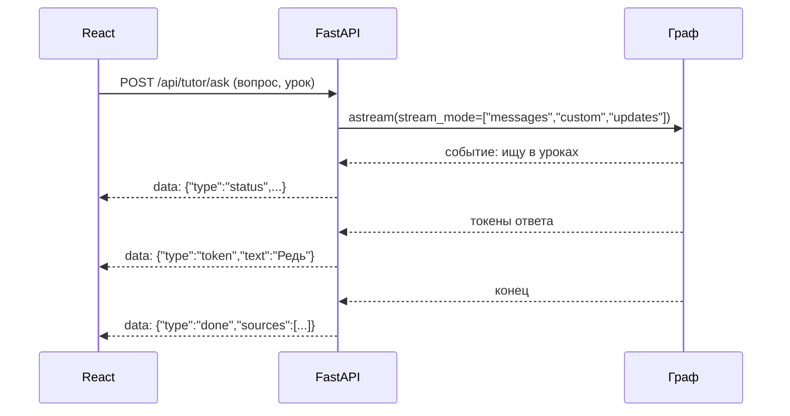

# Наставник внутри платформы: SSE в FastAPI и виджет урока

Теперь соберём всё вместе: граф живёт в приложении, студент задаёт вопрос прямо на странице урока, ответ печатается по мере генерации, а вопросы наставника («показать решение?») появляются как отдельный элемент интерфейса.

Бэкенд платформы — FastAPI с JWT-сессиями, фронтенд — React 19. Значит, транспорт выбираем под них.

## Почему SSE, а не WebSocket

Поток от агента — односторонний: сервер шлёт события, клиент только открывает соединение. Для такого есть Server-Sent Events — обычный HTTP-ответ, который не закрывается. Он проходит через любые прокси, переподключается браузером сам и не требует отдельного протокола.

WebSocket нужен, когда клиент шлёт данные в том же соединении постоянно, — у нас не тот случай: вопрос и ответ на прерывание уходят обычными POST-запросами.



## Эндпоинт

```python
# backend/app/api/tutor.py
import json
from typing import Annotated, AsyncIterator

from fastapi import APIRouter, Depends
from fastapi.responses import StreamingResponse

from app.deps import get_user_id
from tutor.graph import build_graph

router = APIRouter(prefix="/api/tutor", tags=["tutor"])
UserDep = Annotated[str, Depends(get_user_id)]


async def events(question: str, lesson_id: str, user_id: str) -> AsyncIterator[str]:
    graph = build_graph()
    config = {"configurable": {"thread_id": f"{user_id}:{lesson_id.split('/')[0]}"}}
    context = {"student_id": user_id, "locale": "ru"}
    payload = {"messages": [{"role": "user", "content": question}], "lesson_id": lesson_id}

    async for mode, chunk in graph.astream(
        payload, config, context=context, stream_mode=["messages", "custom", "updates"]
    ):
        if mode == "messages":
            token, meta = chunk
            if meta.get("langgraph_node") == "answer" and token.text:
                yield sse({"type": "token", "text": token.text})
        elif mode == "custom":
            yield sse({"type": "status", **chunk})

    snapshot = await graph.aget_state(config)
    if snapshot.interrupts:
        yield sse({"type": "question", "value": snapshot.interrupts[0].value})
    else:
        yield sse({"type": "done", "sources": snapshot.values.get("sources", [])})


def sse(payload: dict) -> str:
    return f"data: {json.dumps(payload, ensure_ascii=False)}\n\n"


@router.post("/ask")
async def ask(question: str, lesson_id: str, user_id: UserDep) -> StreamingResponse:
    return StreamingResponse(
        events(question, lesson_id, user_id),
        media_type="text/event-stream",
        headers={"Cache-Control": "no-cache", "X-Accel-Buffering": "no"},
    )
```

Что здесь важно, кроме самого стрима:

- **`thread_id` собирается на сервере** из идентификатора пользователя, который пришёл из зависимости `get_user_id`, — не из тела запроса. Иначе чужую нить можно открыть, подставив идентификатор.
- **Фильтр `langgraph_node == "answer"`** отсекает токены служебных вызовов.
- **Завершение проверяется по снимку.** Поток кончился — смотрим состояние: либо вопрос от наставника, либо готовый ответ со ссылками.
- **`X-Accel-Buffering: no`** — если перед приложением стоит nginx, без этого заголовка он накопит ответ в буфере и отдаст всё разом, убив весь смысл стрима.

Ответ на прерывание — отдельный эндпоинт:

```python
@router.post("/resume")
async def resume(lesson_id: str, answer: str, user_id: UserDep) -> StreamingResponse:
    ...  # то же самое, но payload = Command(resume=answer)
```

## Клиент

Браузерный `EventSource` умеет только GET и не отправляет заголовок авторизации, а у платформы токен в заголовке. Поэтому читаем поток через `fetch`:

```ts
export async function* askTutor(body: AskBody, signal: AbortSignal) {
  const response = await apiFetch("/api/tutor/ask", {
    method: "POST",
    body: JSON.stringify(body),
    signal,
  });
  const reader = response.body!.getReader();
  const decoder = new TextDecoder();
  let buffer = "";

  while (true) {
    const { done, value } = await reader.read();
    if (done) break;
    buffer += decoder.decode(value, { stream: true });

    const parts = buffer.split("\n\n");
    buffer = parts.pop() ?? "";
    for (const part of parts) {
      if (part.startsWith("data: ")) yield JSON.parse(part.slice(6));
    }
  }
}
```

Две детали, на которых спотыкаются: события разделяются пустой строкой (`\n\n`), и последний кусок буфера может быть неполным — его нельзя разбирать, пока не пришёл разделитель.

`AbortSignal` нужен, потому что студент уходит со страницы посреди ответа. Отмена на клиенте закрывает соединение; сервер увидит разрыв на следующей попытке записи. Состояние при этом не теряется: чекпойнтер уже сохранил всё, что успело выполниться, и разговор продолжится с того же места.

Компонент урока раскладывает события по типам: `token` дописывает текст, `status` показывает строку «ищу в уроках…», `question` разворачивает кнопки «показать решение / дать подсказку», `done` дорисовывает ссылки на уроки.

## Куда это встаёт в платформе

| Слой | Что добавляется |
|---|---|
| `agent/tutor/` | граф, узлы, инструменты — всё, что вы писали с модуля 02 |
| `backend/app/api/tutor.py` | два эндпоинта: `ask` и `resume` |
| `backend/app/deps.py` | зависимость, отдающая собранный граф (создаётся один раз при старте) |
| `frontend/src/features/tutor/` | кнопка на странице урока, панель диалога, разбор потока |

Граф компилируется **один раз при старте приложения** вместе с пулом соединений и Store. Сборка на каждый запрос — это заново открытое соединение к базе и потерянный кеш.

## Типичные ошибки

**`thread_id` из тела запроса.** Прямой доступ к чужим разговорам. Собирайте его на сервере.

**Буферизация на прокси.** Ответ приходит целиком в конце, и выглядит это как «стрим не работает». Проверяется тем же эндпоинтом напрямую, мимо прокси.

**Граф на каждый запрос.** Компиляция дешёвая, но вместе с ней обычно создаются соединения и чекпойнтер — вот они дорогие.

**Игнорирование прерываний в потоке.** Поток закончился, ответа нет, интерфейс показывает пустоту. Проверяйте снимок после окончания стрима.

**Попытка передать токен авторизации через `EventSource`.** Не получится: заголовков он не отправляет. Либо `fetch`, как выше, либо одноразовый токен в адресе — что хуже, потому что он попадёт в логи.
