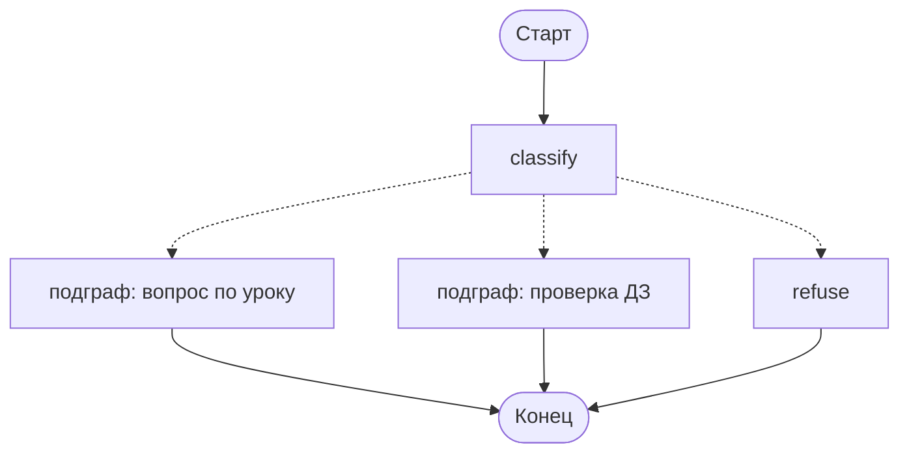

# Подграфы: граф как узел другого графа

Граф наставника разросся: классификация, загрузка урока, ответ, рецензия, проверка ДЗ веером, память, спойлер-гейт. Полтора десятка узлов в одном файле читаются плохо, а проверка ДЗ вообще живёт своей жизнью — у неё свой вход, свои шаги и свой результат.

Решение — вынести её в отдельный граф и подключить как узел.

## Подграф с общим полем состояния

Самый простой случай: у родителя и подграфа есть общие поля, и подграф подставляется на место узла прямо скомпилированным объектом.

```python
# граф проверки ДЗ — тот самый веер из модуля 03
homework_graph = homework_builder.compile()

# граф наставника
builder.add_node("check_homework", homework_graph)
builder.add_edge("route", "check_homework")
```

Никакой обёртки не нужно: подграф — такой же вызываемый объект, как функция-узел. Состояние передаётся по совпадающим ключам, обновления возвращаются в родителя по тем же правилам (редьюсеры родителя применяются к тому, что вернул подграф).

Проверено на langgraph 1.2.11: родитель с полем `log: Annotated[list, add]` и подграф с таким же полем дают `{'log': ['внутри подграфа', 'после']}` — запись подграфа попала в общее поле.

## Подграф с другой схемой

Чаще схемы не совпадают: проверка ДЗ ничего не знает про `messages` и `lesson_id`, ей нужны текст решения и список признаков. Тогда подграф оборачивают функцией — она переводит состояние туда и обратно.

```python
def check_homework(state: TutorState) -> dict:
    result = homework_graph.invoke({
        "submission": state["submission"],
        "criteria": state["criteria"],
    })
    return {"answer": result["verdict"], "checks": result["checks"]}


builder.add_node("check_homework", check_homework)
```

Это не костыль, а нормальный приём: функция-обёртка становится явным контрактом между графами. Подграф можно тестировать отдельно, переиспользовать в другом месте и менять его внутренности, пока обёртка возвращает то же самое.

| | Прямое подключение | Обёртка |
|---|---|---|
| Когда | схемы пересекаются по нужным полям | схемы разные |
| Контракт | неявный: по именам полей | явный: видно в коде обёртки |
| Переиспользование подграфа | ограничено именами полей | свободное |
| Видно на схеме | да, разворачивается | нет, обычный узел |

## Стрим и чекпойнты внутри подграфа

Две вещи, которые ведут себя не так, как ожидаешь.

**Стрим.** По умолчанию события подграфа наружу не выходят: родитель отдаёт один элемент на весь вложенный граф. Нужен флаг:

```python
for namespace, chunk in graph.stream(payload, config, stream_mode="updates", subgraphs=True):
    print(namespace, chunk)
```

Настоящий вывод:

```
('sub:1d256e8f-…',)  {'c': {'log': ['внутри подграфа']}}
()                   {'sub': {'log': ['внутри подграфа']}}
()                   {'after': {'log': ['после']}}
```

Пустой кортеж — родитель, непустой — путь до узла с подграфом. Для наставника это важно: проверка ДЗ идёт дольше всего, и без `subgraphs=True` студент увидит паузу в самый длинный момент.

**Чекпойнты.** Подграфу отдельный чекпойнтер не нужен: он пользуется родительским, а его снимки живут в пространстве имён (`checkpoint_ns`) внутри той же нити. Прерывание, вызванное внутри подграфа, всплывает наверх как обычное, и `Command(resume=...)` доходит до него.

Из этого следует приятное: спойлер-гейт из модуля 06 можно держать внутри подграфа проверки ДЗ, и снаружи он будет работать так же.

## Когда выносить в подграф

| Признак | Выносить? |
|---|---|
| Кусок графа имеет собственный вход и результат | да |
| Его хочется тестировать отдельно | да |
| Он переиспользуется в двух местах | да |
| Просто хочется, чтобы файл был короче | нет, достаточно разнести узлы по модулям |
| Нужно «спрятать» сложность от чтения | нет: сложность никуда не денется, а схема станет менее наглядной |

## Что получает наставник



Два подграфа: диалоговый (модель ↔ инструменты, рецензия) и проверочный (веер по признакам, спойлер-гейт). Наверху остаётся маршрутизация и работа с памятью — то есть ровно то, что должно быть видно на одной схеме.

## Типичные ошибки

**Совпадение имён полей по случайности.** При прямом подключении общие поля связываются по именам. Поле `status` в родителе и `status` в подграфе с другим смыслом — источник неотлаживаемых чудес. Либо разводите имена, либо используйте обёртку.

**Забытый `subgraphs=True`.** Интерфейс молчит ровно там, где работы больше всего.

**Свой чекпойнтер у подграфа.** Не нужен и мешает: подграф получает родительский, а отдельный превратит нить в две независимые.

**Подграф ради красоты схемы.** Композиция оправдана, когда у куска есть собственный контракт. Иначе вы добавили уровень косвенности и ничего не упростили.

**Аннотация `Literal` у узла, который передаёт управление наверх.** Про это — следующий урок; ошибка на компиляции выглядит неочевидно.
