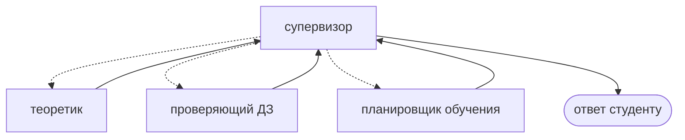

# Мультиагентность: супервизор, рой и трезвый расчёт

Слово «мультиагентная система» звучит солидно, но по существу это выбор: один агент с десятью инструментами или несколько агентов с разными ролями. Разберём, когда второе действительно лучше.

## Зачем вообще разделять

Аргументов ровно три, и все они про ограничения модели:

- **Слишком много инструментов.** Когда их больше десятка, модель начинает путаться в выборе. Разделение по ролям сокращает список у каждого.
- **Разные инструкции.** Наставнику, который объясняет теорию, и наставнику, который проверяет ДЗ, нужны разные системные промпты, а иногда и разные модели: объяснение подлиннее и подороже, проверка признака — дешёвая и короткая.
- **Разные права.** Агенту-теоретику незачем уметь отмечать урок пройденным.

Если ни один из аргументов не применим, разделение только добавит вызовов модели и задержек.

## Супервизор

Самая понятная схема: центральный агент решает, кому передать работу, исполнители возвращают результат ему.



Руками это собирается ровно тем, что уже известно: узлы-агенты (каждый — `create_agent` или подграф), маршрутизация из супервизора через `Command`, возврат по обычным рёбрам.

Есть и готовая реализация — пакет `langgraph-supervisor`:

```python
from langgraph_supervisor import create_supervisor

app = create_supervisor(
    agents=[theory_agent, homework_agent],
    model=MODEL,
    prompt="Ты распределяешь вопросы студента между наставниками.",
    output_mode="last_message",
).compile()
```

Из полезных параметров: `output_mode` — что возвращать от исполнителя (полную историю или последнее сообщение), `add_handoff_back_messages` — добавлять ли в историю явные пометки о возврате, `state_schema` и `context_schema` — как в обычном графе. Версия пакета на сентябрь 2026 — 0.0.x, то есть API ещё может меняться; это аргумент за то, чтобы супервизора в ответственных местах писать самому — благо это десяток строк.

Цена схемы: каждый шаг проходит через супервизора, то есть добавляется лишний вызов модели на каждую передачу.

## Рой

Альтернатива: агенты передают управление друг другу напрямую, без посредника. Активный агент запоминается в состоянии, и следующий запрос попадает сразу к нему.

```python
from langgraph_swarm import create_swarm

app = create_swarm(agents=[theory_agent, homework_agent], default_active_agent="theory").compile()
```

Такая схема дешевле (нет промежуточного вызова) и естественнее для длинного диалога: разговор «прилипает» к тому, кто его ведёт. Но она менее предсказуема — нет единой точки, где видно решение о маршрутизации.

| | Супервизор | Рой |
|---|---|---|
| Кто решает | центральный агент | текущий агент |
| Лишние вызовы модели | да, на каждую передачу | нет |
| Предсказуемость | высокая, решение в одном месте | ниже |
| Длинный диалог с одной ролью | каждый раз через супервизора | остаётся у активного агента |
| Отладка | проще | сложнее |

## Честный третий вариант: не мультиагент

Прежде чем разделять, проверьте, не решается ли задача маршрутизацией. У наставника есть классификатор из модуля 02, который и так выбирает ветку: вопрос по уроку, проверка ДЗ, отказ. Это **не** мультиагентная система — это граф с ветвлением, и он дешевле: один вызов модели на классификацию вместо агента-супервизора с полноценным диалогом.

Практическое правило: начинайте с одного агента и ветвления. Разделяйте, когда упрётесь в конкретное ограничение — список инструментов, противоречивые инструкции, разные права. «Так масштабнее» ограничением не является.

Для наставника разделение оправдано ровно в одном месте: проверка ДЗ и объяснение теории — это разные инструкции и разные инструменты. Планировщик обучения — третий кандидат, но только если он появится.

## Как это тестировать

Мультиагентная система ломается не там, где одноагентная. Проверяйте отдельно:

- **маршрутизацию** — на наборе типовых запросов: попадает ли вопрос к нужному агенту;
- **передачу контекста** — видит ли исполнитель то, что ему нужно, и не видит ли лишнего;
- **завершаемость** — не перекидывают ли агенты разговор друг другу по кругу.

Подробно про тесты — следующий модуль.

## Типичные ошибки

**Агент на каждую функцию.** «Агент-поисковик», «агент-форматировщик» — это инструменты и узлы, а не агенты. Агент — тот, кто сам решает, что делать дальше.

**Общая история на всех.** Каждый агент платит за контекст всех остальных, а качество падает: в истории лежат чужие вызовы инструментов.

**Супервизор без лимита передач.** Два вежливых агента способны перекидывать вопрос до упора в лимит шагов.

**Ставка на пакеты с версией 0.0.x.** `langgraph-supervisor` и `langgraph-swarm` удобны для прототипа, но их API ещё не устоялся. В ответственном коде супервизор на `Command` пишется сам и не зависит от чужих релизов.
