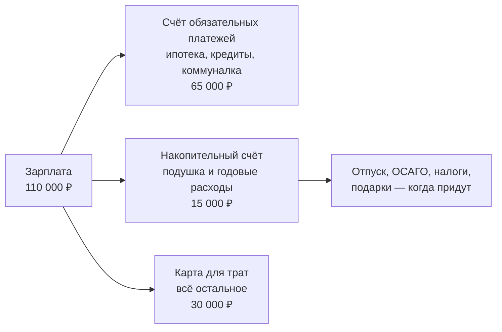

# Бюджет, который не бросают через месяц

Почти все, кто начинает записывать расходы, бросают это за три-четыре недели. Дело не в силе воли: у ежедневного учёта усилие каждый день, а отдача — через несколько месяцев. Этот урок о том, как получить результат без ежедневного учёта.

## Учёт нужен один раз, а не всегда

Записывать каждую покупку имеет смысл ровно до того момента, когда вы узнали структуру своих расходов. Дальше она меняется медленно: продукты, жильё и кредиты год за годом занимают примерно одну и ту же долю.

Получить эту структуру можно без единой записи вручную. В личном кабинете банка выгружается выписка за период — обычно в разделе «История операций» есть кнопка выгрузки в Excel или CSV. Возьмите три месяца, сложите по категориям, которые банк уже проставил, и поправьте те, где он ошибся. Полчаса работы вместо трёх месяцев дисциплины.

Категорий должно быть мало — пять-шесть. Вот рабочий набор:

| Категория | Что входит |
|---|---|
| Жильё | Ипотека или аренда, коммунальные платежи, интернет |
| Долги | Платежи по кредитам и рассрочкам, кроме ипотеки |
| Еда | Продукты, кафе, доставка |
| Транспорт | Бензин, проезд, обслуживание машины |
| Регулярное прочее | Связь, подписки, бытовая химия, одежда |
| Годовое | ОСАГО, отпуск, налоги, подарки — делится на 12 |

Тридцать категорий не дадут более точного ответа, а времени на разбор уйдёт в пять раз больше. Разделять «продукты» и «продукты в маленьком магазине у дома» бессмысленно: ни одно решение от этого не зависит.

## Трогать стоит только крупное и повторяющееся

Вернёмся к Марине из прошлого урока: минус 14 900 ₽ в месяц. Посмотрим, где этот минус можно закрыть.

| Что можно сделать | Экономия в месяц | Какую долю минуса закрывает |
|---|---|---|
| Отказаться от трёх подписок | 1 200 ₽ | 8% |
| Не покупать кофе навынос | 2 400 ₽ | 16% |
| Продать машину, ездить на транспорте: минус автокредит, бензин, ОСАГО, резина | 21 450 ₽ | 144% |
| Рефинансировать автокредит под меньшую ставку | 2 800 ₽ | 19% |

Отказ от кофе — это усилие каждый день в течение года ради 16% результата. Решение по машине — одно усилие один раз, и проблема закрыта полностью. Машина при этом может быть нужна для работы, и тогда ответ другой, но считать надо именно так: сравнивать величину эффекта, а не удобство решения.

Правило простое: **сначала смотрите на самые крупные строки расходов, потом на всё остальное**. У подавляющего большинства людей три верхние строки — жильё, транспорт и долги — занимают больше половины бюджета, а решения по ним принимаются раз в несколько лет и действуют всё это время.

## Сначала отложить, потом тратить

Есть одна вещь, которая работает надёжнее любого учёта: **разделить деньги в день зарплаты, а не в конце месяца**.

Схема выглядит так:

Работает это потому, что убирает решение из момента траты. Пока все деньги лежат на одной карте, каждая покупка — это вопрос «могу ли я себе это позволить», и ответ почти всегда «да, на карте же есть». Когда на карте для трат лежит ровно 30 000 на месяц, вопрос отвечает сам себя.

Важная часть схемы — отдельный счёт под **годовые расходы**. Те самые 10 400 ₽ в месяц из прошлого урока не пропадают: они копятся, и в августе отпуск оплачивается из накопленного, а не из кредитной карты. Именно этот перевод чаще всего и отличает бюджет, который сходится, от бюджета, который не сходится.

Переводы нужно поставить автоматическими на день после зарплаты. Ручной перевод раз в месяц пропускается примерно так же, как ежедневный учёт.

## Типичные ошибки

**Считать бюджет по плану, а не по факту.** План расходов, составленный из головы, обычно оптимистичнее реальности на 20–30%: в него не попадает то, что человек не считает «своими» тратами. Основа бюджета — выписка, а не представление о себе.

**Ставить цель «тратить меньше».** Такая цель не проверяется и поэтому не выполняется. Проверяемая цель — «перевести 15 000 на накопительный счёт 5-го числа»: в конце месяца видно, сделано или нет.

**Резать переменные расходы, оставляя обязательные.** Еда и развлечения — это то, что чувствуется каждый день и даёт мало. Ипотека, кредиты и машина — то, что не чувствуется и даёт много.

**Откладывать «то, что останется».** Не остаётся никогда — на этом и построено правило «сначала отложить».

**Бросать после первого превышения.** Один месяц с перерасходом ничего не значит, потому что расходы неровные по месяцам. Смотреть имеет смысл на квартал.

## Практика

Выгрузите выписку за три месяца, сведите по шести категориям и найдите три самые крупные строки. Для каждой ответьте на один вопрос: решение по этой строке принимается каждый день или раз в несколько лет? Начинать нужно со второй группы.
