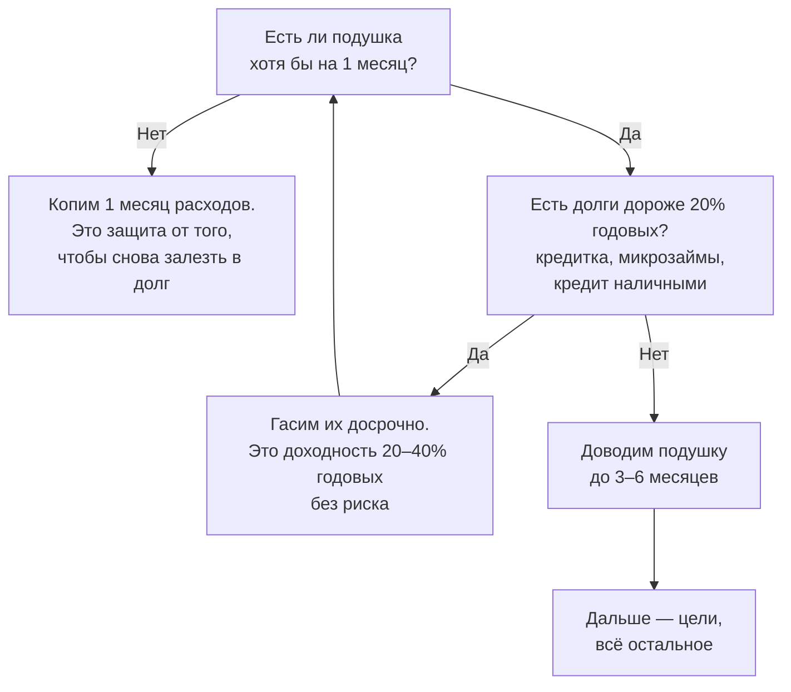

# Подушка безопасности: сколько и где держать

Подушка безопасности — это деньги на случай, когда доход прекратился или понадобилась крупная сумма немедленно. Главное их свойство — не доходность, а то, что они доступны сегодня и в полном объёме.

## Сколько денег нужно

Считается от **расходов**, а не от доходов. Если вы тратите 125 000 ₽ в месяц, а зарабатываете 200 000 ₽, подушка нужна от расходов: потеряв работу, вы будете тратить, а не зарабатывать.

Стандартный ориентир — **от трёх до шести месяцев расходов**. Три месяца — нижняя граница, потому что примерно столько в среднем занимает поиск новой работы на сопоставимую зарплату. Шесть — если доход нестабильный или профессия редкая.

Вернёмся к Марине из второго модуля: её ежемесячные расходы 114 500 ₽ плюс 10 400 ₽ годовых в пересчёте на месяц, итого 124 900 ₽.

| Размер подушки | Сумма |
|---|---|
| 1 месяц | 124 900 ₽ |
| 3 месяца | 374 700 ₽ |
| 6 месяцев | 749 400 ₽ |

Сдвинуть эти числа вниз можно, ответив на вопрос честно: какие расходы исчезнут, если доход пропадёт? Отпуск, кафе и одежда — исчезнут. Ипотека, еда и коммунальные платежи — нет. Подушку можно считать по «сжатому» бюджету, но сжимать нужно до реального минимума, а не до желаемого.

**Кому нужно больше:** самозанятым и всем, у кого доход неровный; единственному работающему в семье; людям с редкой специальностью, которую ищут долго; тем, у кого есть ипотека, — просрочка по ней дороже всех остальных.

**Кому достаточно трёх месяцев:** наёмным работникам в массовой профессии, когда в семье работают двое и доходы сопоставимы.

## Подушка или досрочное погашение долга

Вопрос возникает сразу: копить подушку или гасить кредит? Ответ даёт сравнение ставок.

Деньги в подушке лежат под 9–12% годовых. Долг по кредитной карте стоит 39,9% годовых. Пока существует такой долг, каждые 100 000 ₽ в подушке обходятся примерно в 30 000 ₽ в год — это разница между тем, что вы получаете, и тем, что платите.

Рабочий порядок действий:

Одного месяца в начале достаточно, чтобы сломанная стиральная машина не отправила вас обратно к кредитной карте. Ипотека под 6% в эту схему не попадает: гасить её досрочно вместо накопления подушки невыгодно, к этому вернёмся в модуле про кредиты.

## Где держать

Требования к месту хранения — по убыванию важности: деньги можно забрать **сегодня**, сумма **не уменьшается**, и только потом — доходность.

| Куда | Подходит | Почему |
|---|---|---|
| Накопительный счёт | Да | Снять можно в любой момент, проценты начисляются ежемесячно |
| Вклад с частичным снятием | Да | Ставка ниже обычного вклада, зато деньги доступны |
| Короткие вклады на 3 месяца, открытые лестницей | Да, для части подушки | Каждый месяц один из них заканчивается |
| Обычный вклад без снятия | Только часть | При досрочном снятии проценты пересчитают по ставке «до востребования» — обычно 0,01% |
| Наличные дома | Только небольшую часть | При инфляции 6,3% теряют 5,93% покупательной способности в год |
| Акции, фонды, криптовалюта | Нет | Могут стоить дешевле как раз тогда, когда деньги понадобились |

**Лестница вкладов** — приём, который снимает противоречие между доступностью и ставкой. Подушку 360 000 ₽ делят на три вклада по 120 000 ₽ и открывают с интервалом в месяц на три месяца каждый. Дальше каждый месяц один вклад заканчивается: если деньги не нужны — открываете его заново, если нужны — забираете без потери процентов.

Разумно держать 10–20 тысяч рублей наличными дома. Не ради доходности, а на случай, когда не работают карты: сбой у банка, отключение электричества, поездка в место без связи.

## Типичные ошибки

**Считать подушку от зарплаты.** Расходы и доходы — разные числа, и подушка считается от первых.

**Копить сразу шесть месяцев, имея долг под 40%.** Пока есть дорогой долг, большая подушка — это осознанная плата за спокойствие, и стоит она десятки тысяч рублей в год. Один месяц расходов, потом долги, потом остальная подушка.

**Тратить подушку на плановое.** Отпуск, новый телефон, страховка — это годовые расходы из второго модуля, под них отдельный счёт. Подушка тратится на то, чего нельзя было предвидеть.

**Держать подушку в том же банке, где ипотека и зарплата.** При проблемах у банка вы теряете доступ ко всему сразу. Разнести по двум банкам — бесплатно.

**Не восстанавливать подушку после траты.** Потратили — следующая цель автоматически становится «вернуть подушку на место», а не «накопить на новое».

## Практика

Посчитайте свой «сжатый» месяц: сумма расходов, которые не исчезнут, если завтра пропадёт доход. Умножьте на три. Это ваша ближайшая цель — и, если подушки пока нет, первая строка в схеме выше.
