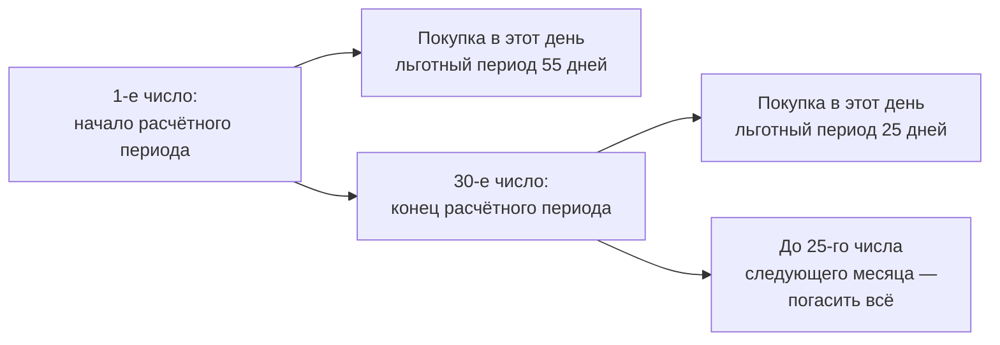

# Кредитная карта: как на самом деле считается льготный период

Кредитная карта — самый дорогой кредит из массовых и единственный, которым можно пользоваться бесплатно. Разница между этими двумя состояниями — в нескольких правилах, которые почти никто не читает.

## Льготный период не равен «120 дням из рекламы»

**Льготный период** (его называют грейс-периодом) — срок, в течение которого можно вернуть потраченное и не заплатить процентов.

Классическая схема состоит из двух частей:

- **расчётный период** — обычно 30 дней, в течение которых вы тратите;
- **платёжный период** — обычно 20–25 дней после него, в течение которых нужно погасить всё, что потратили.

Отсюда и «до 55 дней»: 30 + 25. Ключевое слово — «до».

Покупка, сделанная в **первый** день расчётного периода, получает все 55 дней. Покупка в **последний** день того же периода — только 25. Одна и та же карта, разница в 30 дней, и понять её можно, только зная дату начала расчётного периода.

Дату начала расчётного периода видно в приложении банка или в выписке. Практический приём: делайте крупные покупки в начале расчётного периода, а не в конце.

Встречается и другая схема — «льготный период 120 дней с даты первой покупки». Она проще и длиннее, но у неё обычно есть условие: платить каждый месяц минимальный платёж, иначе грейс сгорает.

## Что не попадает в льготный период

Здесь теряют деньги чаще всего.

**Снятие наличных.** Комиссия обычно 3–5% плюс фиксированная сумма, и проценты начинают начисляться **с первого дня**, без всякого грейса. Снять 50 000 ₽ и вернуть через месяц: комиссия 2 500 ₽ плюс проценты 1 640 ₽ — 4 140 ₽ за месяц пользования, что соответствует ставке около 99% годовых.

**Переводы с карты на карту и на счёт.** Считаются так же, как снятие наличных.

**Оплата услуг, приравненных к квази-наличным**: пополнение электронных кошельков, покупка валюты, ставки, переводы по номеру телефона. Список есть в тарифах.

**Комиссии и проценты, начисленные ранее.** Грейс на них не распространяется никогда.

Правило простое: **грейс-период — только для покупок в магазинах**. Всё остальное стоит денег с первого дня.

## Минимальный платёж не спасает от процентов

Самое дорогое заблуждение в теме.

**Минимальный платёж** — сумма, которую нужно внести, чтобы не было просрочки. Обычно 3–8% от долга. Он защищает кредитную историю и только её.

Если вы внесли минимальный платёж, но не погасили весь долг за расчётный период, **льготный период считается нарушенным, и проценты начисляются на всю сумму задолженности с даты каждой покупки**. Не на остаток после платежа, а на всю сумму и задним числом.

Пример: потратили 80 000 ₽, внесли минимальный платёж 4 000 ₽, грейс потерян. Проценты за 55 дней по ставке 39,9% — 4 810 ₽, и они начисляются несмотря на внесённый платёж.

## Сколько стоит платить минимальными платежами

Долг 100 000 ₽, ставка 39,9% годовых, минимальный платёж 5% от долга.

| Способ погашения | Срок | Всего выплачено |
|---|---|---|
| Только минимальные платежи | 170 месяцев — 14,2 года | 285 374 ₽ |
| По 10 000 ₽ в месяц | 13 месяцев | 123 616 ₽ |

Разница — 161 758 ₽ и тринадцать лет. Механизм виден в арифметике: проценты за месяц составляют 3,3% от долга, а минимальный платёж — 5%, то есть на сам долг идёт 1,7%. Долг тает почти незаметно, а проценты идут всё это время.

Минимальный платёж рассчитан так, чтобы вы платили как можно дольше. Это не обман — это бизнес-модель продукта, описанная в тарифах.

## Когда кредитная карта выгодна

При одном условии: **вы гасите весь долг в льготный период, всегда**. Тогда это бесплатный кредит на 30–55 дней, и деньги, которые остались на накопительном счёте, успевают заработать проценты.

Выгода при тратах 60 000 ₽ в месяц и накопительном счёте под 12%: примерно 60 000 × 12% × 45/365 = 888 ₽ в месяц, то есть около 10 600 ₽ в год. Плюс кешбэк, если он есть.

Условия, при которых это перестаёт работать:

- карта с платным обслуживанием, если его стоимость выше выгоды;
- хотя бы один месяц, когда долг не погашен целиком — проценты за него съедят выгоду за полгода;
- привычка считать кредитный лимит своими деньгами и тратить больше, чем зарабатываете.

## Типичные ошибки

**Считать, что льготный период — 55 дней для всех покупок.** Он от 25 до 55 в зависимости от даты.

**Снимать наличные с кредитной карты.** Эквивалент ставки около 100% годовых на месяц пользования.

**Вносить минимальный платёж и думать, что процентов не будет.** Проценты начислятся на всю сумму долга.

**Гасить долг за день до срока переводом из другого банка.** Межбанковский перевод может идти сутки, и платёж попадёт за пределы грейса. Кладите деньги за 3–4 дня.

**Держать карту «на всякий случай» и пользоваться ей как подушкой.** Подушка — это ваши деньги, а карта — чужие под 40% годовых.

## Практика

Найдите в приложении своей кредитной карты три числа: дату начала расчётного периода, дату платежа и полную задолженность (не минимальный платёж). Если полная задолженность больше нуля дольше одного месяца — посчитайте по таблице выше, во сколько вам обходится эта карта.
