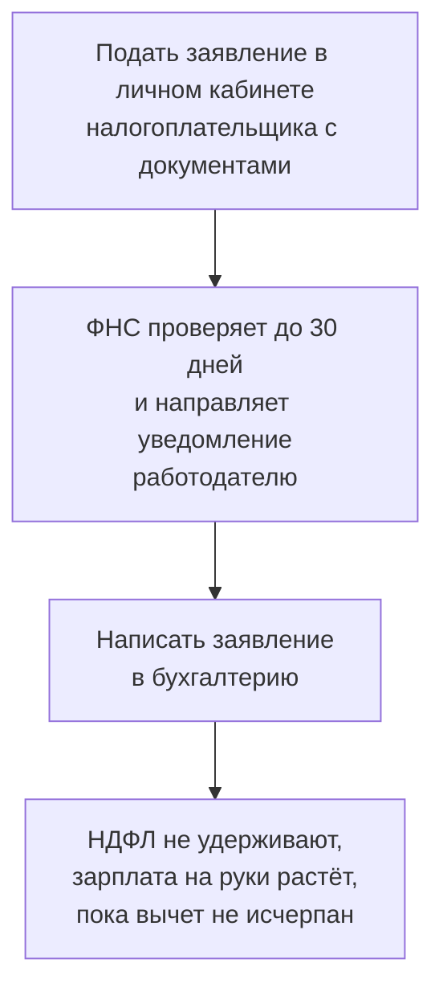

# Как вернуть налог: три способа

Вычет посчитан — теперь его нужно получить. Способов три, и они различаются скоростью, объёмом бумаг и тем, когда приходят деньги.

## Способ 1. Через работодателя — в текущем году

Подходит для социальных и имущественных вычетов и работает так: работодатель просто перестаёт удерживать с вас НДФЛ, пока сумма вычета не исчерпается.

Главное преимущество — деньги приходят в этом же году, а не через год. Главный минус — если вычет большой, зарплаты может не хватить до конца года; остаток придётся добирать декларацией.

Стандартный вычет на детей работает похоже, но проще: достаточно одного заявления в бухгалтерию с копией свидетельства о рождении, ФНС в этом не участвует.

## Способ 2. Декларация 3-НДФЛ — за прошедшие годы

Универсальный способ: подходит для любых вычетов.

Подаётся **на следующий год после того, в котором были расходы**, через личный кабинет налогоплательщика или Госуслуги. Срок 30 апреля относится к тем, кто обязан отчитаться о доходах; **если вы подаёте декларацию только ради вычета, её можно подать в любой день года**.

Порядок:

1. Заполнить декларацию в личном кабинете — часть данных подтягивается автоматически из справок о доходах.
2. Приложить документы: договоры, чеки, справки об оплате, свидетельства.
3. Дождаться камеральной проверки — до 3 месяцев.
4. Подать заявление на возврат (обычно оно включено в декларацию) — деньги приходят в течение месяца после окончания проверки.

Итого до четырёх месяцев от подачи до поступления денег.

## Способ 3. Упрощённый порядок — без декларации

Самый быстрый способ, но доступен не для всех вычетов.

Банк или другая организация сама передаёт данные о ваших расходах в ФНС. На их основе в личном кабинете появляется **предзаполненное заявление** — его остаётся подписать.

В упрощённом порядке получают вычеты:

- за покупку или строительство жилья и по процентам по ипотеке;
- за взносы на индивидуальный инвестиционный счёт;
- за взносы на негосударственное пенсионное обеспечение, добровольное страхование жизни и ДМС.

Проверка занимает **до месяца**, деньги приходят в течение 15 рабочих дней после решения. Документы прикладывать не нужно — ФНС уже получила данные от организации.

Условие одно: организация должна участвовать в обмене данными с ФНС. Уточнить это можно прямо у банка или клиники; если не участвует — остаётся декларация.

## Три года — срок, за который можно вернуть

Вычет заявляется за три предшествующих года. В 2026 году можно подать декларации за 2023, 2024 и 2025 годы — тремя отдельными декларациями, по одной на каждый год.

Правило имеет важное следствие для социальных вычетов: **расходы 2022 года в 2026 году вернуть уже нельзя**. Каждый год в январе один год «сгорает».

У имущественного вычета логика другая. Само право на него не сгорает: квартиру можно было купить десять лет назад и заявить вычет сейчас — но вернуть налог получится только за три последних года. Исключение для пенсионеров: им разрешено перенести вычет на четыре предшествующих года.

## Какие документы нужны

| Вычет | Документы |
|---|---|
| Лечение | Договор с клиникой, справка об оплате медицинских услуг с кодом 1 или 2, лицензия клиники |
| Лекарства | Рецепт со штампом «Для налоговых органов», чеки |
| Обучение | Договор, лицензия организации, чеки; для детей — свидетельство о рождении и справка об очной форме |
| Спорт | Договор и чек организации из перечня Минспорта |
| Покупка жилья | Договор купли-продажи или ДДУ, выписка ЕГРН или акт приёма-передачи, платёжные документы |
| Проценты по ипотеке | Кредитный договор и справка банка об уплаченных процентах за год |

Справку об уплаченных процентах банки выдают в приложении за пару минут, и заказывать её нужно **каждый год заново** — в вычет идут только фактически уплаченные за год проценты.

## Типичные ошибки

**Ждать 30 апреля.** Для вычета этот срок не нужен: подать можно в любой день.

**Пропустить трёхлетний срок.** Социальный вычет за давний год вернуть нельзя ни при каких обстоятельствах.

**Заявить всё одной декларацией за разные годы.** На каждый год — своя декларация со своими доходами и лимитами.

**Приложить чек вместо справки об оплате медицинских услуг.** Для вычета за лечение нужна именно справка установленной формы, чек её не заменяет.

**Не проверить наличие предзаполненного заявления.** Если вычет доступен в упрощённом порядке, декларация — лишняя работа.

**Забыть, что вычет по ипотечным процентам заявляется ежегодно.** Многие получают вычет за покупку и на этом останавливаются, теряя до 390 000 ₽.

## Практика

Зайдите в личный кабинет налогоплательщика, раздел «Доходы и вычеты», и посмотрите, есть ли там предзаполненные заявления. Затем проверьте, за какие годы вы ещё можете подать декларацию, — в 2026 году это 2023, 2024 и 2025.
