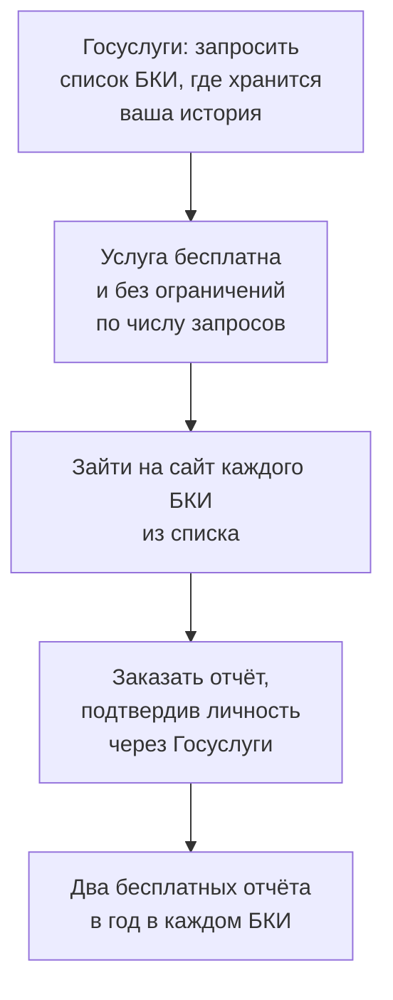

# Кредитная история: как прочитать и зачем

Кредитная история — досье, по которому банк за несколько секунд решает, давать вам кредит и под какой процент. Посмотреть её можно бесплатно, и делать это стоит раньше, чем вы придёте за ипотекой.

## Что в ней записано

Кредитные истории хранят **бюро кредитных историй (БКИ)** — коммерческие организации, работающие по лицензии. Банки и микрофинансовые организации обязаны передавать туда данные, но каждый банк может работать со своим бюро, поэтому ваша история обычно разбросана по нескольким БКИ.

Что попадает в историю:

- все кредиты, займы и кредитные карты — открытые и закрытые;
- суммы, сроки, размеры платежей;
- **просрочки** с указанием длительности;
- заявки на кредит и их результат, включая отказы;
- кто и когда запрашивал вашу историю;
- поручительство по чужим кредитам;
- долги по алиментам и по ЖКХ, если они взысканы судом и не погашены вовремя.

Записи хранятся **семь лет** с момента последнего изменения. Погашенная просрочка не исчезает, а остаётся видна эти семь лет — но с каждым годом влияет на решение всё слабее.

Чего в истории **нет**: остатков на ваших счетах, зарплаты, покупок, вкладов. Банк видит только кредиты.

## Как получить бесплатно

Дважды в год каждый имеет право получить свою кредитную историю бесплатно. Порядок из двух шагов.

Список бюро приходит в личный кабинет Госуслуг обычно в течение суток. Дальше отчёт заказывается на сайте самого БКИ — там же, где хранится история, а не на Госуслугах.

Платные сервисы, обещающие «узнать кредитную историю за 300 рублей», продают то, что вы получаете бесплатно.

## Что смотреть в отчёте

**Все ли договоры ваши.** Чужой кредит в вашей истории — признак либо ошибки, либо оформленного на вас займа. Это первое, что нужно проверять.

**Закрыты ли те договоры, которые вы считаете закрытыми.** Классическая ситуация: кредит погашен, но осталась задолженность в 12 рублей, о которой никто не сообщил. Через год это просрочка, а через три — отказ по ипотеке.

**Просрочки и их длительность.** Просрочка до 30 дней воспринимается банками спокойно, свыше 90 дней — серьёзная проблема на годы.

**Число запросов за последние месяцы.** Десять заявок в разные банки за неделю банк читает как признак отчаянного положения. Если собираетесь за крупным кредитом, не подавайте заявки веером.

**Действующие кредитные карты, которыми вы не пользуетесь.** Банк учитывает не потраченное, а **весь одобренный лимит** как потенциальный долг. Неиспользуемая карта с лимитом 500 000 ₽ может снизить одобренную сумму по ипотеке. Перед подачей заявки такие карты стоит закрыть — именно закрыть договор, а не просто перестать пользоваться.

## Кредитный рейтинг — это не кредитная история

В отчёте БКИ часто показывает **кредитный рейтинг** — число, обычно от 300 до 850 или от 1 до 999.

Это собственная оценка бюро, и банки её не используют: у каждого банка своя модель. Рейтинг полезен как грубый индикатор «всё хорошо / есть проблемы», но решение принимается не по нему.

На решение банка влияет другое:

| Что банк смотрит | Почему |
|---|---|
| Показатель долговой нагрузки (ПДН) | Доля всех платежей по кредитам в доходе. Выше 50% — хуже условия, выше 80% — обычно отказ |
| Просрочки за последние 2–3 года | Главный фактор после ПДН |
| Число недавних заявок | Много заявок подряд — тревожный признак |
| Срок кредитной истории | Полное отсутствие истории — тоже минус: банку не на что опереться |

Последний пункт неочевиден: человек, никогда не бравший кредитов, для банка менее понятен, чем человек с небольшой аккуратно погашенной историей.

## Как исправить ошибку

Если в отчёте есть чужой договор или просрочка, которой не было, подаётся **заявление о внесении изменений** — прямо в то БКИ, где обнаружена ошибка. Бюро обязано провести проверку и запросить подтверждение у банка-источника в установленный законом срок, около 20 рабочих дней.

Приложите то, что у вас есть: справку банка о закрытии кредита, платёжные документы. Если банк подтвердит ошибку, запись исправят.

Если бюро отказало, а вы уверены в своей правоте, остаётся жалоба в Банк России или суд.

## Типичные ошибки

**Не проверять историю до подачи заявки на ипотеку.** Исправление ошибки занимает месяц, а сделка ждать не будет.

**Верить в «чёрные списки банков».** Единого списка не существует; каждый банк принимает решение сам по своим правилам.

**Считать, что история «обнуляется» через год.** Записи хранятся семь лет.

**Закрывать кредит «примерно».** Берите у банка справку о полном погашении и отсутствии задолженности — она пригодится, если появится хвост в 12 рублей.

**Платить за то, что бесплатно.** Два отчёта в год в каждом БКИ не стоят ничего.

**Оставлять открытыми неиспользуемые кредитные карты.** Их лимиты уменьшают то, что вам одобрят.

## Практика

Запросите на Госуслугах список БКИ и закажите отчёт хотя бы в одном из них. Проверьте три вещи: все ли договоры ваши, все ли закрытые действительно закрыты, нет ли просрочек, о которых вы не знали.
