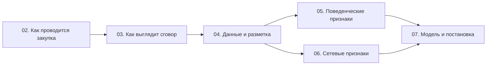

# Что этот курс даёт и чего в нём нет

Курс готовит к одной конкретной работе: взять открытые данные российских государственных закупок и построить модель, которая ранжирует закупки по вероятности того, что участники действовали по сговору.

## Задача, к которой идёт курс

На входе — выгрузка закупок за период. На выходе — список из N закупок, отсортированный так, что вверху стоят самые подозрительные, и у каждой есть объяснение: какие именно признаки её туда привели и насколько каждый из них вложился в итоговую оценку.

Такая задача называется **скринингом** (screening) — предварительным отбором для дальнейшей проверки. Это не «выявление виновных» и не «доказывание нарушения». Разница не косметическая: она задаёт единицу наблюдения, целевую метрику и способ валидации — то есть почти весь диплом. Модуль 03 показывает эту разницу с юридической стороны, модуль 07 — со стороны метрик.

Вы поймёте, что научились, по трём признакам:

- по описанию закупки вы называете, какая схема сговора могла бы её объяснить, и какой след эта схема оставляет в конкретных полях данных;
- вы считаете скрининговые показатели на реальной выгрузке и объясняете для каждого, что он ловит и в каких добросовестных ситуациях даёт ложное срабатывание;
- вы формулируете постановку задачи: единица наблюдения, источник целевой переменной, схема разделения выборки, метрика качества — и умеете обосновать каждый пункт.

## Что нужно знать заранее

Курс не учит программировать и не объясняет машинное обучение с нуля. Предполагается, что вы уверенно соединяете таблицы и группируете данные в pandas, понимаете, чем отличается переобучение от недообучения, читаете вложенный XML и помните, что такое дисперсия и квантиль.

Предметная область не требует ничего: 44-ФЗ, роли участников, устройство электронных площадок, антимонопольное законодательство — всё объясняется с нуля. Теория графов тоже: сетевой анализ в модуле 06 начинается с определения двудольного графа.

## Чего в курсе нет

| Тема | Почему не вошла | Где искать |
|---|---|---|
| Юридическая техника доказывания картеля | Отдельная профессия; вам нужно понимать, что́ считается доказательством, а не уметь его добыть | Практика ФАС, комментарии к 135-ФЗ |
| Структурные эконометрические модели аукционов | Другой класс методов: восстановление распределения издержек участников вместо поиска аномалий | Литература по эмпирическому анализу аукционов |
| 223-ФЗ в подробностях | Данные по нему хуже стандартизованы; для дипломной выборки практичнее 44-ФЗ | Сам закон и положения о закупке заказчиков |
| Инженерия больших данных | Объёмы дипломной выборки укладываются в один компьютер | Курсы по Spark и хранилищам |
| Зарубежные системы закупок | Другие форматы данных и другое право | Порталы TED (ЕС), USAspending (США) |

## Как устроен курс

Семь модулей, и порядок в них не случайный. Модули 02 и 03 — предметная область: как проводится закупка и как в ней выглядит сговор. Модуль 04 — данные: где они лежат, что в них связывается и откуда брать разметку. Модули 05 и 06 — два семейства признаков, вынесенные в название вашей темы: поведенческие и сетевые. Модуль 07 — модель, её оценка и сборка всего этого в дипломную постановку.

В шести модулях из семи есть домашнее задание. Автоматической проверки нет: каждое задание заканчивается разделом «Как проверить себя», где перечислены признаки верного решения и типичные ошибки. Задания рассчитаны на работу с настоящими данными, а не с учебным набором, — поэтому их результат ложится прямо в диплом.

В каждом модуле есть тест, в конце курса — экзамен и две справочные страницы: шпаргалка с формулами, полями и порядком действий и глоссарий терминов.

## Два решения, которые нельзя откладывать

Курс построен так, что два самых дорогих решения принимаются рано, в модуле 04, а не в конце.

Первое — **откуда берётся целевая переменная**. Достоверно известные сговоры — это решения антимонопольного органа, их на порядки меньше, чем закупок. От того, используете вы их как метки, как валидационный набор или не используете вовсе, зависит весь дальнейший выбор методов.

Второе — **какие признаки вы физически сможете посчитать**. Часть самых сильных поведенческих признаков (совпадение IP-адресов, метаданные файлов заявок) существует только внутри электронных площадок и антимонопольного органа и в открытые данные не попадает. Список доступного нужно зафиксировать до того, как вы начнёте писать код.

Если начать считать признаки, не ответив на эти два вопроса, работу придётся переделывать целиком.
