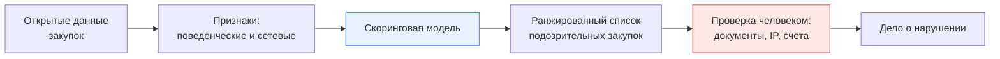

# Почему сговор оставляет следы в данных

Идея, что сговор можно найти статистикой, держится не на том, что участники картеля глупы, а на том, что картель — это организация, которой приходится решать управленческие задачи. Решения этих задач и попадают в данные.

## Две задачи, которые обязан решить картель

Экономическая литература о выявлении картелей (основополагающая работа — Joseph Harrington, «Detecting Cartels», 2008) исходит из того, что любой сговор на торгах решает две задачи.

**Первая — распределить победы.** Участникам нужен механизм: кто выигрывает эту закупку, а кто следующую. Механизмы бывают разные — очерёдность, раздел по заказчикам, раздел по территории, раздел по товарным группам, компенсация проигравшему субподрядом.

**Вторая — обеспечить победу назначенного.** Остальные участники сговора должны проиграть, причём проиграть надёжно: подать заведомо худшее предложение, не торговаться, отозвать заявку, подать заявку с изъяном.

Обе задачи требуют **повторяемости**. Разовая договорённость в одной закупке статистически почти неотличима от совпадения: два участника могли не снизить цену потому, что им обоим невыгодно. Но механизм распределения побед по определению работает на серии закупок — и именно серия отличима от случайности.

Отсюда главный методологический вывод курса: **сигнал живёт не в закупке, а в панели**. Признак, посчитанный по одной процедуре, почти всегда слаб; признак, посчитанный по истории участника и по истории его пересечений с другими, — силён.

## Три семейства следов

| Семейство | Что измеряет | Пример показателя |
|---|---|---|
| Внутрипроцедурные | Как выглядят предложения и торг внутри одной закупки | Снижение от начальной цены, разрыв между первым и вторым местом, число шагов торга |
| Поведенческие по участнику | Как участник ведёт себя в серии закупок | Доля побед, доля закупок, где он подал заявку, но не торговался, состав заказчиков |
| Сетевые | Кто с кем систематически встречается на одних торгах | Частота совместного участия пары, превышающая ожидаемую при случайном пересечении |

Ваша тема объединяет второе и третье семейства. Первое при этом никуда не девается — оно даёт сырьё, из которого агрегируются поведенческие показатели.

## Почему из следа не следует вывод

Здесь начинается место, где ломается большинство студенческих работ. Проблема не в качестве модели, а в **базовой частоте** (base rate) — доле нарушений в генеральной совокупности.

Посчитаем на условных, но правдоподобных порядках. Пусть в выборке 1 000 000 электронных аукционов за период, и пусть сговор реально был в 1 % из них — 10 000 закупок. Модель с полнотой 60 % и долей ложных срабатываний 5 % даст:

- верно найденных: `0.6 × 10 000 = 6 000`;
- ложных: `0.05 × 990 000 = 49 500`.

Точность (precision) = `6000 / 55 500 ≈ 11 %`. На каждую найденную закупку со сговором приходится восемь пустых проверок. При этом доля ложных срабатываний 5 % — это по меркам машинного обучения хороший результат, и общая доля верных ответов (accuracy) у такой модели будет около 95 %, что выглядит прекрасно и не значит ничего.

Два следствия, к которым курс будет возвращаться:

1. **Accuracy и ROC-AUC для этой задачи почти бесполезны.** Осмысленная метрика — точность в голове списка: сколько настоящих нарушений в топ-100 закупок, которые реально успеет проверить инспектор. Подробно — в модуле 07.
2. **Результат модели — приоритет, а не вердикт.** Модель сокращает пространство поиска с миллиона закупок до сотни. Дальше работает человек: запрашивает документы, сравнивает IP-адреса, изучает движение средств.

Ваша работа заканчивается на блоке D. Блок E использует данные, которых у вас нет, и полномочия, которых у вас нет. Это ограничение стоит объявить в постановке задачи явно: оно не слабость работы, а её граница.

## Где на этом обычно ошибаются

**Принимают уровень цены за признак сговора.** Высокая цена контракта объясняется в первую очередь тем, что закупается: цена ремонта дороги и цена поставки бумаги несравнимы. Даже доля снижения от начальной цены сама по себе мало что значит — в одних товарных группах снижение на 3 % нормально, в других нормой будет 40 %. Сравнивать нужно похожее с похожим: внутри одного кода ОКПД2, близкого масштаба и сопоставимого региона. Практически это означает, что почти каждый признак должен нормироваться на сегмент.

**Принимают малое число участников за признак сговора.** Два участника на торгах бывают потому, что рынок узкий: на весь регион есть три компании с нужной лицензией. Число участников — это признак-контекст, а не признак-улика, и работает он только вместе с остальными.

**Считают признак по всей истории сразу.** Если для закупки от марта вы считаете «долю побед участника» по данным за весь год, в признак попадает информация из будущего. Модель научится угадывать то, чего в момент принятия решения знать нельзя, покажет отличные метрики на тесте и провалится в реальности. Это ошибка утечки данных (data leakage), и в сетевых признаках она особенно коварна — отдельный разговор в модуле 06.
