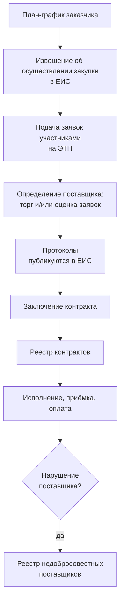

# Контрактная система: кто, что и где

Чтобы читать данные закупок, нужно понимать, кто их порождает. Здесь — минимальная карта участников и документов, на которую опирается весь остальной курс.

## Два закона, два режима

Государственные и муниципальные закупки в России регулируются двумя разными законами, и данные у них разного качества.

| | 44-ФЗ | 223-ФЗ |
|---|---|---|
| Полное имя | Федеральный закон от 05.04.2013 № 44-ФЗ «О контрактной системе в сфере закупок товаров, работ, услуг для обеспечения государственных и муниципальных нужд» | Федеральный закон от 18.07.2011 № 223-ФЗ «О закупках товаров, работ, услуг отдельными видами юридических лиц» |
| Кто закупает | Госорганы, муниципалитеты, бюджетные учреждения | Госкорпорации, компании с госучастием, ГУП и МУП, субъекты естественных монополий |
| Правила процедуры | Жёстко заданы законом | Заказчик пишет собственное положение о закупке |
| Способы закупки | Закрытый перечень | Заказчик вправе вводить свои |
| Пригодность для анализа | Высокая: процедуры единообразны, поля сопоставимы | Низкая: у каждого заказчика своя процедура и своя терминология |

Для дипломной выборки практически всегда берут 44-ФЗ. Причина не в том, что по 223-ФЗ сговоров меньше, — а в том, что там невозможно сравнивать процедуры между заказчиками: под названием «конкурентный отбор» у двух компаний могут скрываться две несопоставимые механики. Это ограничение выборки стоит проговорить в работе прямо, а не умалчивать.

## Роли

**Заказчик** — тот, кому нужны товары, работы или услуги. Он определяет предмет закупки, считает начальную (максимальную) цену контракта — далее НМЦК, — устанавливает требования к участникам и подписывает контракт.

**Участник закупки** — любое юридическое или физическое лицо, в том числе индивидуальный предприниматель, претендующее на контракт. В данных участник почти всегда идентифицируется по ИНН.

**Оператор электронной площадки** (ЭТП) — организация, на чьей технической инфраструктуре проходит процедура: приём заявок, торг, формирование протоколов. Перечень операторов утверждён распоряжением Правительства РФ от 12.07.2018 № 1447-р: восемь федеральных площадок для обычных закупок (среди них «Сбербанк-АСТ», «РТС-тендер», «Единая электронная торговая площадка», «ТЭК-Торг», «Электронные торговые системы», «Российский аукционный дом», «Агентство по государственному заказу Республики Татарстан», «ЭТП ГПБ») плюс специализированная площадка для закрытых закупок. *Перечень меняется — проверяйте актуальную редакцию распоряжения.*

**Единая информационная система** (ЕИС) — государственный портал `zakupki.gov.ru`, где публикуется всё: планы-графики, извещения, протоколы, контракты, реестры. Для вас ЕИС — единственный источник массовых данных.

**Контрольный орган** — Федеральная антимонопольная служба (ФАС России) и её территориальные управления. Рассматривает жалобы, проводит проверки, возбуждает и рассматривает дела о нарушении антимонопольного законодательства.

Важно не путать ЕИС и ЭТП. ЕИС — витрина и архив: там лежит информация. ЭТП — место, где происходит действие: подаются заявки, идёт торг. Часть данных физически рождается на площадке и попадает в ЕИС уже в свёрнутом виде — об этом отдельно в четвёртом уроке модуля.

## Жизненный цикл закупки

Каждая стрелка на этой схеме — это публикуемый документ. Каждый документ — строка или несколько строк в ваших будущих таблицах.

## Реестры, которые вам понадобятся

Помимо самих закупок в ЕИС ведётся несколько реестров, и три из них имеют прямое отношение к вашей задаче.

**Реестр контрактов** — сведения о заключённых контрактах: стороны, цена, сроки, изменения, исполнение, расторжение. Отсюда берётся фактическая цена (она может отличаться от цены победителя при изменении контракта) и признаки проблемного исполнения.

**Реестр недобросовестных поставщиков** (РНП) — компании и их учредители, уклонившиеся от заключения контракта или существенно нарушившие его. Ведёт ФАС. Для скрининга это полезный, но осторожно интерпретируемый признак: попадание в РНП говорит о проблемах с исполнением, а не о сговоре. Использовать его как целевую переменную — грубая ошибка, использовать как один из входных признаков — допустимо.

**Реестр жалоб, плановых и внеплановых проверок, принятых решений** — обращения участников в контрольный орган. Жалоба на действия заказчика может указывать на конфликт, но так же часто это инструмент конкурентной борьбы.

Отдельно стоит база решений антимонопольного органа `br.fas.gov.ru`. Это не реестр ЕИС, а отдельный ресурс ФАС, и именно там лежат решения по делам о картелях — единственный доступный вам источник достоверных меток. Как с ним работать — в модуле 04.

## Что из этого важно запомнить

Данные закупок — не одна таблица, а связанный набор документов, порождаемых разными сторонами в разные моменты времени. Ключ, который сшивает почти всё, — реестровый номер извещения; ключ, который сшивает участников между закупками, — ИНН. Всё остальное присоединяется к этим двум.
