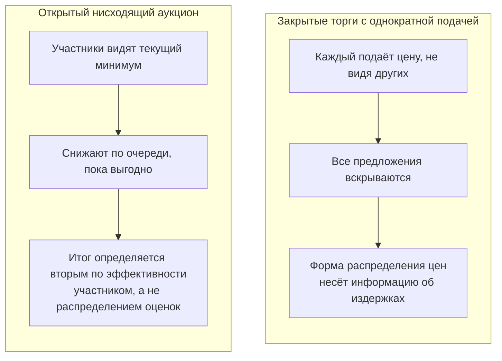

# Способы закупки и их уязвимость к сговору

Способ определения поставщика задаёт механику торга, а механика торга задаёт, какие признаки сговора вообще возможно посчитать. Выбор способа — первое, что вы фильтруете при сборке выборки.

## Перечень способов

Статья 24 Закона № 44-ФЗ делит способы определения поставщика на конкурентные — конкурсы, аукционы, запросы котировок — и закупку у единственного поставщика (статья 93). После «оптимизационного пакета» (Федеральный закон от 02.07.2021 № 360-ФЗ, вступил в силу с 1 января 2022 года) перечень конкурентных способов сокращён, а сами процедуры переведены в электронную форму и унифицированы. Практически весь массив открытых данных, с которым вы будете работать, — это электронный аукцион, электронный конкурс и электронный запрос котировок.

| Способ | Как выбирается победитель | Механика подачи цены | Типичная схема сговора | Пригодность для скрининга |
|---|---|---|---|---|
| Электронный аукцион | Минимальная цена | Открытый нисходящий торг: участники видят текущее минимальное предложение и снижают его | «Таран», отказ от торга, ротация побед | Высокая: наблюдаем и результат, и процесс торга |
| Электронный конкурс | Лучшие условия по совокупности критериев, включая нестоимостные | Однократная подача цены в составе заявки, без торга | Согласованные цены прикрытия, ротация | Средняя: наблюдаем распределение однократных предложений |
| Электронный запрос котировок | Минимальная цена, без нестоимостных критериев | Однократная подача, ограничен по цене и объёму | Согласованные цены прикрытия | Средняя, но выборка смещена в мелкие закупки |
| Закупка у единственного поставщика | Победителя нет, контракт заключается напрямую | Цены как таковой не предлагают | Не картель участников, а соглашение с заказчиком | Низкая: нет ни конкурентов, ни торга |

## Почему аукцион — главный полигон

По оценкам ФАС России, около 85 % выявленных картельных соглашений приходится на торги на электронных площадках. Причина не только в объёме: аукцион даёт самый наблюдаемый процесс. В конкурсе вы видите только итоговое предложение каждого участника, в аукционе — ещё и то, как участники себя вели, дойдя до этого предложения.

Именно это делает вашу тему выполнимой. «Поведенческие данные» в формулировке темы — это в первую очередь данные о ходе аукционного торга и о поведении участника в серии аукционов.

## Развилка, которую нельзя пропустить

Здесь методологическая ловушка, на которой спотыкается большинство работ, переносящих зарубежную методику на российские данные.

Основной корпус скрининговых показателей — коэффициент вариации предложений, относительная дистанция между первым и вторым местом, асимметрия и эксцесс распределения ставок — разработан для **закрытых торгов с однократной подачей** (sealed-bid first-price auction). Классические работы по выявлению сговора в строительстве (Швейцария, Италия, Япония) анализируют именно такие торги: каждый участник один раз подаёт запечатанное предложение, все предложения вскрываются одновременно.

Российский электронный аукцион устроен иначе: это **открытый нисходящий аукцион**. Участник видит текущую минимальную цену, знает, что его перебили, и решает, продолжать ли. Форма распределения итоговых предложений здесь порождается не независимыми оценками издержек, а динамикой торга.

Практический вывод: показатели формы распределения ставок к электронному аукциону **напрямую не переносятся**. Для аукциона осмысленны другие величины — глубина снижения относительно сегмента, число шагов, кто и когда вступил в торг, разрыв между победителем и последним предложением ближайшего конкурента. Для конкурса и запроса котировок классические показатели работают как задумано.

Если в дипломе вы смешаете эти два типа процедур в одну выборку и посчитаете по ним общие показатели, результат будет бессмысленным, а на защите это первый вопрос, который задаст любой знакомый с темой рецензент. Разумная стратегия — работать с одним типом процедуры, а второй использовать как проверку переносимости метода.

## Чего не ищем

Два явления регулярно путают со сговором участников, и оба — другой класс задач.

**Дробление закупки.** Заказчик разбивает крупную потребность на серию мелких закупок у единственного поставщика, чтобы обойти конкурентную процедуру. Это нарушение, но не картель: конкурентов нет, сговаривать некого. Ищется совсем другим методом — поиском серий однотипных мелких контрактов одного заказчика с одним поставщиком за короткий период.

**Заточка документации.** Заказчик формулирует требования так, что им соответствует ровно один поставщик. Тоже нарушение, и часто идёт рядом со сговором, но выявляется анализом текста документации, а не поведения участников.

Оба сюжета стоит упомянуть в дипломе в разделе об ограничениях — чтобы показать, что граница задачи проведена осознанно.
