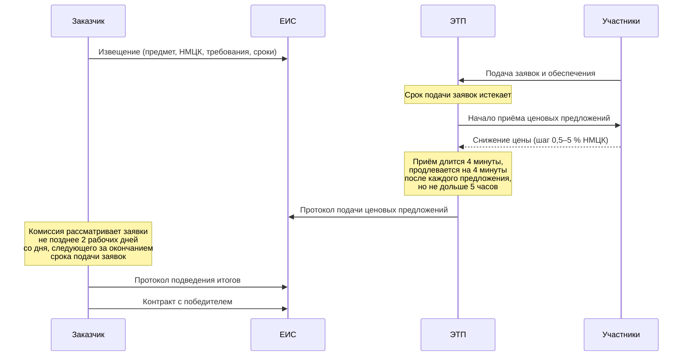

# Анатомия электронного аукциона

Порядок проведения электронного аукциона задан статьёй 49 Закона № 44-ФЗ. Разбираем его по шагам, потому что почти каждый поведенческий признак в вашей будущей модели — это число, вычисленное из какого-то из этих шагов.

## Хронология

Обратите внимание на порядок двух последних блоков: **торг происходит раньше, чем комиссия рассматривает заявки**. Это не техническая деталь, а конструктивная особенность, на которой построена самая известная схема сговора в российских закупках. Подробно — в модуле 03; пока запомните сам факт.

## Деньги на входе

**НМЦК** — начальная (максимальная) цена контракта. Её считает заказчик по методике из статьи 22 закона и обязан обосновать. НМЦК — верхняя граница торга и знаменатель почти всех относительных показателей, которые вы будете считать.

**Обеспечение заявки** требуется, если НМЦК превышает 1 млн рублей. Размер — от 0,5 % до 1 % НМЦК при цене до 20 млн рублей и от 0,5 % до 5 % при цене выше. Деньги вносятся на спецсчёт или предоставляется независимая гарантия, и на время процедуры они заморожены.

Это важнее, чем кажется. Участие в закупке **стоит денег и требует организации**. Компания, которая подаёт заявку и затем не делает ни одного шага в торге, заморозила средства ради нулевого результата. Единичный случай объясним — передумали, ошиблись в расчётах. Систематическое повторение такого поведения у одного участника объяснимо гораздо хуже, и это один из самых сильных доступных вам признаков.

**Обеспечение исполнения контракта** предоставляет победитель перед подписанием.

## Правила торга

- Шаг аукциона — от 0,5 % до 5 % НМЦК. Участник снижает текущее минимальное предложение на величину в этих границах.
- Допускается подача предложения вне шага при соблюдении условий, установленных законом.
- Время приёма ценовых предложений — **четыре минуты**. Каждое поступившее предложение продлевает срок ещё на четыре минуты.
- Общая продолжительность приёма предложений не превышает **пяти часов**.

Отсюда следует простая арифметика, полезная при разметке данных: аукцион, закончившийся ровно через четыре минуты после старта, — это аукцион, где не подано ни одного ценового предложения. Аукцион, шедший пять часов, упёрся в регламентный предел, и его итоговая цена — не обязательно та, до которой участники были готовы дойти.

## Протоколы

**Протокол подачи ценовых предложений** формирует оператор площадки. Он содержит дату и время проведения, минимальные ценовые предложения каждого участника и порядковые номера заявок, присвоенные по возрастанию цены. На этой стадии участники обезличены: видны номера, не наименования.

**Протокол подведения итогов** публикуется после рассмотрения заявок комиссией. В нём победитель, порядок участников и — ключевое для анализа — **основания отклонения** заявок, признанных не соответствующими требованиям извещения.

Соединение этих двух протоколов даёт вам полную картину: кто сколько предложил и кого после этого отклонили.

## Антидемпинговые меры

Статья 37 закона включает антидемпинговый механизм. Если участник снизил цену на **25 % и более** от НМЦК, контракт с ним заключается только после предоставления обеспечения исполнения контракта в размере, превышающем указанный в документации **в полтора раза**; авансирование такого контракта не допускается. При НМЦК до 15 млн рублей закон допускает альтернативу — подтверждение добросовестности сведениями об исполненных контрактах.

Для анализа это означает, что порог 25 % — не просто число, а **точка разрыва в поведении участников**: снижаться чуть ниже него дорого. Если в вашем распределении глубины снижения видна заметная скученность прямо перед 25 %, это следствие регулирования, а не аномалия. Не примите её за сигнал.

## Что из этого становится признаком

| Элемент процедуры | Наблюдаемая величина | Что может означать |
|---|---|---|
| НМЦК и итоговая цена | Глубина снижения, % | Аномально малое снижение для сегмента |
| Ход торга | Число ценовых предложений, длительность торга | Торга не было при нескольких участниках |
| Предложения по участникам | Разрыв между победителем и вторым местом | Аккуратно выверенный минимальный отрыв |
| Обеспечение заявки | Сам факт участия | Издержки участия без попытки победить |
| Протокол итогов | Отклонение участника и его основание | Отклонение тех, кто демпинговал сильнее всех |
| Порог 25 % | Скученность перед порогом | Эффект регулирования, не признак |

## Где здесь ошибаются

**Считают, что победил тот, кто предложил минимальную цену.** Не обязательно: заявку участника с минимальной ценой могут отклонить при рассмотрении, и контракт достанется следующему. Если вы определяете победителя как минимум по цене, а не берёте его из протокола подведения итогов, вы своими руками стираете след главной схемы сговора.

**Путают дату окончания подачи заявок с датой аукциона и с датой протокола итогов.** Это три разные отметки времени, и для построения признаков «без заглядывания в будущее» важна первая, а не последняя.

**Берут цену из контракта вместо цены из протокола.** Цена контракта может быть изменена при исполнении в пределах, допускаемых законом. Для анализа торга нужна цена победителя по протоколу, для анализа исполнения — цена контракта. Это разные величины с разным смыслом.
