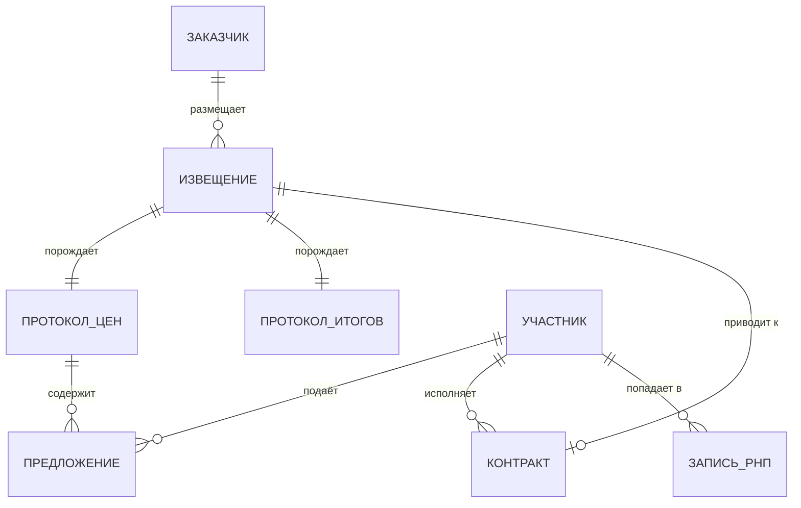

# Что остаётся в данных после каждой стадии

Последний урок модуля — мост к практике: разложим процедуру на документы и посмотрим, какие поля из них доживают до вашей таблицы.

## Документы и их содержимое

| Стадия | Документ | Ключевые поля |
|---|---|---|
| Планирование | План-график | Объект закупки, планируемая цена, срок размещения извещения |
| Объявление | Извещение об осуществлении закупки | Реестровый номер, заказчик, ИКЗ, ОКПД2, объект закупки, НМЦК, размер обеспечения, сроки, ЭТП, преимущества и ограничения |
| Торг | Протокол подачи ценовых предложений | Дата и время торга, минимальное предложение каждого участника, порядковые номера заявок |
| Подведение итогов | Протокол подведения итогов | Победитель (ИНН, наименование), цена, порядок участников, отклонённые заявки и основания отклонения |
| Контракт | Запись реестра контрактов | Реестровый номер контракта, стороны, цена, сроки, изменения, исполнение, расторжение |
| Санкции | Запись РНП | Участник, учредители, основание включения, срок |

## Идентификаторы, которыми всё сшивается

Работа с данными закупок — это работа с соединениями таблиц, и соединения держатся на нескольких кодах.

- **Реестровый номер извещения** — 19 цифр. Главный ключ: по нему связываются извещение, все протоколы и контракт.
- **ИКЗ** — идентификационный код закупки, 36 разрядов. Внутри закодированы год, заказчик, номер закупки в плане-графике, код объекта по классификации. Полезен для восстановления связи с планом-графиком.
- **ИНН** — 10 знаков у юридического лица, 12 у индивидуального предпринимателя. Единственный надёжный идентификатор участника и заказчика. Наименование для этой цели не годится: оно меняется, пишется по-разному и не уникально.
- **ОКПД2** — код продукции по классификатору. Основа сегментации: сравнивать закупки имеет смысл внутри близких кодов.
- **КТРУ** — каталог товаров, работ, услуг; более точная, чем ОКПД2, характеристика предмета закупки, доступна не для всех позиций.
- **ОКТМО** либо код региона заказчика — вторая ось сегментации.

Центральная для вас связка — «участник ↔ закупка» в середине этой схемы. Именно она в модуле 06 превратится в двудольный граф.

## Чего в данных нет

Список того, чего вы не получите, важнее списка того, что получите: он ограничивает пространство признаков, а значит и постановку задачи.

| Данные | Где существуют | Почему недоступны |
|---|---|---|
| IP-адреса подачи заявок | Электронная площадка | Не публикуются; запрашиваются контрольным органом в рамках проверки |
| Метаданные файлов заявок (автор, время создания) | Заявки на площадке | Сами заявки в открытый доступ не выкладываются |
| Переписка, телефонные соединения, движение средств | Стороны, банки, операторы связи | Добываются оперативным путём |
| Учредители и бенефициары участников | ЕГРЮЛ, ФНС | Есть, но в другом источнике — присоединять нужно отдельно, по ИНН |
| Полный журнал торга по шагам | Электронная площадка | В протокол попадают минимальные предложения каждого участника, а не вся последовательность |

Последняя строка требует пояснения, потому что она напрямую бьёт по слову «поведенческих» в названии вашей темы. Регламент формирует протокол подачи ценовых предложений из минимальных предложений участников. Насколько подробно конкретная площадка раскрывает промежуточные шаги и отметки времени — вопрос, который **нужно проверить на реальной выгрузке до того, как вы спроектируете признаки**. От ответа зависит, доступен ли вам тайминг внутри торга или только агрегаты по участникам.

Проверка занимает вечер, а ошибка здесь стоит месяца работы. Это первое практическое задание курса.

## Практика

Откройте `zakupki.gov.ru`, найдите любой завершённый электронный аукцион по 44-ФЗ и посмотрите вкладку с документами закупки. Найдите там протокол подачи ценовых предложений и протокол подведения итогов и ответьте себе на три вопроса:

1. Видны ли в протоколе отметки времени по отдельным ценовым предложениям или только итоговое время торга?
2. Совпадает ли победитель с участником, предложившим минимальную цену?
3. Есть ли отклонённые заявки и указано ли основание отклонения?

Развёрнутый вариант этого разбора — в домашнем задании модуля.
