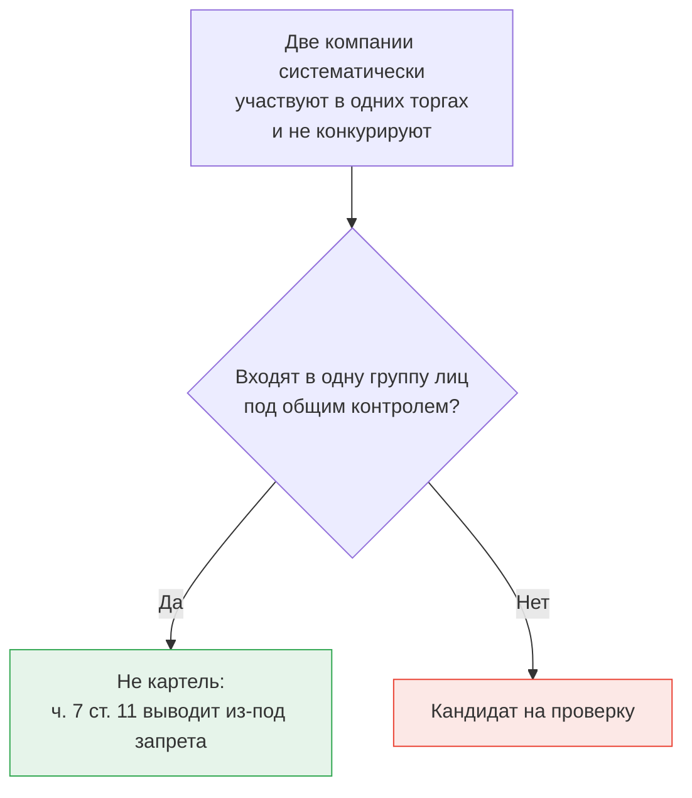

# Что закон считает сговором

Юридическая рамка нужна вам не для того, чтобы применять её, а для того, чтобы правильно определить целевую переменную. Формулировка «сговор» в обиходе покрывает несколько разных нарушений с разными сторонами и разными следами в данных.

## Основной запрет

Антиконкурентные соглашения регулирует Федеральный закон от 26.07.2006 № 135-ФЗ «О защите конкуренции».

Часть 1 статьи 11 запрещает **картель** — соглашение между хозяйствующими субъектами-конкурентами, если оно приводит или может привести к перечисленным последствиям. Для вашей темы ключевой пункт 2: повышение, снижение или поддержание цен **на торгах**.

Два свойства этого запрета важны практически.

**Запрет действует сам по себе.** Для картеля не требуется доказывать наступление вредных последствий: достаточно установить факт соглашения и его направленность. Это отличает его от норм, где нужно взвешивать влияние на конкуренцию.

**Соглашение не обязано быть документом.** Пункт 18 статьи 4 закона определяет соглашение как договорённость в письменной форме, содержащуюся в документе или нескольких документах, либо договорённость в устной форме. На практике это означает, что картель доказывается совокупностью косвенных доказательств, и устойчивое поведение участников на серии торгов — одно из них.

Второе свойство — причина, по которой ваша работа вообще имеет прикладной смысл: поведенческие закономерности здесь не просто подсказка для проверяющего, они входят в доказательственную базу.

## Соседние составы, которые не надо путать

| Норма | Что запрещает | Кто стороны | Видно ли в поведении участников |
|---|---|---|---|
| ч. 1 ст. 11, п. 2 | Соглашение конкурентов о ценах на торгах | Участники между собой | Да — это ваша задача |
| ст. 16 | Соглашения органов власти с хозяйствующими субъектами | Заказчик и участник | Косвенно: через устойчивую связку «заказчик — победитель» |
| ст. 17 | Нарушение антимонопольных требований к торгам, включая координацию со стороны организатора | Заказчик, организатор, оператор | Плохо: след прячется в документации, а не в торге |
| ч. 5 ст. 11 | Координация экономической деятельности третьим лицом | Внешний координатор и участники | Косвенно: через общий центр подготовки заявок |

Разница существенна для разметки. Если вы возьмёте из базы решений ФАС все дела со словом «торги» и сложите их в одну целевую переменную, вы смешаете нарушения с разной механикой и разными следами. Модель, обученная на такой смеси, будет учиться среднему по несопоставимым явлениям.

## Исключение, которое ломает наивный сетевой анализ

Часть 7 статьи 11 выводит из-под запрета соглашения между хозяйствующими субъектами, входящими в одну группу лиц, если один из них контролирует другого либо если они находятся под контролем одного лица. Контроль определён в части 8 — это, в частности, распоряжение более чем половиной голосов или выполнение функций исполнительного органа.

Последствие для вашей модели прямое и болезненное. Две компании, систематически участвующие в одних и тех же закупках и никогда не перебивающие друг друга, — идеальный кандидат в картель по любому сетевому признаку. Но если у них общий собственник с долей выше половины, это **не нарушение**: внутри группы лиц согласованность законна.

Отсюда практическое требование к вашей работе: сведения об аффилированности из ЕГРЮЛ нужно присоединять к данным закупок и использовать как **фильтр ложных срабатываний**. Работа, которая этого не делает, выдаст в топе списка десятки групп компаний и будет справедливо раскритикована.

Нюанс, о котором стоит знать: сама по себе связь через ЕГРЮЛ не всегда равна контролю в смысле части 8, а контроль может существовать и без формальной доли. Поэтому корректная формулировка в дипломе — не «исключаем аффилированных», а «понижаем приоритет пар с признаками формальной аффилированности, отмечая, что признак неполон в обе стороны».

## Ответственность

Административная ответственность за картель предусмотрена статьёй 14.32 КоАП РФ и рассчитывается, как правило, от выручки на рынке — так называемый оборотный штраф.

Уголовная ответственность наступает по статье 178 УК РФ, если картель причинил крупный ущерб или повлёк извлечение дохода в крупном размере. Пороги были повышены Федеральным законом от 13.12.2024 № 467-ФЗ: крупный ущерб — свыше 16 млн рублей, доход в крупном размере — свыше 80 млн рублей. *Пороговые суммы периодически пересматриваются — при использовании в дипломе сверяйтесь с действующей редакцией.*

## Что отсюда следует для целевой переменной

Определение, которое стоит записать в постановку задачи, выглядит примерно так: положительным примером считается закупка, в отношении участников которой решением антимонопольного органа, вступившим в силу, установлено нарушение пункта 2 части 1 статьи 11 Закона о защите конкуренции.

Каждое слово в этом определении работает:

- **решением** — не жалобой, не заявлением, не фактом возбуждения дела;
- **вступившим в силу** — решения оспариваются в суде, и часть из них отменяется;
- **пункта 2 части 1 статьи 11** — именно картель на торгах, а не соглашение с заказчиком и не нарушение требований к торгам;
- **в отношении участников** — нарушителем признаётся лицо, а привязка к конкретным закупкам восстанавливается из текста решения, и это отдельная работа, о которой в модуле 04.
