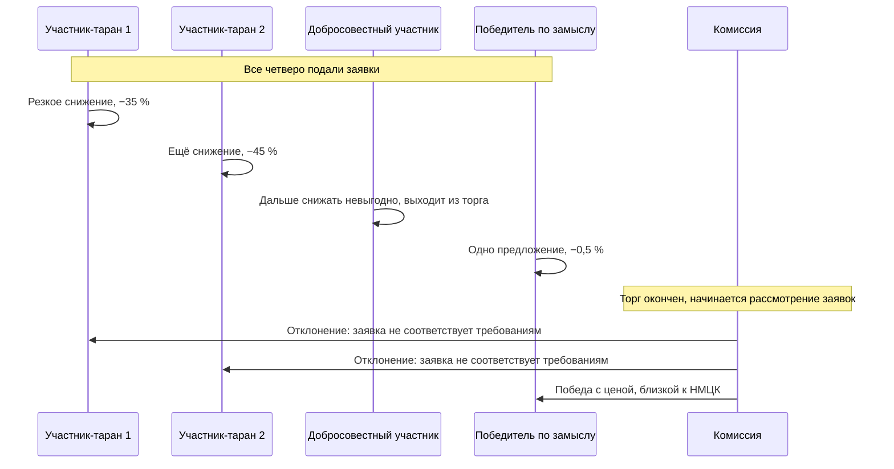

# Типовые схемы и их след в данных

Схем сговора на торгах немного, и почти все они описаны в Руководстве ОЭСР по борьбе со сговором на торгах при осуществлении государственных закупок и в материалах ФАС России. Ниже — те, что встречаются в российских электронных аукционах, и главное: как каждая выглядит в полях, которые вы сможете выгрузить.

## «Таран»

Самая известная российская схема. Она работает именно потому, что комиссия рассматривает заявки **после** торга.

Двое участников группы обваливают цену до уровня, при котором добросовестному участнику работать заведомо невыгодно. Тот выходит из торга. Третий участник группы делает символическое снижение. После торга заявки двух «таранов» отклоняются — в них заранее заложен дефект, из-за которого они не соответствуют требованиям извещения. Контракт достаётся третьему по цене, почти равной начальной.

Изменение процедуры с 2022 года, когда заявка на электронный аукцион стала единой, схему не убило: порядок «сначала торг, потом рассмотрение» сохранился, а значит сохранилась и возможность выбыть из процедуры уже после того, как конкуренты вытеснены.

**След в данных, полностью доступный вам:**

- победитель имеет одно из самых высоких итоговых предложений среди всех участников;
- участники с самыми низкими предложениями отклонены при рассмотрении;
- разрыв между ценой победителя и минимальным предложением в закупке велик — десятки процентов;
- в серии закупок повторяется устойчивая тройка или более крупная группа.

Это редкий случай, когда схема оставляет след настолько характерный, что его можно поймать простым правилом. Хорошее эмпирическое правило для отбора кандидатов: `отклонены участники с минимальной ценой` **и** `снижение победителя < 2 %` **и** `минимальное предложение по закупке ниже цены победителя более чем на 20 %`.

## Отказ от торга и цены прикрытия

Участники подают заявки, но не торгуются. Формально конкуренция есть, фактически её нет: назначенный победитель делает одно предложение или не делает ни одного, остальные молчат.

**След:** снижение от НМЦК близко к нулю при трёх и более участниках; число ценовых предложений меньше числа участников; длительность торга — четыре минуты или около того. У конкретных участников — высокая доля закупок, где они подали заявку, внесли обеспечение и не сделали ни одного шага.

Именно здесь работает довод из модуля 02 про обеспечение заявки: пассивное участие стоит денег, и систематическое пассивное участие требует объяснения.

## Ротация побед

Состав участников в сегменте стабилен, а победы распределяются по очереди. Это способ решить задачу «кто выигрывает сейчас, а кто потом» при сохранении видимости конкуренции.

**След:** в сегменте (заказчик, код ОКПД2, регион) доля побед участников подозрительно ровная; последовательность победителей чередуется чаще, чем при независимых исходах; доля побед конкретного участника слабо связана с тем, насколько низкие цены он предлагает.

## Раздел рынка

Участники договариваются не пересекаться: каждый работает со своими заказчиками, своей территорией или своей товарной группой.

**След — обратный по знаку остальным.** Здесь подозрительна не повышенная частота совместного участия, а **аномально низкая**: две крупные компании одного профиля, работающие в одном регионе и никогда не встречающиеся на одних торгах. Этот признак принципиально требует сетевого подхода: он не существует на уровне отдельной закупки. Подробно — в модуле 06.

## Компенсация проигравшему

Проигравший участник получает долю работ по субподряду. Механизм устойчивости сговора: отказ от победы компенсируется деньгами.

**След в открытых данных — слабый.** Сведения о субподрядчиках публикуются далеко не по всем контрактам. Признак полезен для понимания механики, но закладывать его в модель как основной не стоит.

## Сводка

| Схема | Механика | Наблюдаемый след | Чем маскируется |
|---|---|---|---|
| «Таран» | Демпинг с последующим отклонением заявок | Победитель с высокой ценой, отклонены самые дешёвые | Ошибки в заявках бывают и случайными |
| Отказ от торга | Заявки поданы, снижения нет | Снижение около нуля при нескольких участниках | Узкий рынок, НМЦК на уровне себестоимости |
| Ротация побед | Победы по очереди | Ровное распределение побед в сегменте | Реальная специализация участников |
| Раздел рынка | Непересечение | Аномально редкое совместное участие | Географическая логистика, разные ниши |
| Компенсация субподрядом | Оплата отказа от конкуренции | Почти не виден | — |

## Где на этом ошибаются

**Ищут одну схему и строят под неё одну модель.** Признаки разных схем не просто различаются — они направлены в разные стороны. Для «тарана» подозрительна большая разница между ценой победителя и минимальным предложением, для отказа от торга — отсутствие разницы вообще. Модель, обученная на смеси, усредняет противоположные сигналы. Разумнее либо строить отдельный скоринг на каждую схему, либо использовать модель, способную к нелинейным взаимодействиям признаков, и обязательно проверять, что она выучила, — через анализ вкладов признаков.

**Принимают нормальное поведение рынка за схему.** Ровное распределение побед бывает при реальной специализации: три компании делят регион не по сговору, а потому что у каждой своя база и свои мощности. Ни один признак из этого урока не является уликой сам по себе — все они кандидаты на проверку.

**Забывают, что «таран» требует хотя бы одного добросовестного участника.** Если в закупке ровно два участника, схема не имеет смысла — вытеснять некого. Признаки схемы имеет смысл считать только там, где число участников это допускает.
