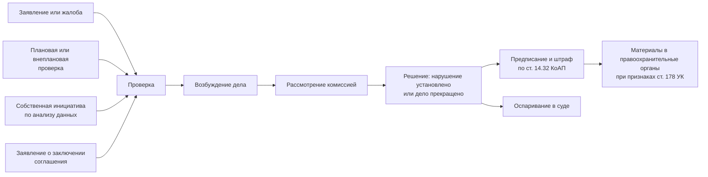

# Как сговор выявляют и доказывают

Этот урок — про то, откуда берутся ваши метки. Понимать процесс нужно не ради процесса: свойства процедуры напрямую превращаются в свойства выборки, а те — в ограничения модели.

## Путь дела

Ветка `A4` — программа освобождения от ответственности. Примечание к статье 14.32 КоАП РФ освобождает от административной ответственности участника соглашения, который первым добровольно заявил о нём, прекратил участие и представил достаточные сведения. Это мощный инструмент правоприменения и одновременно источник систематического искажения ваших данных — о нём ниже.

## Чем доказывают

Поскольку соглашение может быть устным, доказывание строится на совокупности. Условно доказательства делятся на три группы.

| Группа | Примеры | Доступно вам |
|---|---|---|
| Инфраструктурные | Совпадение IP-адресов подачи заявок, общие спецсчета, банковские гарантии одного банка в один день, совпадающие метаданные файлов заявок, единый центр подготовки документов | Нет |
| Поведенческие | Устойчивое повторение модели поведения на серии торгов, отказ от торга без экономического объяснения, отклонение заявок демпингующих участников | Да |
| Экономические | Отсутствие разумного объяснения поведения, невыгодность действий вне предположения о соглашении | Частично |

Средняя строка — это ровно то, что вы строите. Ваша работа не изобретает новый тип доказательства: она автоматизирует извлечение того типа, который уже признан правоприменительной практикой, и делает это на всём массиве, а не на закупках, попавших под проверку.

## Что уже автоматизировано

ФАС России развивает собственные средства поиска сговоров. Пилотный проект «Большой цифровой кот» был запущен осенью 2019 года; его развитием стала автоматизированная система «Антикартель», разработанная антикартельным подразделением службы совместно с Российской академией наук. Система анализирует данные закупок и внешние источники. По оценкам службы, около 85 % выявляемых картельных соглашений приходится на торги на электронных площадках, а наиболее поражённые отрасли — строительство, фармацевтика и организация питания. *Состав и возможности системы публично раскрыты фрагментарно и меняются; при ссылке в дипломе опирайтесь на официальные сообщения службы с датой.*

Для вашей работы это значит, что позиционирование «предлагаю автоматизировать то, чего нет» неверно и будет замечено. Работающие формулировки новизны — другие: воспроизводимая методика на открытых данных, оценка того, сколько даёт добавление сетевых признаков к поведенческим, сравнение классов моделей на одной выборке, честная оценка качества в условиях неполной разметки.

## Три свойства выборки, которые нужно объявить

**Смещение отбора.** Дела возбуждаются не по случайной выборке закупок. Их источники — жалобы, проверки и собственный анализ службы. Значит, в множество известных картелей систематически чаще попадают те, кого искали: крупные закупки, определённые отрасли, регионы с активными территориальными управлениями. Модель, обученная на таких метках, учится в том числе воспроизводить приоритеты правоприменителя, а не только распознавать сговор.

**Искажение от программы освобождения.** Часть дел появляется из добровольных заявлений. Такой картель мог не иметь в данных вообще никаких аномалий — он выявлен не по следу, а по признанию. Эти наблюдения попадут в вашу положительную выборку как объекты, неотличимые от добросовестных, и будут тянуть качество модели вниз способом, который невозможно исправить подбором гиперпараметров.

**Лаг.** Между закупкой и вступившим в силу решением проходит от одного до нескольких лет: проверка, рассмотрение дела, оспаривание в суде. Практическое следствие: **свежий период выборки почти не содержит положительных меток**, и это не отсутствие нарушений, а отсутствие ещё не вынесенных решений. Если вы разделите выборку по времени наивно и положите последние полгода в тест, вы получите тест, в котором положительный класс почти пуст.

## Что с этим делать

Полного решения нет ни у кого, но есть честные варианты, и выбрать один придётся в модуле 04:

- считать задачу задачей обучения на положительных и неразмеченных данных (PU-learning), прямо признавая, что отрицательный класс — это «неизвестно», а не «нарушения не было»;
- строить скрининг без учителя, а известные дела использовать только для проверки, что подозрительные закупки действительно всплывают наверх;
- работать с обучением с учителем, но обрезать период так, чтобы метки успели появиться, и явно описать смещение в ограничениях работы.

Худший вариант — молча обучить классификатор, получить высокие метрики и не сказать про смещение ни слова. Именно этот вариант чаще всего и встречается в студенческих работах, и именно на нём их разбирают на защите.
