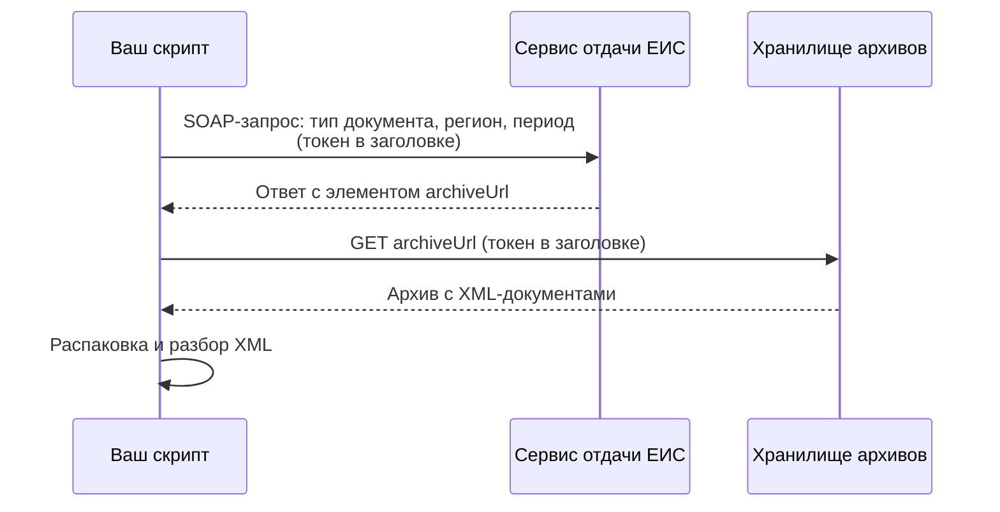

# Получение данных из ЕИС

Практический урок: как устроен обмен с сервисами отдачи информации ЕИС и как спланировать выгрузку так, чтобы не переделывать её трижды.

Всё описанное ниже верно **по состоянию на сентябрь 2026 года**. Сервис развивается, поэтому имена методов и допустимые значения параметров сверяйте с двумя документами на `zakupki.gov.ru`: инструкцией по использованию сервисов отдачи информации ЕИС и Альбомом ТФФ.

## Схема обмена



Ключевая особенность: сервис не возвращает данные напрямую. Он возвращает **ссылку на архив**, который нужно скачать отдельным запросом, тоже с токеном.

## Что нужно на входе

**Токен.** Выдаётся в личном кабинете ЕИС. Порядок получения описан в инструкции по использованию сервисов отдачи информации для юридических и физических лиц. Для физического лица используется собственный набор методов.

**Точка подключения.** Для физических лиц — `https://int44.zakupki.gov.ru/eis-integration/services/getDocsIP`. Для юридических лиц существует отдельная точка.

## Структура запроса

SOAP-конверт состоит из заголовка с токеном и тела с методом. В теле два обязательных блока: `index` с метаданными запроса и `selectionParams` с параметрами отбора.

```xml
<soapenv:Envelope xmlns:soapenv="http://schemas.xmlsoap.org/soap/envelope/"
                  xmlns:ws="http://zakupki.gov.ru/fz44/get-docs-ip/ws">
  <soapenv:Header>
    <individualPerson_token>ВАШ_ТОКЕН</individualPerson_token>
  </soapenv:Header>
  <soapenv:Body>
    <ws:getDocsByOrgRegionRequest>
      <index>
        <id>0f0a3f1e-4c1b-4a6d-9b2e-7c9d1a2b3c4d</id>
        <createDateTime>2026-09-15T10:00:00</createDateTime>
        <mode>PROD</mode>
      </index>
      <selectionParams>
        <orgRegion>66</orgRegion>
        <subsystemType>PRIZ</subsystemType>
        <documentType44>epNotificationEF2020</documentType44>
        <periodInfo>
          <exactDate>2026-09-01</exactDate>
        </periodInfo>
      </selectionParams>
    </ws:getDocsByOrgRegionRequest>
  </soapenv:Body>
</soapenv:Envelope>
```

Пространство имён, точные названия элементов и допустимые значения `subsystemType` и `documentType44` берите из инструкции и Альбома ТФФ — в примере они показаны для понимания структуры, а не для копирования вслепую.

Основные методы:

| Метод | Когда применять |
|---|---|
| `getDocsByOrgRegionRequest` | Массовая выгрузка: регион + тип документа + период |
| `getDocsByReestrNumberRequest` | Точечно: документы по конкретной закупке |
| `getNsiRequest` | Справочники: классификаторы, перечни |

`getNsiRequest` пропускать не стоит. Справочники нужны, чтобы расшифровывать коды в основных документах, и выгружать их надо один раз в начале.

## Минимальный клиент на Python

Библиотека `requests` (версия 2.x), стандартные модули для разбора XML и работы с архивами.

```python
import uuid
import zipfile
import io
from datetime import datetime
import requests
from lxml import etree

ENDPOINT = "https://int44.zakupki.gov.ru/eis-integration/services/getDocsIP"
TOKEN = "ВАШ_ТОКЕН"

def build_request(org_region: str, subsystem: str, doc_type: str, date: str) -> str:
    return f"""<soapenv:Envelope xmlns:soapenv="http://schemas.xmlsoap.org/soap/envelope/"
                      xmlns:ws="http://zakupki.gov.ru/fz44/get-docs-ip/ws">
  <soapenv:Header><individualPerson_token>{TOKEN}</individualPerson_token></soapenv:Header>
  <soapenv:Body>
    <ws:getDocsByOrgRegionRequest>
      <index>
        <id>{uuid.uuid4()}</id>
        <createDateTime>{datetime.now().isoformat(timespec='seconds')}</createDateTime>
        <mode>PROD</mode>
      </index>
      <selectionParams>
        <orgRegion>{org_region}</orgRegion>
        <subsystemType>{subsystem}</subsystemType>
        <documentType44>{doc_type}</documentType44>
        <periodInfo><exactDate>{date}</exactDate></periodInfo>
      </selectionParams>
    </ws:getDocsByOrgRegionRequest>
  </soapenv:Body>
</soapenv:Envelope>"""

def fetch_archive_urls(org_region, subsystem, doc_type, date):
    body = build_request(org_region, subsystem, doc_type, date)
    resp = requests.post(
        ENDPOINT,
        data=body.encode("utf-8"),
        headers={"Content-Type": "text/xml; charset=utf-8"},
        timeout=120,
    )
    resp.raise_for_status()
    tree = etree.fromstring(resp.content)
    # имя элемента со ссылкой ищем без учёта пространства имён
    return [el.text for el in tree.iter() if etree.QName(el).localname == "archiveUrl"]

def download_and_extract(archive_url, target_dir):
    resp = requests.get(
        archive_url,
        headers={"individualPerson_token": TOKEN},
        timeout=600,
    )
    resp.raise_for_status()
    with zipfile.ZipFile(io.BytesIO(resp.content)) as zf:
        zf.extractall(target_dir)
        return zf.namelist()
```

Обратите внимание на две детали. Токен передаётся **дважды и по-разному**: в теле SOAP-конверта при запросе и в HTTP-заголовке при скачивании архива. И поиск элемента `archiveUrl` сделан без учёта пространства имён — так код переживёт смену версии схемы.

## План выгрузки

Выгрузка — это перебор по трём осям: регион × период × тип документа. Несколько правил, которые экономят дни.

**Сохраняйте сырьё.** Скачанные архивы кладите на диск как есть и никогда не удаляйте. Разбор XML вы переделаете пять раз, а повторная выгрузка миллиона документов стоит суток.

**Ведите журнал.** Таблица «регион, дата, тип документа, статус, число файлов, время» позволяет продолжить с места обрыва и доказать полноту выгрузки в дипломе.

**Выгружайте согласованные комплекты.** Для одной закупки нужны извещение и **оба протокола**. Если вы выгрузите только извещения, посчитать не сможете ничего: там нет ни участников, ни цен.

**Начните с одного дня и одного региона.** Разберите на нём XML полностью, убедитесь, что нужные поля есть, и только потом запускайте массовую выгрузку. День работы здесь экономит неделю.

## Где ошибаются

**Выгружают извещения и обнаруживают, что данных о торге нет.** Самая частая и самая дорогая ошибка. Участники, их предложения, победитель и отклонения лежат в протоколах, а не в извещении.

**Разбирают XML с жёстко прописанным пространством имён.** Версии схем меняются, и код, привязанный к конкретному URI пространства имён, ломается на документах другого года. В выборке за три-четыре года такие документы будут обязательно.

**Не проверяют полноту.** Отсутствие данных за какой-то день легко не заметить, а потом получить провал в графе участников и списать его на «в этот период не было закупок». Сверяйте число документов по дням и глазами смотрите на график — провалы видны сразу.
