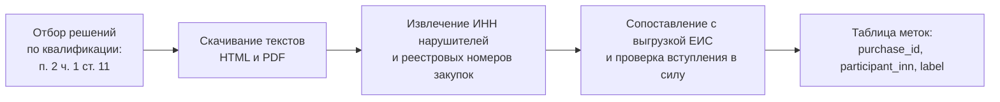

# Разметка: где взять целевую переменную

Самый важный урок курса. Решение, принятое здесь, определяет выбор моделей, схему валидации, метрику и то, какие утверждения вы сможете защитить.

## Единственный источник

Достоверно известный сговор — это вступившее в силу решение антимонопольного органа. Других источников нет: ни жалобы, ни попадание в реестр недобросовестных поставщиков, ни «подозрительное поведение» метками не являются.

Решения лежат в базе `br.fas.gov.ru`. Программного интерфейса у неё нет, поэтому построение разметки — это конвейер из четырёх шагов.



## Извлечение идентификаторов

Реестровый номер извещения — 19 цифр, ИНН — 10 или 12. Регулярные выражения находят кандидатов, контрольная сумма отсеивает мусор: в тексте решения есть и номера дел, и номера счетов, и ОГРН.

```python
import re

RE_REESTR = re.compile(r"\b\d{19}\b")
RE_INN = re.compile(r"\b(\d{10}|\d{12})\b")

WEIGHTS_10 = (2, 4, 10, 3, 5, 9, 4, 6, 8)
WEIGHTS_11 = (7, 2, 4, 10, 3, 5, 9, 4, 6, 8)
WEIGHTS_12 = (3, 7, 2, 4, 10, 3, 5, 9, 4, 6, 8)

def is_valid_inn(inn: str) -> bool:
    if not inn.isdigit():
        return False
    d = [int(c) for c in inn]
    def csum(weights, upto):
        return sum(w * x for w, x in zip(weights, d[:upto])) % 11 % 10
    if len(d) == 10:
        return csum(WEIGHTS_10, 9) == d[9]
    if len(d) == 12:
        return csum(WEIGHTS_11, 10) == d[10] and csum(WEIGHTS_12, 11) == d[11]
    return False

def extract(text: str):
    inns = {m for m in RE_INN.findall(text) if is_valid_inn(m)}
    reestr = set(RE_REESTR.findall(text))
    return inns, reestr
```

Контрольная сумма отсекает большую часть ложных срабатываний, но не все: последовательность из десяти нулей проверку проходит. Финальная сверка — по наличию ИНН в вашей выгрузке ЕИС.

## Три неприятных свойства получаемой разметки

**Решение выносится в отношении лиц, а не закупок.** Комиссия признаёт нарушителями организации; перечень закупок приводится в мотивировочной части, и приводится не всегда полно — встречаются формулировки вида «и в иных закупках». Значит, сопоставление «решение → закупки» само по себе неточно, и часть положительных примеров вы пометите как отрицательные.

**Тексты неструктурированы.** Часть решений выложена в PDF, иногда сканами. Доля извлекаемых машинно решений — величина, которую нужно измерить на своей выборке и указать в работе.

**Объём мал.** Дел о картелях на торгах — сотни в год по стране, из них с полностью раскрытым перечнем закупок — меньше. После пересечения с вашим сегментом (регион, ОКПД2, период) положительных примеров может остаться несколько десятков. Это реалистичный, а не пессимистический прогноз, и планировать работу нужно исходя из него.

Сделайте эту оценку **до** того, как начнёте что-либо моделировать: отберите решения по своему сегменту и посчитайте, сколько закупок вы из них извлекли. Если получилось меньше тридцати, обучение с учителем как основной метод отпадает, и это надо знать в начале работы, а не в конце.

## Три постановки задачи

| Постановка | Что считаем известным | Плюсы | Минусы | Когда выбирать |
|---|---|---|---|---|
| Обучение с учителем | Метки достоверны в обе стороны | Привычные метрики, простая подача | Отрицательный класс заведомо загрязнён; сильное смещение отбора | Меток много, сегмент хорошо покрыт делами |
| Обучение на положительных и неразмеченных данных (PU-learning) | Положительные достоверны, остальное неизвестно | Честно отражает природу данных; методологическая новизна | Сложнее в реализации и в объяснении | Меток мало, но они есть — типичный случай |
| Скрининг без учителя | Меток нет, есть ожидания о форме аномалии | Не зависит от смещения разметки; работает на всём массиве | Нельзя измерить полноту; оценка качества трудоёмка | Меток почти нет либо нужен метод для любого сегмента |

Ключевое различие между первой и второй строкой — интерпретация нуля. В обучении с учителем ноль означает «нарушения не было». В действительности он означает «нарушение не выявлено», а это совсем другое утверждение, и вся разница между честной и нечестной работой умещается в него.

## Рекомендуемая схема для диплома

Гибрид, который защищается лучше всего и опирается на ваши реальные объёмы данных:

1. **Скрининг без учителя как основной метод.** Он применим ко всему массиву и не зависит от того, добралась ли до сегмента проверка.
2. **Известные дела как проверочный набор.** Вопрос, на который вы отвечаете: какую долю закупок из установленных картелей ваш скрининг поднимает в верхние проценты списка. Это оценка полноты на достоверном подмножестве.
3. **Обучение с учителем на подвыборке — как сравнение.** Если меток хватает хотя бы на десятки примеров, обучите модель и сравните с скринингом по одной метрике. Даже отрицательный результат здесь содержателен: он показывает, сколько на самом деле даёт разметка.
4. **Ручная проверка головы списка.** Возьмите топ-50 закупок и разберите каждую по схеме из домашнего задания модуля 03. Доля объяснимых — оценка точности, полученная единственным доступным вам способом.

Пункт 4 — та часть работы, которую студенты пропускают чаще всего и которая на защите ценится выше всех остальных: она показывает, что вы понимаете, что именно нашла ваша модель.

## Что записать в ограничения работы

Три формулировки, которые стоит иметь в тексте диплома дословно:

- отрицательный класс означает отсутствие выявленного нарушения, а не отсутствие нарушения;
- выборка известных нарушений смещена приоритетами правоприменителя и содержит дела, раскрытые не по следу в данных, а по заявлению участника;
- в свежем периоде метки отсутствуют по причине лага правоприменения, поэтому обучение и проверка ограничены периодом, для которого решения успели вступить в силу.

Эти три предложения закрывают большинство вопросов, которые задают на защите таких работ.
