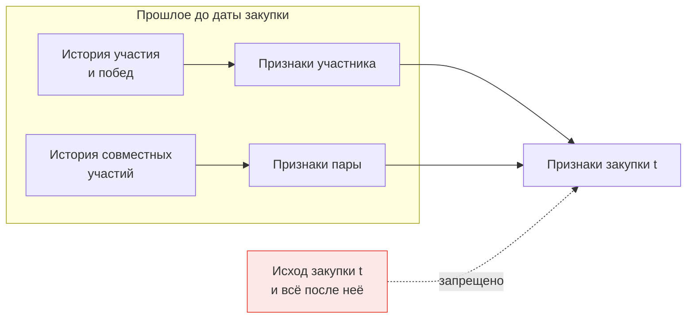

# Логика скрининга

Скрининг (screening) — метод поиска сговора по статистическим отклонениям в наблюдаемых данных. Понятие пришло из антимонопольной экономики; базовое разделение предложено в работе Joseph Harrington «Detecting Cartels» (2008).

## Два типа скринингов

**Структурный скрининг** отвечает на вопрос «где сговор вероятен». Он смотрит на характеристики рынка: число поставщиков, концентрация, однородность продукции, стабильность состава участников, барьеры входа. Сговор легче поддерживать на рынке с немногими устойчивыми игроками и однородным товаром.

**Поведенческий скрининг** отвечает на вопрос «где сговор проявился». Он смотрит на действия участников: как распределены цены, кто торгуется, кто выигрывает, кто с кем встречается.

Ваша тема — про второй тип, но первый нужен как источник контекстных признаков. Закупка со снижением 0,3 % на рынке из сорока активных поставщиков и такая же закупка на рынке из трёх — разные события, и модель должна видеть эту разницу.

## Почему скрининги вообще работают

Конкурентный торг — это процесс, где исход определяется независимыми обстоятельствами каждого участника: его издержками, загрузкой, аппетитом к риску. Независимость порождает разброс.

Сговор заменяет независимость координацией. Координация убирает разброс там, где он должен быть (цены проигравших перестают отражать их издержки; глубина снижения становится одинаковой), и создаёт закономерности там, где их быть не должно (победы чередуются; одни и те же участники всегда встречаются вместе).

Отсюда рабочее определение признака: **признак сговора — это измеримое отклонение от того разброса, который должна порождать независимость**.

## Главный принцип: отклонение от нормы сегмента

Ни один показатель из следующих уроков не используется в абсолютном виде. Снижение на 2 % — это много или мало? Ответ зависит от того, что закупается и где.

Поэтому каждый показатель проходит нормировку внутри сегмента. Сегмент определяется, как минимум, кодом ОКПД2 и регионом; при достаточном объёме данных добавляется диапазон НМЦК.

```python
def normalize_in_segment(df, col, segment_cols, min_size=30):
    grp = df.groupby(segment_cols)[col]
    mu, sd, n = grp.transform("mean"), grp.transform("std"), grp.transform("size")
    z = (df[col] - mu) / sd
    # в маленьких сегментах статистика ненадёжна
    return z.where(n >= min_size)
```

Два замечания к этому коду. Первое: в маленьких сегментах нормировка бессмысленна, и значение лучше отметить как отсутствующее, чем подсунуть модели шум. Второе: если распределение показателя далеко от симметричного — а у большинства ценовых показателей это так, — вместо стандартизации надёжнее брать перцентиль внутри сегмента:

```python
df["drop_rate_pct"] = df.groupby(segment_cols)["drop_rate"].rank(pct=True)
```

Перцентиль устойчив к выбросам и одинаково интерпретируется в любом сегменте: 0,02 означает «снижение в нижних двух процентах для такого рынка».

## Три уровня агрегации

| Уровень | Единица | Примеры признаков | Роль |
|---|---|---|---|
| Закупка | Лот | Глубина снижения, разрыв до минимальной цены, число ценовых предложений | Что произошло здесь |
| Участник | ИНН на момент времени | Доля побед, доля пассивных участий, концентрация по заказчикам | Как ведёт себя этот игрок |
| Пара участников | Две компании на момент времени | Частота совместного участия, асимметрия побед в паре | Есть ли между ними отношения |

Признаки второго и третьего уровня — это то, что в названии вашей темы скрыто за словами «поведенческих и сетевых». Третий уровень естественно продолжается в граф и разбирается в модуле 06.

## Правило, нарушение которого обесценивает всю работу

Все признаки уровня участника и пары считаются **по данным строго до момента, когда закупка стала известна** — то есть до даты окончания подачи заявок по ней.

Нарушить это правило легко и незаметно: достаточно посчитать «долю побед участника» по всей выборке и присоединить её к каждой закупке. Модель получит информацию о будущем, метрики на тесте вырастут, а на новых данных всё рассыплется.



Как считать признаки без утечки технически — в третьем уроке модуля.

## Где ошибаются

**Нормируют по всей выборке вместо сегмента.** Признак «снижение ниже среднего по стране» помечает подозрительными целые отрасли с низкой маржой и пропускает сговоры в отраслях с высокой.

**Стандартизуют скошенные распределения.** Для показателей вроде разрыва до минимальной цены, где почти все значения равны нулю, а немногие очень велики, среднее и дисперсия непоказательны, и z-оценка получается нестабильной.

**Считают признак пары по всем парам подряд.** Число пар растёт квадратично: десять тысяч участников дают пятьдесят миллионов пар, из которых подавляющее большинство никогда не встречались. Считать нужно только по парам, встретившимся хотя бы дважды, — как это делается, в модуле 06.
