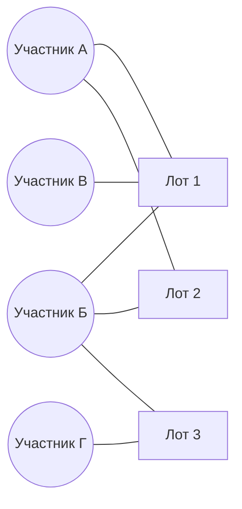

# Как построить граф участников

Сетевой анализ добавляет к поведенческим признакам то, чего в них принципиально нет: структуру отношений между участниками. Начинаем с построения самого графа — и с ошибки, которую делают почти все.

## Двудольный граф

Естественное представление данных о закупках — двудольный граф (bipartite graph): вершины двух типов, рёбра только между типами.



Здесь ребро означает «участник подал заявку на этот лот». Это исходная структура; никакой информации она не теряет.

## Проекция и её главная ловушка

Чтобы говорить об отношениях между участниками, граф проецируют на одну долю: вершины — участники, ребро между двумя участниками означает, что они встречались, вес — число совместных участий.

И здесь возникает проблема, из-за которой наивный сетевой анализ даёт бесполезный результат. **Число совместных участий смещено активностью.** Компания, подающая заявки на тысячу закупок в год, встретится со всеми часто — не потому, что с кем-то связана, а потому, что она везде. Наиболее «связанными» окажутся самые крупные игроки рынка.

Вес ребра поэтому нужно измерять не в количестве встреч, а в том, **насколько число встреч превышает ожидаемое при случайном пересечении**.

## Нулевая модель

Зафиксируем, что считать случайностью: участники распределены по лотам случайно при сохранении числа участий у каждого участника и числа участников в каждом лоте.

Если всего `N` лотов, участник A подал заявки на `a` из них, участник B — на `b`, то число их совместных лотов при случайном распределении подчиняется гипергеометрическому распределению. Ожидаемое число встреч примерно `a · b / N`, а значимость наблюдаемого числа `k` оценивается как вероятность получить `k` или больше случайно.

```python
import numpy as np
import pandas as pd
from itertools import combinations
from scipy.stats import hypergeom

def pair_significance(bids: pd.DataFrame) -> pd.DataFrame:
    lots = bids["purchase_id"].nunique()
    n_by_participant = bids.groupby("participant_inn")["purchase_id"].nunique()

    co = (
        bids.groupby("purchase_id")["participant_inn"]
            .apply(lambda s: list(combinations(sorted(s.unique()), 2)))
            .explode()
            .dropna()
            .value_counts()
            .rename("k")
            .reset_index(names="pair")
    )
    co = co[co["k"] >= 2].copy()
    co[["a_inn", "b_inn"]] = pd.DataFrame(co["pair"].tolist(), index=co.index)

    a = co["a_inn"].map(n_by_participant).to_numpy()
    b = co["b_inn"].map(n_by_participant).to_numpy()
    k = co["k"].to_numpy()

    co["expected"] = a * b / lots
    # вероятность встретиться k и более раз случайно
    co["p_value"] = hypergeom.sf(k - 1, lots, a, b)
    co["lift"] = k / co["expected"]
    return co
```

Такой подход к проверке связей в двудольных сетях закупок использован, в частности, в работе Wachs и Kertész о сетевом выявлении картелей на венгерских торгах (Scientific Reports, 2019).

Два практических замечания.

**Пары с одной встречей отбрасываются до расчёта.** Их подавляющее большинство, они не несут информации, а вычисление по ним съедает всё время.

**Множественная проверка гипотез.** Вы считаете p-значение для сотен тысяч пар, поэтому часть малых значений появится случайно. Применяйте поправку — контроль доли ложных отклонений (процедура Бенджамини — Хохберга) практичнее, чем поправка Бонферрони, которая при таком числе сравнений оставит вас без связей вовсе.

## Сегментация графа

Граф строится **внутри сегмента**, а не по всему массиву. Иначе поставщик продуктов питания и подрядчик по дорожному ремонту окажутся связанными через закупку, где оба почему-то участвовали, и структура рынка размоется.

Практически это означает: либо отдельный граф на каждый крупный сегмент, либо один граф, но с нулевой моделью, учитывающей сегменты — тогда ожидаемое число встреч считается по лотам того сегмента, где пара реально работает.

## Какие ещё графы бывают полезны

| Граф | Вершины | Ребро | Что показывает |
|---|---|---|---|
| Совместного участия | Участники | Встретились на одном лоте | Кто с кем пересекается |
| Участник — заказчик | Участники и заказчики | Участник подал заявку заказчику | Привязка к заказчикам, раздел по клиентам |
| Победы и проигрыши | Участники | Один выиграл, другой проиграл при встрече | Асимметрия: кто кому systematически уступает |
| Аффилированности | Участники | Общий учредитель, руководитель или адрес | Фильтр групп лиц из модуля 03 |

Последний граф строится не из данных закупок, а из ЕГРЮЛ, и нужен для того, чтобы не выдать законную группу лиц за картель.

## Где ошибаются

**Строят проекцию с сырыми весами и радуются плотному ядру.** Плотное ядро в такой проекции — это просто список самых активных участников рынка. Проверить легко: сопоставьте степень вершины с числом участий; если корреляция близка к единице, вы измеряете активность, а не связи.

**Включают в граф закупки с одним участником.** Они не порождают рёбер, но входят в общее число лотов `N` и потому искажают нулевую модель. Считайте `N` по лотам, где участников было не менее двух.

**Строят граф по всему периоду сразу.** Это утечка: связи, возникшие после закупки, попадают в её признаки. Решение — снимки графа, третий урок модуля.
