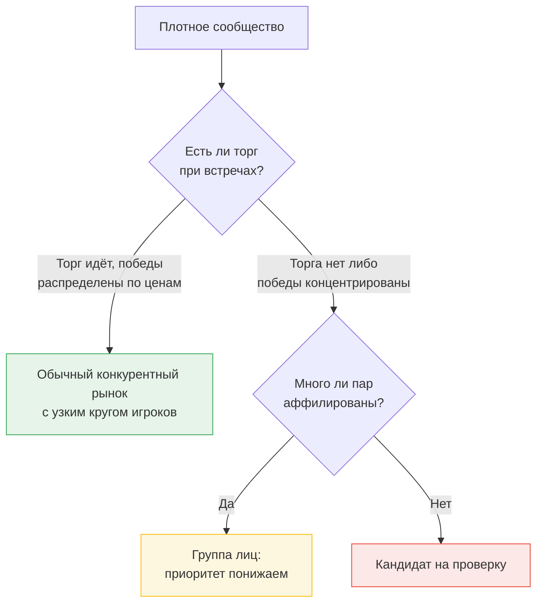

# Метрики графа и выявление сообществ

Граф построен, связи проверены на значимость. Теперь из него нужно извлечь структуру: кто образует плотные группы и какие из этих групп ведут себя не как конкуренты.

## Метрики вершин

Считаются на графе значимых связей — то есть после отсечения по поправленному p-значению из предыдущего урока.

| Метрика | Что означает | Как читать в контексте задачи |
|---|---|---|
| Степень | Число значимых партнёров | Много устойчивых пересечений при умеренной активности |
| Взвешенная степень | Суммарный вес значимых связей | Сила всех отношений вместе |
| Коэффициент кластеризации | Доля связанных пар среди соседей | Соседи участника связаны и между собой — признак группы, а не звезды |
| Номер k-ядра | Глубина вложенности в плотную часть графа | Принадлежность к устойчивому ядру рынка |

Коэффициент кластеризации — самая информативная из четырёх. Крупный подрядчик пересекается со многими, но его партнёры друг с другом не связаны: получается звезда с низкой кластеризацией. Группа договорившихся компаний встречается друг с другом попарно: получается плотный треугольник и высокая кластеризация при умеренной степени.

## Выявление сообществ

Сообщество (community) — группа вершин, связанных между собой плотнее, чем с остальным графом. Стандартный инструмент — максимизация модулярности методом Лувена или его улучшенной версией Лейдена.

```python
import networkx as nx  # networkx 3.x

edges = co[co["p_adj"] < 0.01]           # значимые связи после поправки
G = nx.Graph()
G.add_weighted_edges_from(
    edges[["a_inn", "b_inn", "lift"]].itertuples(index=False, name=None)
)

communities = nx.community.louvain_communities(G, weight="weight", seed=42)
clustering = nx.clustering(G, weight="weight")
core = nx.core_number(G)
```

Параметр `seed` обязателен: метод Лувена стохастичен, и без фиксации зерна результат меняется от запуска к запуску. Для диплома это вопрос воспроизводимости.

Вес ребра здесь — превышение фактического числа встреч над ожидаемым, а не само число встреч. Это принципиально: иначе сообщества сформируются вокруг самых активных компаний.

## Сообщество — ещё не картель

Плотное сообщество означает только, что группа компаний систематически встречается на одних торгах. Это верно и для настоящего конкурентного рынка: три дорожных подрядчика области будут встречаться постоянно, потому что заказчиков мало и все закупки общие.

Отличие сговора не в том, что участники встречаются, а в том, что **при встречах они не конкурируют**. Значит, сообщества нужно ранжировать не по плотности, а по отсутствию конкуренции внутри.

| Показатель сообщества | Формула | Подозрительное значение |
|---|---|---|
| Внутренняя плотность | Доля реализованных рёбер среди возможных | Близко к 1 |
| Доля встреч без торга | Лоты со встречей членов группы, где ни один из них не сделал ценового предложения | Высокая |
| Средняя глубина снижения при встречах | По лотам, где встретились не менее двух членов | Низкая относительно сегмента |
| Концентрация побед | Индекс Херфиндаля по победителям внутри группы | Очень высокая или, наоборот, подозрительно ровная |
| Доля отклонённых заявок членов группы | Отклонения / участия | Высокая — возможный признак «тарана» |
| Доля пар с формальной аффилированностью | По данным ЕГРЮЛ | Высокая означает группу лиц, а не картель |

Последняя строка — фильтр, о котором шла речь в модуле 03. Сообщество с высокой долей аффилированных пар опускается в приоритете: согласованность внутри группы лиц выведена из-под запрета частью 7 статьи 11.

Два подозрительных профиля выглядят по-разному, и их полезно различать с самого начала:



## Размер сообществ

Метод Лувена на разреженном графе закупок часто выдаёт несколько огромных сообществ и длинный хвост мелких. Огромные сообщества бесполезны: они соответствуют рынку целиком, а не группе.

Два способа получить работающее разбиение. Первый — увеличить параметр разрешения (`resolution` в `louvain_communities`): чем он больше, тем мельче сообщества. Второй, обычно лучший, — не искать разбиение всего графа, а искать локально плотные группы: k-ядра высокого порядка или клики небольшого размера.

Для вашей задачи интересны группы из трёх — семи участников. Схема «таран» требует минимум трёх; сговоры из десятков компаний встречаются, но координировать такую группу трудно, и в делах они редки.

## Где ошибаются

**Ранжируют сообщества по размеру или плотности.** В голову списка попадают целые отрасли. Ранжировать нужно по отсутствию конкуренции внутри группы.

**Не фиксируют зерно генератора.** Разбиение меняется между запусками, и числа в дипломе не воспроизводятся — на защите это заметная проблема.

**Интерпретируют сообщество как обвинение.** Сообщество — это гипотеза о группе, требующая проверки каждого её участника по остальным признакам. В тексте работы формулировки должны это отражать: «группа, требующая приоритетной проверки», а не «выявленный картель».
