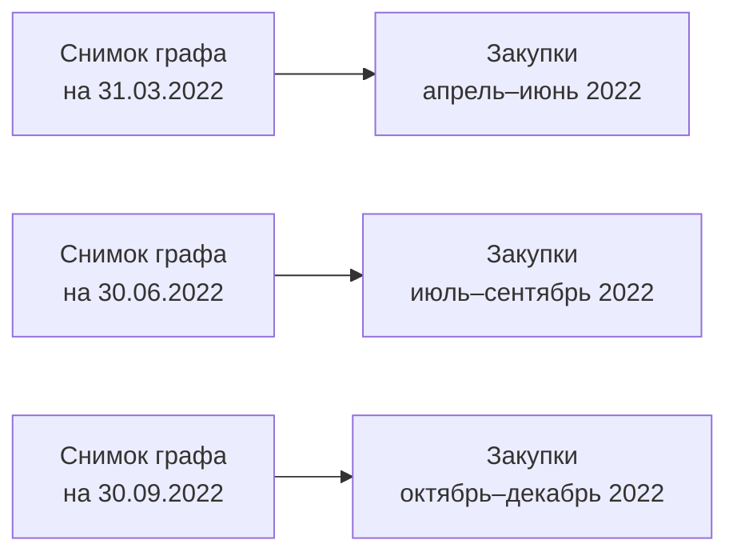

# Признаки из графа без утечки

Сетевые признаки — самое опасное место всей работы с точки зрения утечки данных. Граф по своей природе агрегирует всю историю, а история в нём не размечена по времени, если вы этого не сделали руками.

## В чём опасность

Представьте закупку, состоявшуюся в марте 2022 года, и участников A и B. Вы строите граф по всей выборке за 2021–2024 годы, получаете вес ребра A—B и присоединяете его к мартовской закупке как признак.

В этот вес вошли все их встречи, включая встречи 2023 и 2024 годов. Если A и B действительно связаны, их последующие совместные участия усилили ребро — и признак закупки 2022 года теперь содержит информацию о том, что произошло после неё.

Эффект сильнее, чем при утечке в обычных признаках, по двум причинам. Во-первых, граф связывает наблюдения между собой, поэтому утечка распространяется по рёбрам: закупка получает информацию не только о своём будущем, но и о будущем своих участников. Во-вторых, метрики сообществ вычисляются глобально, и отнесение участника к группе зависит от всего графа целиком.

Результат предсказуем: отличные метрики на тесте и полная неработоспособность на новых данных.

## Решение: снимки графа

Тот же приём, что для сложных поведенческих признаков в модуле 05. Граф строится на конец каждого квартала по данным строго до этой даты; закупка получает признаки из последнего снимка, сделанного до её объявления.



Двенадцать снимков на трёхлетнюю выборку — вполне посильный объём вычислений, а каждый снимок строится тем же кодом, что в первом уроке модуля.

```python
import pandas as pd
from itertools import combinations

def build_snapshots(bids, snap_dates, p_threshold=0.01):
    node_frames, pair_frames = [], []
    for snap in snap_dates:
        hist = bids[bids["dt_bids_end"] < snap]
        if hist["purchase_id"].nunique() < 200:
            continue                       # слишком мало истории для нулевой модели
        co = pair_significance(hist)       # функция из первого урока
        co["p_adj"] = benjamini_hochberg(co["p_value"])
        sig = co[co["p_adj"] < p_threshold]

        G = nx.Graph()
        G.add_weighted_edges_from(
            sig[["a_inn", "b_inn", "lift"]].itertuples(index=False, name=None)
        )
        comms = nx.community.louvain_communities(G, weight="weight", seed=42)
        comm_size = {n: len(c) for c in comms for n in c}
        clustering = nx.clustering(G, weight="weight")
        core = nx.core_number(G)

        node_frames.append(pd.DataFrame({
            "participant_inn": list(G.nodes),
            "snapshot": snap,
            "g_degree": [G.degree(n) for n in G.nodes],
            "g_clustering": [clustering[n] for n in G.nodes],
            "g_core": [core[n] for n in G.nodes],
            "g_comm_size": [comm_size.get(n, 1) for n in G.nodes],
        }))
        sig = sig.assign(snapshot=snap)
        pair_frames.append(sig[["a_inn", "b_inn", "lift", "snapshot"]])

    return pd.concat(node_frames), pd.concat(pair_frames)
```

Условие на минимальный размер истории существенно: на первых кварталах выборки графа фактически нет, и считать по ним нулевую модель бессмысленно. Первый год выборки почти всегда уходит на «разогрев» и в обучении не участвует — это нормально и должно быть указано в работе.

## Признаки уровня закупки

Из снимка графа к лоту присоединяются агрегаты по его участникам.

| Признак | Как считать |
|---|---|
| Максимальное превышение связи | Максимум веса ребра среди всех пар участников лота |
| Доля значимо связанных пар | Пары со значимой связью / все пары участников лота |
| Доля участников из одного сообщества | Размер наибольшей группы участников лота, принадлежащих одному сообществу, делённый на число участников |
| Средняя кластеризация участников | Среднее по участникам лота |
| Максимальный номер k-ядра | Максимум по участникам лота |

```python
def lot_graph_features(participants, pair_weight, node_feat, comm_of):
    pairs = list(combinations(sorted(participants), 2))
    weights = [pair_weight.get(p, 0.0) for p in pairs]
    comms = [comm_of.get(u) for u in participants if comm_of.get(u) is not None]
    same_comm = pd.Series(comms).value_counts().max() if comms else 0
    return {
        "g_max_lift": max(weights) if weights else 0.0,
        "g_share_sig_pairs": sum(w > 0 for w in weights) / len(pairs) if pairs else 0.0,
        "g_same_comm_share": same_comm / len(participants) if participants else 0.0,
    }
```

## Признак раздела рынка

Раздел рынка, как показано в модуле 03, даёт противоположный по знаку сигнал: пара встречается **реже** ожидаемого. Формально это левый хвост того же гипергеометрического распределения.

Сложность в том, что кандидатов здесь не перечислить перебором встретившихся пар: нас интересуют как раз те, кто не встречался. Число всех пар слишком велико, поэтому кандидатов нужно ограничить содержательно: оба участника активны в одном сегменте, оба работают в одном регионе, у каждого не менее заданного числа участий за период. После такого отбора пар остаются тысячи, и расчёт становится посильным.

Признак получается уровня пары и участника, а не закупки: раздел рынка не наблюдается внутри одной процедуры по определению.

## Ловушка, о которой не пишут

**Идентификаторы сообществ между снимками не связаны.** Метод Лувена нумерует сообщества произвольно; сообщество номер 3 в первом квартале и сообщество номер 3 во втором — разные группы. Использовать номер сообщества как признак нельзя ни в каком виде.

Использовать можно только производные величины, инвариантные к нумерации: размер сообщества, его внутреннюю плотность, долю встреч без торга внутри него, долю аффилированных пар. Если вам нужно проследить одну и ту же группу через снимки, сопоставляйте сообщества по пересечению состава, а не по номеру.

## Где ещё ошибаются

**Строят граф на обучающей выборке, а признаки считают и для тестовой.** Кажется корректным — тест ведь не участвовал в обучении модели. Но признаки тестовых закупок получены из графа, куда эти закупки входили, и оценка качества оказывается завышенной. Разделение по времени должно применяться и к графу.

**Берут слишком мелкий шаг снимков.** Ежедневные снимки графа не улучшают качество — связи так быстро не меняются, — зато увеличивают время расчёта на два порядка. Квартал для трёхлетней выборки достаточен; месяц оправдан только при очень большом объёме данных.

**Считают отсутствие ребра нулём, не отличая его от отсутствия истории.** У участника, впервые вышедшего на торги, нет ни одной связи — и это не то же самое, что участник с длинной историей и без значимых связей. Как и в модуле 05, нужен явный признак отсутствия истории.
