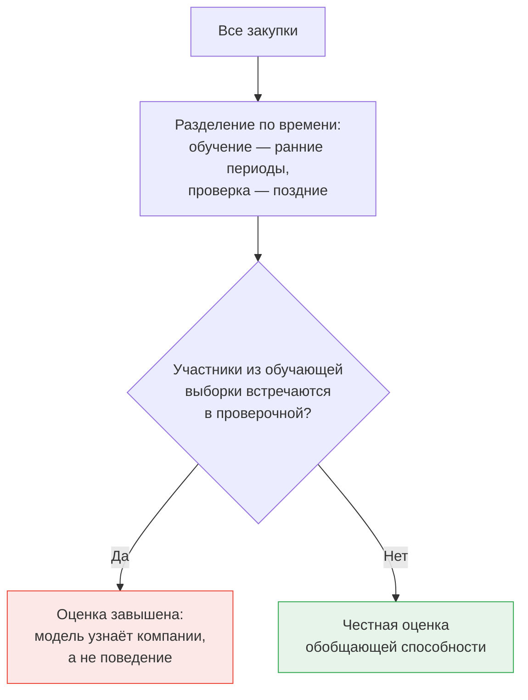

# Постановка задачи машинного обучения

Признаки готовы. Прежде чем обучать что-либо, нужно ответить на три вопроса: что считается наблюдением, что считается целевой переменной и как делится выборка. Ошибка в любом из них обесценивает результат независимо от качества модели.

## Выбор единицы наблюдения

| Единица | Целевая переменная | Плюсы | Минусы |
|---|---|---|---|
| Лот | Был ли по лоту установлен сговор | Прямо соответствует прикладной задаче: что проверять | Метка привязана к закупке, а решения выносятся по лицам |
| Пара участников за период | Установлено ли соглашение между этими лицами | Ближе к тому, как формулируются решения; естественна для сетевых признаков | Число пар велико; результат труднее превратить в список проверок |
| Участник за период | Признан ли участником картеля | Метки извлекаются из решений проще всего | Теряется привязка к конкретным закупкам |

Для дипломной работы по вашей теме практичнее всего **лот** как основная единица и **пара участников** как вспомогательная. Лот даёт результат в форме, пригодной для применения — ранжированный список закупок. Пара позволяет использовать сетевые признаки в их естественном виде и ближе к формулировке решений ФАС.

Использовать обе единицы в одной работе — не усложнение, а хороший ход: совпадение выводов двух постановок усиливает результат, расхождение даёт содержательный раздел.

## Дисбаланс

При любой единице наблюдения положительный класс составит доли процента. Это диктует три решения.

**Не балансируйте выборку удалением отрицательных примеров.** Отбрасывание отрицательных наблюдений искажает базовую частоту, а вместе с ней и калибровку вероятностей. Если алгоритм требует внимания к дисбалансу, используйте взвешивание классов, а не изменение состава выборки.

**Не оценивайте качество долей верных ответов.** Модель, всегда отвечающая «нарушения нет», получит более 99 % — и это ровно та ловушка, которая разобрана в модуле 01.

**Не ждите хорошей полноты.** При такой базовой частоте и неполной разметке разумная цель — сдвинуть настоящие нарушения в верхние проценты ранжирования, а не найти их все.

## Разделение выборки

Здесь два независимых требования, и выполнить нужно оба.

**Разделение по времени — обязательно.** Признаки построены по истории, модель применяется к будущему; случайное перемешивание даёт обучение на будущем и предсказание прошлого.

**Разделение по группам — тоже обязательно.** Дело о картеле охватывает несколько закупок одних и тех же участников. При случайном разделении часть закупок одного дела попадёт в обучение, а часть — в проверку, и модель будет узнавать не признаки сговора, а конкретные компании. Оценка окажется завышенной, а на новых участниках модель не сработает.



Полностью развести участников между периодами обычно невозможно — рынок один и тот же. Практичный компромисс: основная оценка делается по времени, а дополнительно считается оценка на подвыборке проверочного периода, где нет ни одного участника из обучающей. Разрыв между двумя числами — прямая мера того, насколько модель запомнила конкретные компании. Этот разрыв стоит привести в дипломе: он показывает, что вы понимаете границы применимости своего результата.

## Схема скользящего начала

Практическая реализация — расширяющееся окно: обучаемся на всём, что было до момента `t`, проверяемся на следующем квартале, сдвигаем `t`, повторяем.

```python
import numpy as np
import pandas as pd

def rolling_origin_splits(df, date_col, start, end, freq="QE"):
    for cut in pd.date_range(start, end, freq=freq):
        train_idx = df.index[df[date_col] < cut]
        test_idx = df.index[(df[date_col] >= cut) &
                            (df[date_col] < cut + pd.tseries.offsets.QuarterEnd())]
        if len(test_idx) and df.loc[train_idx, "label"].sum() > 0:
            yield train_idx, test_idx
```

Проверка `label.sum() > 0` отсекает ранние периоды, где положительных примеров ещё нет. Из модуля 04 вы помните и обратную проблему: в самых поздних периодах меток нет из-за лага правоприменения, поэтому верхнюю границу диапазона тоже нужно ограничить осознанно.

## Где ошибаются

**Применяют обычную перекрёстную проверку.** Самая частая ошибка в работах по теме: перемешивание разрушает и временной порядок, и групповую структуру сразу.

**Отбирают признаки на всей выборке до разделения.** Отбор признаков — часть обучения. Если ранжировать признаки по связи с целевой переменной на всех данных, а потом делить выборку, информация о проверочной части уже попала в модель.

**Нормируют признаки по всей выборке.** Нормировка внутри сегмента из модуля 05 должна считаться по обучающему периоду и применяться к проверочному, а не пересчитываться на объединённых данных.
