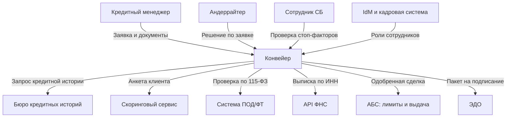

# Граница системы: что внутри, что снаружи и почему

Граница системы — это множество решений, которые принимает ваша команда и
которые меняются по вашему коду. Всё остальное — смежные системы и акторы. Пока
граница не зафиксирована на бумаге, каждая новая задача начинается со спора «а
это вообще наше?», а на приёмке выясняется, что заказчик ждал функцию, которую
никто не проектировал.

## Пять признаков, по которым функция попадает внутрь

Ответ «внутри или снаружи» почти никогда не следует из удобства разработки. Он
следует из того, кто отвечает за данные и правила.

| Признак | Внутрь системы | Наружу |
| --- | --- | --- |
| Источник истины по данным | Данные рождаются у нас и нигде больше | Мы копируем данные, владелец другой |
| Владелец правила | Правило меняет наш заказчик | Правило меняет другое подразделение или регулятор |
| Частота изменений | Меняется чаще, чем раз в квартал | Меняется реже, чем раз в год |
| Ответственность за ошибку | Штраф или убыток ложится на нашего заказчика | Отвечает владелец смежной системы |
| Наличие альтернативы | Готового сервиса нет | Есть промышленный сервис или корпоративный стандарт |

Признаки могут противоречить друг другу. Приоритет такой: источник истины по
данным перевешивает всё остальное. Если данные принадлежат чужой системе, а вы
завели у себя вторую «настоящую» копию, вы получите расхождения, и никакая
сверка их не вылечит — вылечит только удаление своей копии.

Второй по силе признак — ответственность за ошибку. Функция, за неверную работу
которой отвечает чужое подразделение, не должна жить в вашем коде: вы не сможете
ни согласовать изменение, ни объяснить расхождение.

## Что записывать про границу

Граница фиксируется двумя артефактами, и оба короткие.

**Контекстная диаграмма.** Система — один непрозрачный блок. Вокруг — акторы
(роли людей) и смежные системы. Стрелка показывает, кто инициирует обмен, а не
куда «текут данные вообще»; подпись на стрелке называет предмет обмена. Внутрь
блока не заглядываем: на контекстной диаграмме не бывает «микросервиса заявок» и
«базы данных» — это уже уровень контейнеров.

**Список вне границ.** Каждая строка — формулировка «мы этого не делаем» плюс
ответ, кто делает вместо нас. Без второй половины список бесполезен: он не
снимает вопрос, а прячет его.

Отдельно выпишите каналы, по которым данные покидают систему, даже если это не
интеграция: выгрузки в Excel, отчёты по почте, доступ аналитиков к реплике базы.
В системах с персональными данными и банковской тайной именно эти каналы дают
большинство инцидентов, и именно они регулярно не попадают ни в одну диаграмму,
потому что «это же просто отчёт».

## Где ошибаются

- **Рисуют архитектуру вместо контекста.** Если на диаграмме видно очередь и
  базу, вы показали внутреннее устройство — обсуждать границу по такой картинке
  невозможно, разговор сваливается в технологии.
- **Стрелка без инициатора.** «Система ↔ АБС» не даёт ответа на вопрос, что
  произойдёт, когда АБС недоступна. Направление инициативы определяет, кто
  переживает отказ и кто хранит очередь.
- **Акторы записаны должностями.** «Иванов из отдела рисков» превращается в
  проблему при первом же кадровом изменении. Актор — роль: «риск-аналитик».
- **Нет списка вне границ.** Самый дорогой случай: на демо заказчик спрашивает,
  где отчётность для ЦБ, а её никто не планировал, потому что «все же понимали».

## На конвейере

Банк «Меридиан» выдаёт кредиты малому и среднему бизнесу: 500 тыс. — 50 млн ₽,
срок 6–60 месяцев. Сейчас заявку собирают в почте и файлах, решение занимает
6 рабочих дней при потоке 400 заявок в день. Проект — внутренняя система
«Конвейер»: единое рабочее место для 120 кредитных менеджеров в 38 отделениях,
25 андеррайтеров, 6 сотрудников службы безопасности и 4 риск-аналитиков. Цель —
2 рабочих дня.

Спорных случаев на старте было три, и все решались одним вопросом: где источник
истины.

| Функция | Решение | Почему |
| --- | --- | --- |
| Расчёт предварительного лимита по анкете | Внутри | Правило меняет кредитный комитет банка раз в месяц, данные для расчёта собираем мы |
| Окончательный лимит на группу связанных заёмщиков | Снаружи, в АБС | Источник истины по обязательствам группы — АБС; вторая копия неизбежно разойдётся |
| Скоринговая модель | Снаружи | Модель принадлежит риск-подразделению, валидируется отдельно, меняется без нашего релиза |
| Хранение сканов документов | Внутри, в своём бакете | Документы рождаются в заявке, вне заявки не нужны, срок хранения задаём мы |
| Учёт рабочего времени андеррайтеров | Снаружи | За ошибку отвечает кадровая служба, есть корпоративная система |

Список вне границ на старте, дословно из документа:

- Конвейер не рассчитывает резервы по ссудам — расчёт остаётся в АБС по
  правилам риск-подразделения.
- Конвейер не выдаёт деньги и не открывает счета — выдачу проводит АБС после
  подписания в ЭДО.
- Конвейер не готовит отчётность в ЦБ — данные забирает корпоративное
  хранилище ночной выгрузкой, витрины делает подразделение отчётности.
- Конвейер не заводит и не отзывает учётные записи — роли приходят из IdM,
  назначение роли — заявка в IdM, а не настройка в интерфейсе.

Последний пункт выглядит техническим, но он бизнесовый: он означает, что
администратор продукта в «Конвейере» не может выдать себе роль андеррайтера, и
именно это позже станет опорой для сегрегации обязанностей.

Каналы вывода данных, выписанные отдельно и приравненные к интеграциям:

| Канал | Что уходит | Куда |
| --- | --- | --- |
| Ночная выгрузка | Обезличенные факты решений | Корпоративное хранилище |
| Экспорт списка заявок | ИНН, наименование, сумма, статус | Файл на рабочей станции менеджера |
| Печатная форма решения | ПДн руководителя, сумма, условия | Принтер отделения, кредитное досье |

Три строки в таблице выше — заготовка для модуля про конфиденциальность:
экспорт в файл окажется самым сложным местом всей системы.
