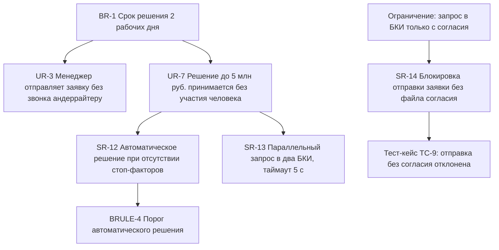

# Уровни требований и трассируемость

Требование «система должна проверять клиента в БКИ» бесполезно, пока неизвестно,
из какой бизнес-цели оно следует и во что превращается на уровне полей и
сообщений. Уровни требований — это способ не смешивать в одном предложении
цель, сценарий и реализацию.

## Три уровня

| Уровень | Отвечает на вопрос | Владелец | Пример формулировки |
| --- | --- | --- | --- |
| Бизнес-требование | Зачем мы вообще это делаем | Заказчик | Сократить средний срок решения по заявке МСБ с 6 до 2 рабочих дней к концу года |
| Пользовательское | Что человек делает в системе | Аналитик вместе с пользователями | Кредитный менеджер отправляет заявку на проверку и видит её статус без звонка андеррайтеру |
| Системное | Что делает система | Аналитик | При переходе заявки в статус `checks_running` система запрашивает отчёт в двух БКИ параллельно и ждёт ответа не дольше 5 секунд |

Признак смешения уровней: в одном предложении есть и цель, и механизм. «Для
ускорения работы система должна кешировать отчёты БКИ 30 дней» — это три
требования, склеенные вместе, и спорить с ним нельзя: непонятно, что именно
оспаривается.

Уровень детализации выбирается по цене ошибки, а не по вкусу. Функция, ошибка в
которой стоит денег или влечёт нарушение нормативных требований, расписывается
до значений полей и текстов сообщений. Функция, ошибка в которой стоит минуты
неудобства, живёт на уровне пользовательского требования и уточняется в
разработке.

## Трассируемость

Трассируемость — связи «требование → откуда пришло → во что превратилось». Она
отвечает на четыре вопроса, и каждый из них рано или поздно задают:

| Вопрос | Кто спрашивает | Без трассировки |
| --- | --- | --- |
| Правило изменилось — что переделать | Аналитик | Поиск по документам, часть мест пропущена |
| Зачем нужна эта проверка в коде | Разработчик | Проверку удаляют как «лишнюю» |
| Чем подтверждено выполнение требования регулятора | Аудит | Ищут вручную перед проверкой |
| Что мы потеряем, если выкинуть задачу из релиза | Заказчик | Решение принимается наугад |

Идентификатор требования — не украшение: именно он попадает в коммит, тест и
пункт протокола. Схема идентификаторов должна быть плоской и неизменной:
`BR-3`, `UR-12`, `SR-45`, `BRULE-7`, `NFR-4`. Нумерация не переиспользуется:
удалённое требование помечается как отменённое, номер не занимается другим.

Трассировать всё подряд — верный способ получить матрицу на восемьсот строк,
которую перестают обновлять на третьем месяце. Трассируйте выборочно: связи
обязательны для требований, вытекающих из ограничений (регуляторика,
безопасность), и для требований, ошибка в которых стоит дороже дня работы
команды. Остальное связывается по факту, когда понадобится.

## Где ошибаются

- **Бизнес-цель без числа и срока.** «Ускорить рассмотрение заявок» нельзя ни
  подтвердить, ни опровергнуть, поэтому на приёмке проект окажется одновременно
  успешным и провальным.
- **Системное требование, описывающее интерфейс.** «Кнопка „Отправить“
  располагается справа» — это макет, а не требование; оно устареет при первом
  редизайне и утащит за собой трассировку.
- **Матрица как отдельный документ.** Если связи живут в файле, который надо
  обновлять руками, они устареют. Связь должна храниться там же, где требование:
  поле в задаче, ссылка в заголовке сценария.
- **Требование без владельца.** У каждого требования есть тот, кто согласует
  изменение. Без этого поля любое уточнение превращается в переписку на неделю.

## На конвейере

Фрагмент дерева требований «Конвейера», от цели до проверяемого поведения:

Обратите внимание на левую нижнюю ветку: ограничение из первого модуля стало
системным требованием и тест-кейсом. Это тот случай, когда трассировка
обязательна — на проверке нужно за минуту показать, чем подтверждено
выполнение требования о согласии.

Как выглядят те же требования в таблице реестра:

| ID | Уровень | Формулировка | Источник | Владелец |
| --- | --- | --- | --- | --- |
| BR-1 | Бизнес | Средний срок решения по заявке МСБ — не более 2 рабочих дней при потоке 400 заявок в день | Цель проекта, протокол от 12.02 | Директор по МСБ |
| UR-7 | Пользовательский | Заявки до 5 млн ₽ без стоп-факторов проходят без участия андеррайтера | Интервью с андеррайтерами | Директор по МСБ |
| SR-12 | Системный | При сумме ≤ порога `BRULE-4`, отсутствии стоп-факторов и скоринговом балле ≥ 620 система выставляет статус `approved` без назначения андеррайтера | UR-7 | Аналитик продукта |
| SR-14 | Системный | Переход заявки из `draft` в `submitted` невозможен, пока к заявке не приложен файл согласия на запрос кредитной истории; при попытке возвращается ошибка `consent_required` | Ограничение комплаенса | Комплаенс |
| NFR-2 | Нефункциональный | 95% открытий карточки заявки — быстрее 1,5 с при 25 одновременно работающих андеррайтерах | Интервью, замер текущей системы | Аналитик продукта |

Три детали этой таблицы стоят того, чтобы их скопировать в свой проект.

Первая: SR-12 ссылается на `BRULE-4` вместо того, чтобы называть 5 млн ₽. Порог
меняет риск-подразделение, и менять его в тексте десяти требований никто не
будет — правило живёт отдельно, требование ссылается.

Вторая: SR-14 содержит код ошибки `consent_required`. Код — это то, что попадёт
в тест, в лог и в сообщение интерфейса; формулировка «система не должна
позволить» без кода порождает три разных поведения в трёх местах.

Третья: у SR-14 владелец не аналитик, а комплаенс. Это значит, что изменить
требование продуктовым решением нельзя, и на планировании его не «упростят».
