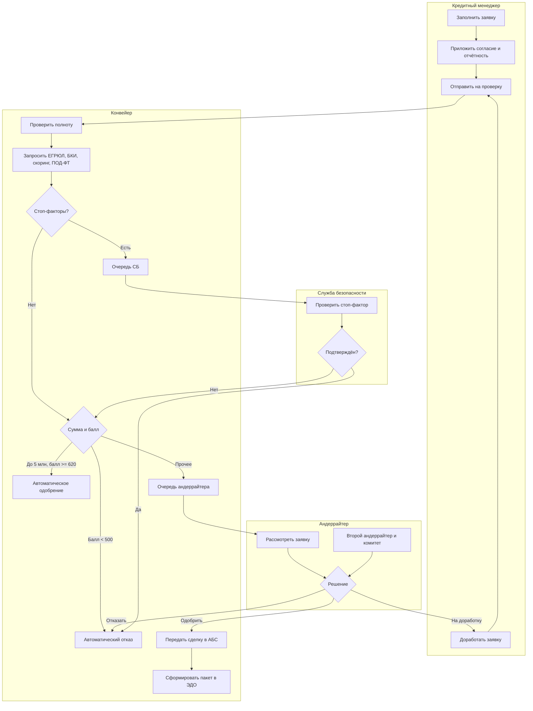

# Модель процесса: дорожки, шлюзы и уровень детализации

Текстовое описание процесса на пять участников нечитаемо: чтобы понять, кто
ждёт кого, приходится держать в голове весь текст. Схема процесса решает ровно
эту задачу — показывает передачу работы между ролями и точки ветвления. Всё
остальное (поля, правила, сообщения) схема показывать не должна.

## Минимальный набор элементов

Девяносто процентов корпоративных процессов описываются шестью элементами
нотации BPMN. Остальные тридцать нужны редко и почти всегда означают, что
процесс стоит разделить.

| Элемент | Что означает | Частая ошибка |
| --- | --- | --- |
| Дорожка | Роль, выполняющая задачи | Дорожка названа должностью или отделом вместо роли |
| Пользовательская задача | Действие человека в системе | Внутрь кладут то, что делает система |
| Сервисная задача | Действие системы без человека | Не показывают вовсе, из-за чего процесс выглядит мгновенным |
| Исключающий шлюз | Выбор одной ветки | Ветки не покрывают все случаи |
| Параллельный шлюз | Одновременное выполнение и ожидание всех | Открыт без парного закрытия — процесс «не сходится» |
| Событие-таймер | Срок, по истечении которого процесс меняет ход | Срок есть в регламенте, но не на схеме |

Правило одного уровня: на схеме процесса все задачи должны быть сопоставимы по
масштабу. «Проверить клиента» и «нажать кнопку „Сохранить“» на одной схеме —
признак, что схему собирали из двух разных обсуждений.

Ветки исключающего шлюза обязаны покрывать все возможные ответы, включая «нет
ответа». Именно ветка «нет ответа» чаще всего отсутствует, и именно она потом
превращается в зависшие заявки.

## Где процесс на самом деле ветвится

Опрашивая пользователей, вы получите линейный процесс: люди описывают, как
должно быть. Реальные ветвления находят тремя вопросами:

1. Что вы делаете, когда данных не хватает? (возврат на доработку)
2. Когда вы кому-нибудь звоните или пишете в мессенджер? (обход системы —
   значит, процесс не поддержан)
3. Какая заявка занимает у вас весь день? (редкий, но дорогой случай)

Ответы на третий вопрос дают исключения, о которых не расскажут на встрече с
руководителями: именно они съедают время, а не основной поток.

## Когда схема не нужна

Процесс из четырёх последовательных шагов с одним участником описывается
таблицей или списком, и схема к нему ничего не добавляет. Схема окупается при
двух и более ролях, ветвлениях или ожиданиях. Иначе вы получаете артефакт,
который нужно поддерживать, но который никто не читает.

## На конвейере

Процесс «от заявки до выдачи» в «Конвейере». Схема упрощена до одного уровня:
внутренние шаги проверок раскрыты отдельно.

Три решения, принятые при рисовании этой схемы, стоит объяснить.

**Проверки объединены в одну сервисную задачу.** Четыре запроса (ЕГРЮЛ, БКИ,
скоринг, ПОД/ФТ) идут параллельно и на уровне процесса ведут себя как один шаг:
результат нужен весь целиком. Их порядок, таймауты и поведение при отказе —
предмет модели состояний и контракта интеграции, а не схемы процесса.

**У очереди СБ отдельная дорожка.** Соблазн был показать СБ как ещё одну
сервисную задачу, но проверка стоп-фактора — работа человека со своим сроком и
своей очередью. Скрыв её внутри системы, вы потеряете из виду 6 сотрудников и
их загрузку, а это влияет на срок решения по заявке сильнее всего остального.

**Возврат на доработку замыкается на менеджера, а не на начало.** Формально
заявка возвращается «в начало», но фактически она сохраняет уже собранные
данные и выполненные проверки. Это различие определяет, нужно ли запрашивать
БКИ повторно — согласно BRULE-12, не нужно, пока отчёту меньше 30 дней.

Сроки на шагах и эскалации выносятся в таблицу: на схеме шесть таймеров
превратят её в нечитаемую.

| Шаг | Срок | При нарушении |
| --- | --- | --- |
| Автоматические проверки | 2 минуты | Признак `checks_delayed`, заявка в `manual_review` |
| Очередь СБ | 4 рабочих часа | Уведомление руководителю СБ |
| Очередь андеррайтера | 8 рабочих часов | Переназначение на дежурного андеррайтера |
| Кредитный комитет | 3 рабочих дня | Уведомление директору по МСБ |
| Подписание в ЭДО клиентом | 10 рабочих дней | Заявка переходит в `expired` |
| Выдача после подписания | 1 рабочий день | Инцидент, ручная сверка с АБС |

Пять строк из шести дают бизнесу больше, чем вся схема: именно здесь видно,
почему решение занимало шесть дней.
