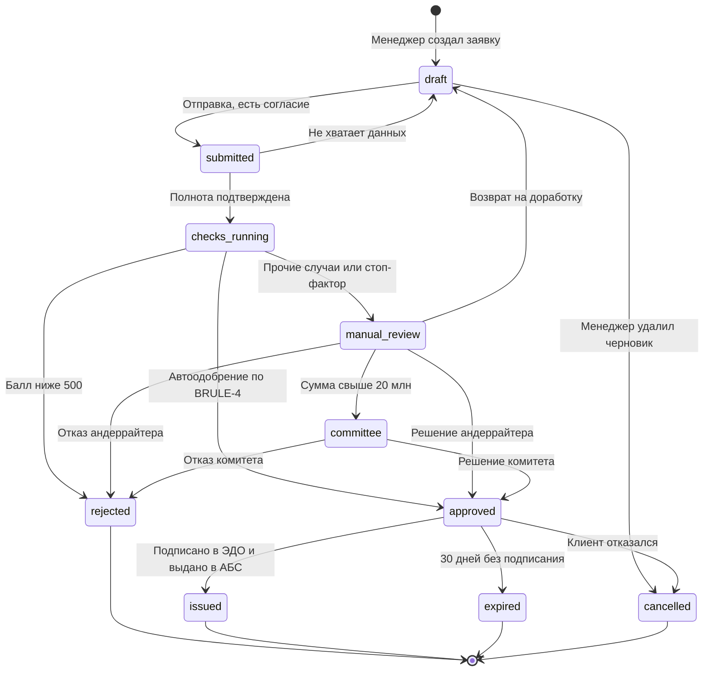

# Модель состояний: переходы, которых не должно быть

Процесс показывает, как работа передаётся между людьми. Модель состояний
показывает, что происходит с объектом. Их путают, и из-за этого появляются
статусы вроде «У андеррайтера» — они описывают не заявку, а того, кто на неё
смотрит, и ломаются, как только смотрящих становится двое.

## Что описывает модель состояний

| Понятие | Определение | Проверка |
| --- | --- | --- |
| Состояние | Набор утверждений, истинных для объекта, пока он в нём находится | Можно назвать инвариант: «в `approved` есть решение и срок его действия» |
| Событие | То, что запускает переход | Есть инициатор: человек, таймер или внешняя система |
| Условие | Когда переход разрешён | Формулируется ссылкой на бизнес-правило |
| Эффект | Что происходит при переходе | Изменение данных, отправка сообщения, постановка задачи |
| Терминальное состояние | Из которого переходов нет | Проверьте, что это правда; часто находится исключение |

Состояние — это свойство объекта, а не место в очереди. Хороший тест: если из
названия статуса можно выбросить упоминание роли и смысл не потеряется, статус
корректен. «На проверке СБ» плох — при передаче другому подразделению его
придётся переименовывать; корректно `manual_review` плюс отдельное поле
«назначенная очередь».

Второй тест: у каждого состояния есть наблюдатель, для которого оно значимо.
Статус, который никого не интересует, — это промежуточное состояние реализации,
и в бизнес-модели ему не место.

## Таблица переходов

Диаграмма показывает структуру, таблица — полноту. Столбцы: исходное состояние,
событие, условие, целевое состояние, инициатор, эффект. Перебирая пары
«состояние × событие», вы находите два вида дефектов: не описанные переходы и
переходы, которые надо явно запретить.

Запрещённые переходы описываются так же явно, как разрешённые, и попадают в
тест-кейсы: попытка → отказ с конкретным кодом. Без этого система «на всякий
случай» разрешает переход, и сначала это выглядит гибкостью, а потом
оказывается, что отменённая заявка снова стала активной.

## Где ошибаются

- **Статус-помойка.** «В работе» объединяет пять разных ситуаций; по нему
  нельзя ни построить отчёт, ни понять, чего заявка ждёт.
- **Два поля со статусом.** Бизнес-статус и технический статус интеграции в
  одном объекте неизбежно разъезжаются. Технический статус принадлежит записи об
  обмене, а не заявке.
- **Переход без инициатора.** «Заявка переходит в `expired`» — сама? По таймеру?
  Кто запускает таймер и от какой даты он считается?
- **Нет ответа, что можно менять в каждом состоянии.** Право на переход и право
  на редактирование полей — разные вещи, и второе забывают описать.

## На конвейере

Фрагмент таблицы переходов — здесь видно то, чего нет на диаграмме:

| Из | Событие | Условие | В | Инициатор | Эффект |
| --- | --- | --- | --- | --- | --- |
| `draft` | Отправка | Приложено согласие, заполнены ИНН, сумма, срок | `submitted` | Менеджер | Заявка блокируется на редактирование, фиксируется `rules_version` |
| `checks_running` | Получены все ответы | BRULE-11: стоп-факторов нет, сумма ≤ 5 млн, балл ≥ 620 | `approved` | Система | Решение сохраняется со снимком входных данных, срок действия 30 дней |
| `checks_running` | Таймаут 2 минуты | Нет ответа скоринга | `manual_review` | Таймер | Признак `score_unavailable`, задача андеррайтеру |
| `manual_review` | Решение | BRULE-9: решающий не участвовал в подготовке | `approved` | Андеррайтер | Запись решения, автор, время, версия правил |
| `approved` | Таймер 30 дней | Нет подписания в ЭДО | `expired` | Таймер | Уведомление менеджеру, отзыв резерва лимита в АБС |

Запрещённые переходы, вынесенные в отдельный список и покрытые тестами:

| Попытка | Ответ | Причина |
| --- | --- | --- |
| `rejected` → `manual_review` | `409`, код `invalid_state` | Пересмотр отказа — только новая заявка; иначе теряется история решений |
| `issued` → любое | `409`, код `invalid_state` | Деньги выданы, изменения только операционными процедурами в АБС |
| `manual_review` → `approved` тем, кто редактировал заявку | `403`, код `segregation_violation` | BRULE-9, правило четырёх глаз |
| `checks_running` → `approved` вручную | `403`, код `not_allowed` | Автоматическое решение не может быть принято человеком, иначе рушится статистика модели |
| `draft` → `submitted` без согласия | `422`, код `consent_required` | Ограничение комплаенса, SR-14 |

Право редактирования полей описывается отдельно от переходов — это та самая
пара, которую забывают:

| Состояние | Кто редактирует | Что редактирует |
| --- | --- | --- |
| `draft` | Автор заявки | Все поля заявки |
| `submitted`, `checks_running` | Никто | — |
| `manual_review` | Андеррайтер | Только комментарий и предлагаемые условия |
| `manual_review` | СБ | Только результат проверки стоп-фактора |
| `approved` | Никто | Условия зафиксированы; изменение — только новая заявка |

Строка про `approved` выглядит жёсткой, и её дважды пытались смягчить: менеджеры
просили «поправить срок кредита, клиент передумал». Ответ риск-подразделения:
решение принято по конкретным условиям, при их изменении меняется расчёт, а
значит, требуется новое решение. Компромисс — кнопка «создать заявку на основе
этой», копирующая данные и заново запускающая проверки.
